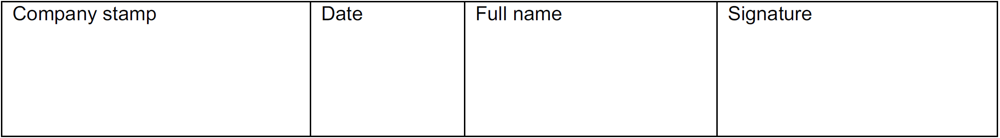

# Decontamination Declaration

For the safety of the service personnel, {{ variables.product.name.en }} components that may have contact with fluid should be decontaminated before sending and recorded in the decontamination declaration.

!!! warning "Note: Refusal to accept a return / additional costs"

    { .img-icon width="80" height="80" }
    
    If a returned product is not decontaminated, it may result in being not accepted or be decontaminated by a company engaged by your distributor at the expense of the sender.

!!! note "The decontamination declaration is pictured on the next page."

## Decontamination Declaration for {{ variables.product.name.en }} and Micro Valves

To guarantee the safety of the service personnel all returned {{ variables.product.name.en }} dispensers and/or wetted components must be decontaminated. 

This decontamination declaration must cover all returned machines, components and parts subject to previous contamination. Non-conformance may result in the shipment being rejected or decontamination being performed by an institution appointed by your distributor at owner’s expense.

### Customer details

| Type                | Details                                                                    |
| ------------------- | -------------------------------------------------------------------------- |
| Company:            | __________________________________________________________________________ |
| Department:         | __________________________________________________________________________ |
| Address:            | __________________________________________________________________________ |
| Postal code / City: | __________________________________________________________________________ |
| Country:            | __________________________________________________________________________ |
| Contact person:     | __________________________________________________________________________ |
| Phone:              | __________________________________________________________________________ |
| E-Mail:             | __________________________________________________________________________ |

### Decontamination / Disinfection
| Machine model Part | Serial No. | Type of decontamination / disinfection | Date |
| ------------------ | ---------- | -------------------------------------- | ---- |
|                    |            |                                        |      |
|                    |            |                                        |      |
|                    |            |                                        |      |
|                    |            |                                        |      |
|                    |            |                                        |      |

### Declaration

I hereby declare that the contents of this package have never been exposed to hazardous, biological and/or radioactive materials/substances or that such parts have been decontaminated and/or disinfected to remove and/or inactivate any biological and/or radioactive materials/substances which could potentially be dangerous to humans.

