# WEB CONTROL

!!! info "Extra: Chargeable add-on"

    {.img-icon width="80" height="80"}
    
    ► WEB CONTROL is a chargeable add-on, which can be purchased separately. To obtain a corresponding license or for further information,contact [sales@nnano.com](mailto:sales@nnano.com).

CERTUS WEB CONTROL enables maintenance functions to be carried out on the {{ variables.product.name.en }} via a web browser on a smartphone or tablet. This is particularly helpful when the {{ variables.product.name.en }} and the PC are not located at the same place.

The following commands can be executed directly on the device using WEB CONTROL:

* Air ON/OFF
* Flush
* Prime
* Purge
* Park
* Clean Cycle

!!! note
    For trial purposes, WEB CONTROL can be executed in simulation mode.

## WEB CONTROL - Installation

If the option `Integrated` was selected, the option `with WEB CONTROL` can also be selected. The data on which WEB CONTRO is based is made available by a web server. The web server can be accessed with a web browser in order to carry out the maintenance functions. 

!!! note

    WEB CONTROL requires a special license, which must be purchased. For license activation, the same steps are necessary as for the Integration Manager (Ref to [Integrated Application](certus_controls.md#integrated-application)). 

In order for the smartphone or tablet to be able to connect to WEB CONTROL, a wireless access point in the network is required. 

!!! note

    After successfully installing CERTUS WEB CONTROL, the WEB CONTROL icon appears on the desktop. (If the `Auto Start` option was also selected, this icon will appear in the taskbar after a restart).
    
    {.img-icon width="80" height="80"}

## WEB CONTROL - Operation

### Open the control page in the web browser

**Requirements:**

► WEB CONTROL must be started with the correct network settings. (Check by double-clicking the WEB CONTROL icon in the task bar)

► Open the web browser and enter the IP address and port of the web server. (Separate IP address and port with a colon)

Example:`http://[IP address]:[Port]/ => http://192.168.10.96:4649/`

► Home page of {{ variables.product.name.en }} WEB CONTROL is opened.

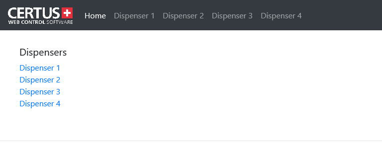{.img-medium}

► Select the desired {{ variables.product.name.en }} on the home page

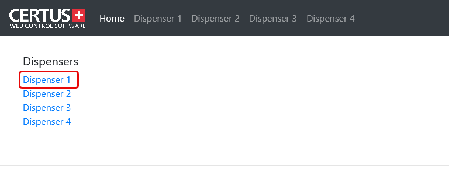{.img-medium}

► The control page of the selected {{ variables.product.name.en }} is opened.

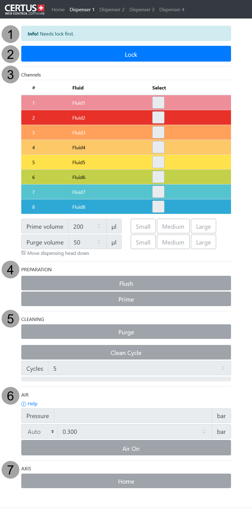{.img-medium .on-glb width="450" height="250"}

| #   | Section        | Description                                                  |
| --- | -------------- | ------------------------------------------------------------ |
| 1   | Info           | Display for prompts, infos, errors.                          |
| 2   | Lock/Release   | Disable/enable the operation of the device.                  |
| 3   | Channels       | Channel selection and definition of the prime/purge volumes. |
| 4   | Preparation    | Flush or prime function for dispensing preparation.          |
| 5   | Cleaning       | Cleaning functions with Purge or Clean Cycle.                |
| 6   | Air            | Compressed air settings.                                     |
| 7   | Axis Functions | Axis movements.                                              |

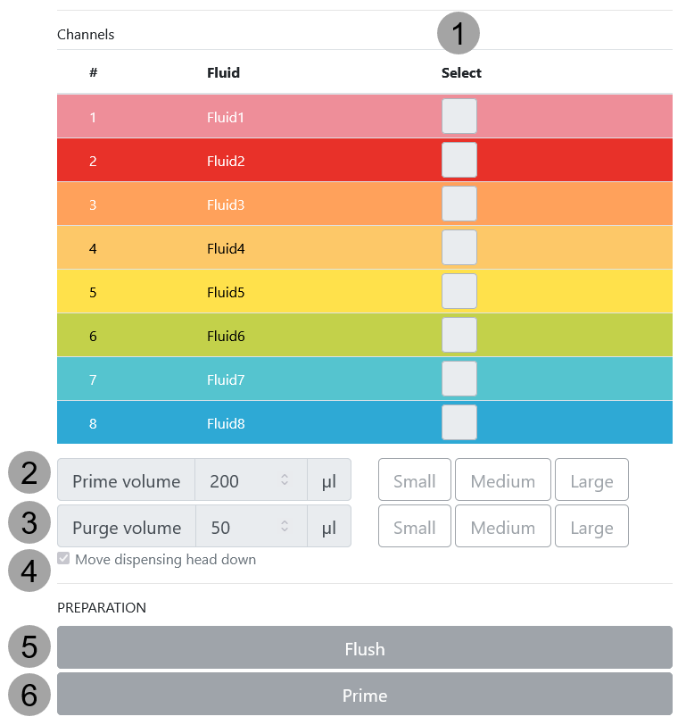{ .img-medium .on-glb width="450" height="250" }

| #   | Section                   | Description                                                       | 
| --- | ------------------------- | ----------------------------------------------------------------- | 
| 1   | Select                    | Channel selection for the execution of the command.               | 
| 2   | Prime volume              | Definition of the prime volume. (Custom, Small, Medium, or Large) | 
| 3   | Purge volume              | Definition of the purge volume. (Custom, Small, Medium, or Large) | 
| 4   | Move dispensing head down | Moves the dispensing head down during dispensing.                 | 
| 5   | Flush                     | Starts the flush function.                                        | 
| 6   | Prime                     | Starts the Prime function.                                        | 

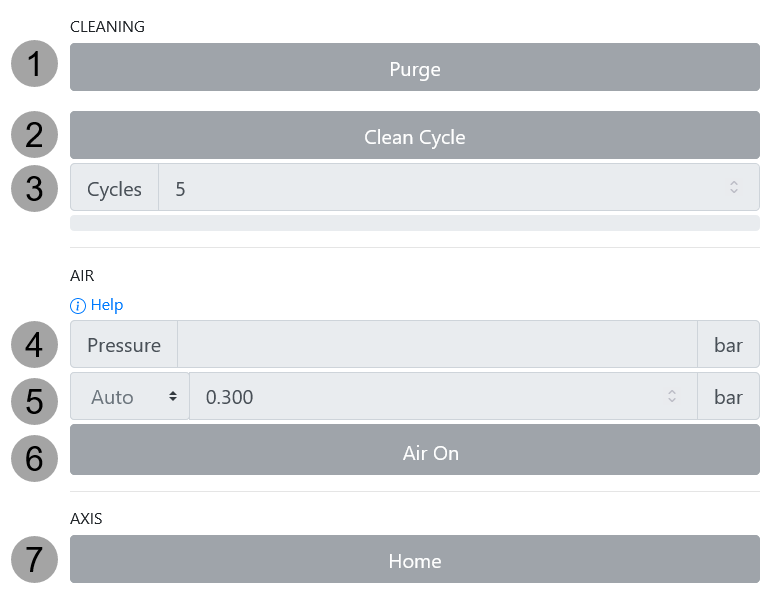{ .img-medium .on-glb width="450" height="250" }

| #   | Section      | Description                                                                                                                           |
| --- | ------------ | ------------------------------------------------------------------------------------------------------------------------------------- |
| 1   | Purge        | Starts the purge function.                                                                                                            |
| 2   | Clean Cycle  | Starts the cleaning function with the defined number of cycles.                                                                       |
| 3   | Cycles       | Number of repetitions for the cleaning function.                                                                                      |
| 4   | Air Pressure | Pressure setting for compressed air.                                                                                                  |
| 5   | Auto/Manual  | **Auto**:  The air pressure defined in the supply kit is used.  **Manual**:  Any air pressure can be selected. (0.051-1 bar) |
| 6   | Air On/Off   | Switch compressed air on/off.                                                                                                         |
| 7   | Park         | Return axes to park position after a collision.                                                                                       |

!!! note

    The address of the control page is fixed and can be saved as a Favorite or Bookmark if used frequently.

## WEB CONTROL - Operation

### Configuration of IP address and port

**Procedure**:

1. Double-click the WEB CONTROL icon in the taskbar.

    ✓ The web server is started automatically when the PC is switched on.

2. Stop the web server.

    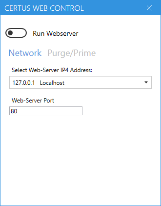{ .img-medium .on-glb width="350" height="150"}

    ✓ The IP address cannot be chosen randomly. It must match the network settings of the PC.
   
    The default setting is `127.0.0.1`.

3. Start the web server.

    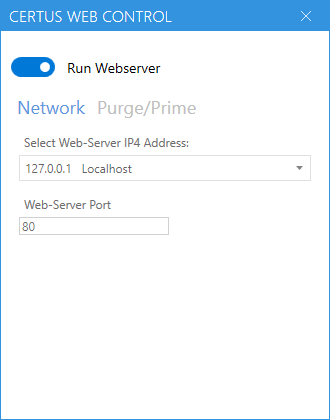{ .img-medium .on-glb width="350" height="150"}

### Predefinition of prime / purge volumes

**Procedure**:

1. Double-click on the WEB CONTROL symbol in the taskbar.

2. Stop the web server.

3. Switch to the Purge / Prime area.

    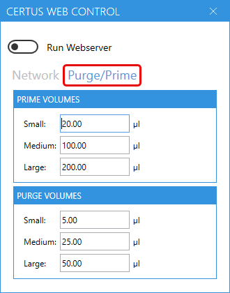{ .img-medium .on-glb width="350" height="150"}

4. Define the volume for Small, Medium and Large.

    !!! note
        
        ► Default values for PRIME: Small = `5 μl`; Medium = `50 μl`; Large = `200 μl`. 
        
        ► Default values for PURGE: Small = `2 μl`; Medium = `10 μl`; Large = `50 μl`.

5. Start the web server.

### Execute commands in the web browser

**Procedure**:

1. Select the Lock button on the control page.

    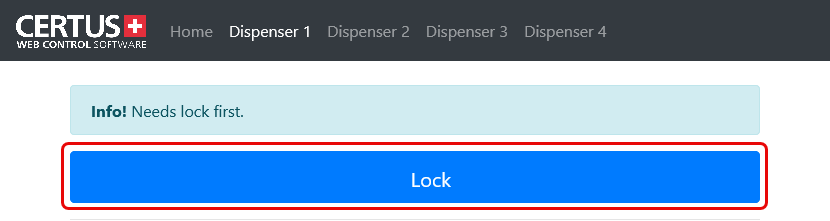{ .img-medium .on-glb width="350" height="150"}

2. Select Air On to turn on the air pressure.

    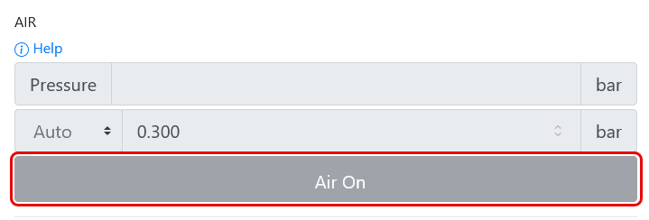{ .img-medium .on-glb width="350" height="150"}

3. Select channels.

    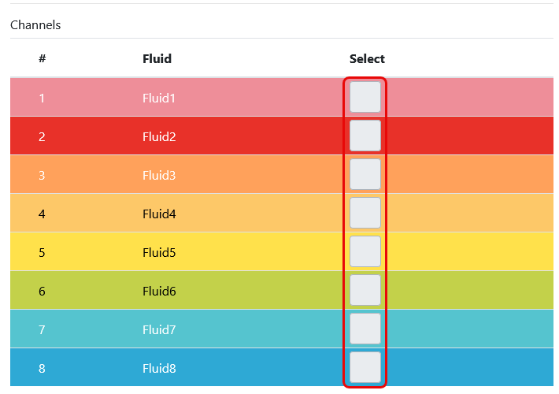{ .img-medium .on-glb width="350" height="150"}

4. Press the desired dispensing command.
    
    ✓ The desired command is carried out.

## WEB CONTROL - Error Messages

With the `Air On` or `Park` commands, it may be necessary to acknowledge an error using the **Confirm** button. 

A corresponding dialog is displayed.

"){ .img-medium .on-glb width="350" height="150"}

