# CERTUS CONTROL

{{ variables.product.software.name.en }} software, which is required for the operation of {{ variables.product.name.en }}, should be installed on the user's PC.

## Features

* {{ variables.product.software.name.en }}:

    * Allows the execution of user protocols with {{ variables.product.name.en }}. {{ variables.product.name.en }}
    * Makes it possible to distribute the user's dispensing tasks across various regions while simultaneously using various valve types for various fluids.
    * Supports dispensing on all formats of well plates, as well as calibration and verification of each micro valve. In addition, it offers automatic generation of detailed dispensing reports for each experiment.

* Opening, creating, and editing protocols.
* Performing calibrations to ensure the highest accuracy of dispensing results.
* Administering users with various rights.
* Automatically logging on using a Windows account.
* Performing all manner of refilling functions/movements.
* Simultaneously dispensing various fluids.
* Creating customized well plates.
* Exporting and importing calibrations and protocols.
* Importing dispensing quantities and regions from Excel files.
* Using time-controlled cleaning functions of the micro valves.
* Manually activating dispensing functions.

A protocol can be directly executed once it is created using {{ variables.product.software.name.en }} and connected to {{ variables.product.name.en }}.

{{ variables.product.software.name.en }} has a simulation mode in which you can create and simulate a protocol without being connected to {{ variables.product.name.en }}.

## Minimum System Requirements

| Processor          | Dual Core Intel/AMD processor, at least 2 GHz |
| ------------------ | --------------------------------------------- |
| RAM                | 4 GB                                          |
| Free memory        | 1 GB                                          |
| Monitor resolution | 1280 x 720 or higher                          |
| Network            | 1 Gbit/s                                      |
| Operating systems  | Windows 7 \| 8 \| 10 \| 11                    |
| Other              | NET Framework 4.8                             |

## Installation

The installation of {{ variables.product.software.name.en }} requires a Windows computer to meet the minimum system requirements and the following installation method to be applied.

!!! note
    The Installation of {{ variables.product.software.name.en }} requires administrator rights. During the installation of {{ variables.product.software.name.en }}, {{ variables.product.name.en }} does not have to be switched on or connected.

### Installation Files

The installation files are on the supplied USB stick or can be downloaded from our FTP server.

* Installation files -- USB:
    * Setup {{ variables.product.software.name.en }} 2.1.19 folder \> {{ variables.product.software.name.en }} 2.1.19
* Installation files -- FTP:
    * Open the following link in your browser: [https://downloads.fgyger.ch/certus/GUI](https://downloads.fgyger.ch/certus/GUI) 
    * Click the bottom folder (corresponds to the latest release) and download Setup {{ variables.product.software.name.en }} 2.1.19.zip.

### Configuring the IP Address

* The standard IP address of {{ variables.product.name.en }} is: `192.168.1.1`. 

* The computer should be part of the same network.

    * **Example**: `192.168.1.2`
    * **Subnet**: `255.255.255.0`

### Installing the INCO Server

The installation of an INCO server is needed to control and monitor {{ variables.product.name.en }}, and is absolutely necessary.

!!! note
    The INCO server is also used for maintenance/repair works. 
    The INCO needs to be installed only once.

1. Double-click on *IndelToolsSetup-tools_24.10.4.exe*.
  
    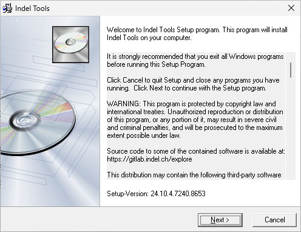{ .img-medium .on-glb width="350", height="350"}

2. Leave the default path on `C:\\Indel`.
    
    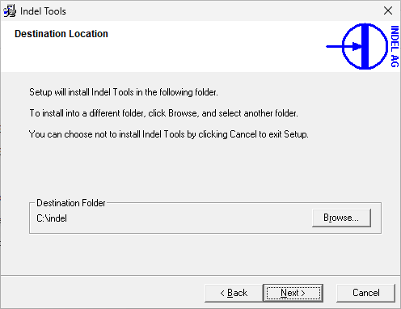{ .img-medium .on-glb width="350", height="350"}

3. Define **Indel Tools** as name.

    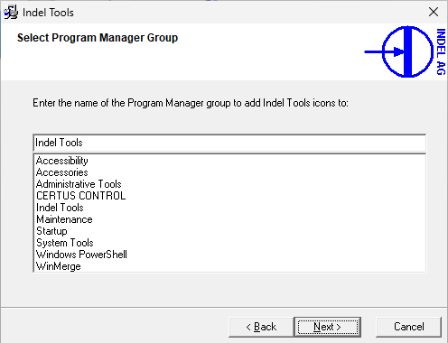{ .img-medium .on-glb width="350", height="350"}

4. Uncheck all components.
    
    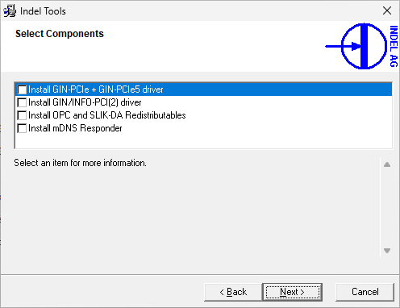{ .img-medium .on-glb width="350", height="350"}

5. Select only the INCO Server rule.
  
    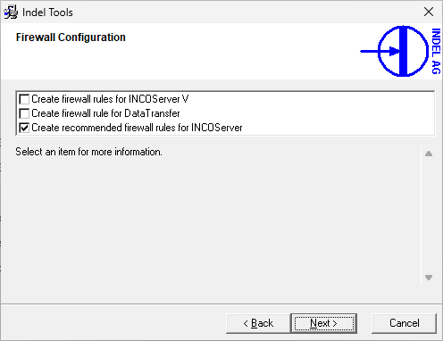{ .img-medium .on-glb width="350", height="350"}

6. Confirm the installation with Next.

    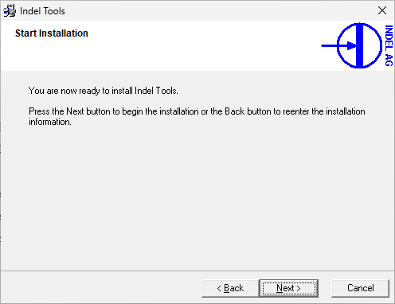{width="350", height="350"}
  
!!! note
    Once the installation is complete, the following symbol appears in the taskbar: { .img-icon width="50" height="50"}

### Installing {{ variables.product.name.en }} Control

1. Double-click to execute `{{ variables.product.software.name.en }} 2.1.19.msi`.
    
    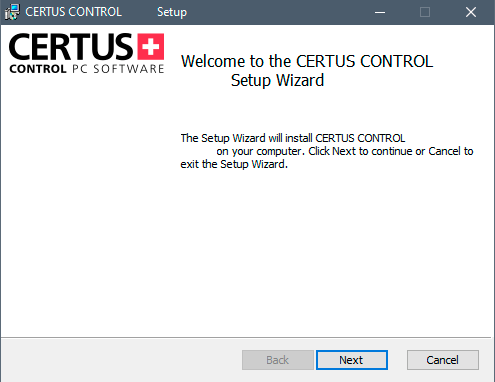{ .img-medium .on-glb width="350" height="350"}

2. Read and accept the license agreement.

    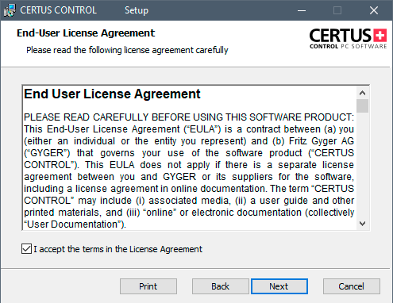{ .img-medium .on-glb width="350" height="350"}

3. Select the type of application (see next page).

    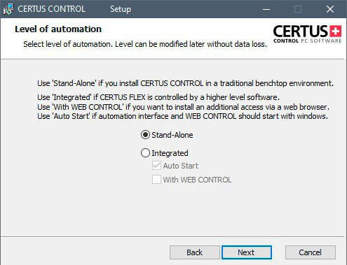{ .img-medium .on-glb width="350" height="350"}

4. Execute the installation.

    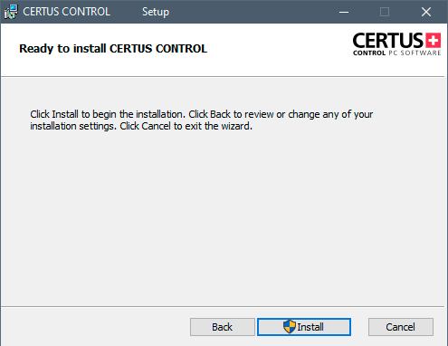{ .img-medium .on-glb width="350" height="350"}

!!! note
    * It is recommended to install the Net Framework 4.8 or higher.
    * The necessary installer ndp48-x86-x64-allos-enu.exe can be found in the Setup *{{ variables.product.software.name.en }} 2.1.19* folder.

### Stand-Alone Application

Select the **Stand-Alone** option if {{ variables.product.name.en }} is to be operated as a stand-alone unit.

!!! note
    Once {{ variables.product.software.name.en }} is successfully installed, the {{ variables.product.software.name.en }} symbol appears on the desktop: { .img-icon width="50" height="50"}

### Integrated Application

If {{ variables.product.name.en }} is part of an automated system, select the Integrated option to make {{ variables.product.name.en }} integration possible.

{ .img-medium .on-glb width="350" height="350"}

The following two additional options are available for the installation:

* _**Auto Start**_: If the Auto Start option is selected, the automation interface and WEB CON- TROL are started automatically when the PC is started.
* _**WEB CONTROL**_: is an extension of {{ variables.product.software.name.en }}.
  It allows the user to execute simple commands such as Flush, Prime or Purge via a web browser.

For the installation of WEB CONTROL, see [WEB CONTROL - Installation](web_control.md#web-control-installation).

#### URL-Reservation

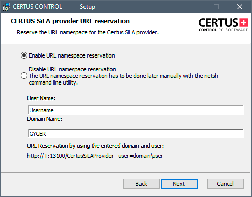{ .img-medium .on-glb width="350" height="350"}

You can choose between automatic and manual reservation.

A reservation is necessary to allow non-administrator users to access a specific URL name- space.

!!! note
    Once {{ variables.product.software.name.en }} is successfully installed, the Integration Manager symbol appears on the desktop: { .img-icon width="50" height="50"}

#### Activating the license

For the integration with laboratory automation, a license file is required.

!!! note
    
    * The license file to control {{ variables.product.name.en}} is closely coupled with the hardware of the PC on which **{{ variables.product.software.name.en }}** is installed. 
    
    * If the PC or its hardware is replaced, a new license should be requested.

Once **{{variables.product.software.name.en }}** is installed, the following steps should be taken:

_**A. Creating a license template**_

1. Double-click the Integration Manager symbol on the desktop.
      * Now the symbol appears in the taskbar.
        
        { .on-glb }

2. Double-click the Integration Manager symbol in the taskbar.
      * The CERTUS Integration Manager opens.
3.  Click Licence Template and send the XML file along with the serial number of the base unit to [service@nnano.com](mailto:service@nnano.com) 
    (The license file will be delivered by the technical staff.)

    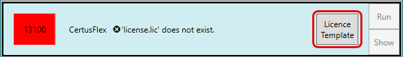{ .on-glb }

    * Delivery of the license file (after one working day at the latest)

!!! note
    For testing purposes, the integration can be executed as a simulation. You do not need a license or {{ variables.product.name.en }} for that.

_**B. Installing the license file**_

1.  Save the license file in:*%ProgramData%\\Gyger\\{{ variables.product.software.name.en }}\\lic*.
2.  Start the {{ variables.product.software.name.en }} Integration Manager (using the symbol in the taskbar).
    
    * The license is activated and the Licence Template option is no longer visible.

!!! note
    The license file can be renamed and moved. For support, please contact your distributor.

_**C. Restart**_

1. Restart the PC to complete the installation.
    
    * The {{ variables.product.software.name.en }} symbol appears on the desktop.

!!! note
    For a new installation on another PC, a new license file is needed. Please contact us by e-mail at service@nnano.com to request a new license file.

### Additional information 

#### Reserve URL namespace

**Reserve Certus SiLAprovider URL**

The {{ variables.product.software.name.en }} installer reserves the Certus SiLA provider URL with the default port **13100** (`url=http://+:13100/CertusSiLAProvider`).

The reservation can also be done manually with the netsh command line utility. Per default Certus SiLA provider runs on port 13100.

The Certus SiLA provider runs on port `13100` by default.

The following example reserves the URL namespace for the CERTUS SiLA provider on port **13100**:

1.  Open the command prompt as administrator.
2.  Type: `*netsh http add urlacl url=http://+:13100/CertusSiLAProvider user= domain \ user`
    
    **Note**: Replace **domain** and **user** with the actual values.
    
3.  Confirm with **Enter**.

**Reserve event receiver URL**

This command has to be executed on the PC where the scheduler software runs. 

For port number and event receiver URL ask your scheduling software provider.

1.  Open the command prompt as administrator.
2.  Type: `netsh http add urlacl *url=http://+:PortNumber / EventReceiverURI user=[domain]\\[user]`
    
    **Note**: Replace **PortNumber**, **EventReceiverURI**, **domain**, and **user** with the actual values.

3.  Confirm with **Enter**.

**Checking Access to the CERTUS SiLA Provider**

1.  Enter [(http://localhost:13100/CertusSilAProvider?wsdl)](http://localhost:13100/CertusSilAProvider?wsdl) in your browser.

    !!! note
        The URL can be used if the SiLA provider and browser are installed on the same computer. 

    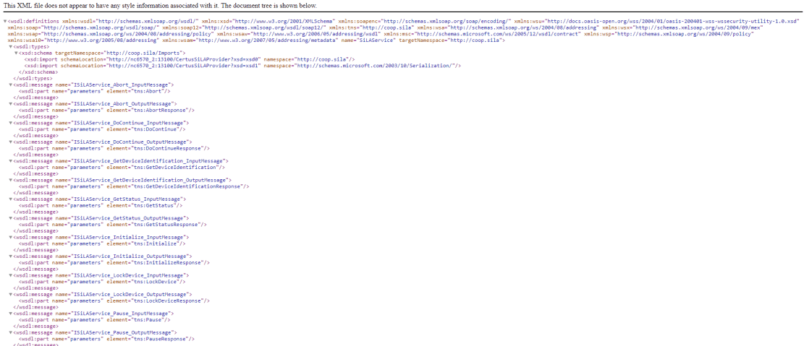{ .on-glb }
    
* SiLA provider's WSDL is shown.

* CERTUS SiLA can only be used in conjunction with PMS.

**Starting/stopping the SiLA provider**

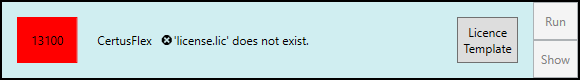

|                                                                                           |               |     |                                         |                                                                         |
| ----------------------------------------------------------------------------------------- | ------------- | --- | --------------------------------------: | ----------------------------------------------------------------------- |
| { .img-icon width="80" height="80"}               | active        |     |                 stops the SiLA provider | { .img-icon width="80" height="80"} |
| { .img-icon width="80" height="80"} | status change |     | opens a maintenance window for the host | { .img-icon width="80" height="80"} |
| { .img-icon width="80" height="80"}           | inactive      |     |                starts the SiLA provider | { .img-icon width="80" height="80"}   |

## Logging on

### Logging on as an Administrator

When you log on for the first time to the user profile management, you need to have a predefined user profile with administrator rights:

|           |       |
| --------- | ----- |
| User name | Admin |
| Password  | admin |

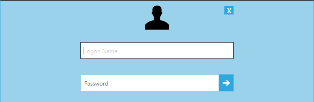{ .img-medium .on-glb width="450" height="450"}

!!! note "Note: Unauthorized admin access"
    
    After you log in as “Admin” for the first time, you should immediately change your password “admin” to prevent unauthorized access to the admin account.
    
    ► After log-in: **Users** > Double-click the administrator > **Edit User**.
    
    ► Replace the password **admin** with a new one and confirm with **Save**.

!!! note
    More information on *Users* and the creation and edition of other user accounts can be found in the section, see [Users](#users).

### Logging onto the Simulation Mode

If no {{variables.product.name.en }} is available or you give up hardware control, the simulation mode is used.

A simulation can be started as follows:
    
* In the start menu, select *{{ variables.product.software.name.en }} Simulation* and press **ENTER**.
    
* After you log on, select the desired dispensing head.

## Overview -- Start Menu

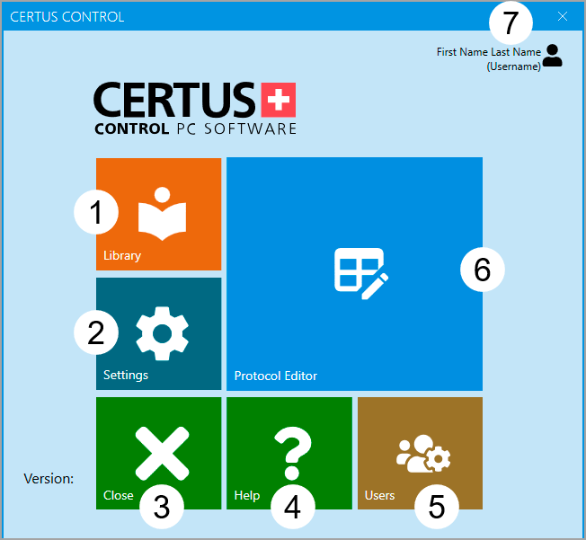{ .img-medium .on-glb width="450" height="450"}

| #   |                                                                                          | Item                | Description                                                                                              |
| --- | ---------------------------------------------------------------------------------------- | ------------------- | -------------------------------------------------------------------------------------------------------- |
| 1   | {width="70" height="70"}                 | **Library**         | Edit measures and software functions. See [Library](#library)                                            |
| 2   | {width="70" height="70"}               | **Settings**        | Manage and calibrate fluids, micro valves, and well plates. See [Settings](#settings)                    |
| 3   | {width="70" height="70"}                     | **Close**           | Close the software.                                                                                      |
| 4   | {width="70" height="70"}                       | **Help**            | View the license agreement, documentation, and system information, and create backups. See [Help](#help) |
| 5   | {width="70" height="70"}                       | **User**            | Edit user data. See [Users](#users)                                                                      |
| 6   | {width="70" height="70"} | **Protocol Editor** | Create and execute experiments. See [Protocol Editor](#protocol-editor)                                  |
| 7   | 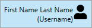{width="70" height="70"}       | **Current User**    | Shows the current user's name.                                                                           |

## Library

{width="75" height="75"}

In the **Library** menu, you can manage all fluids, micro valves, well plates, and calibrations for an experiment. Next, you go to *Protocol Editor.* When you click *Library* in the start menu, a separate window (*Library Manager*) opens.

!!! note
    Before you can start an experiment, all data, if they are not available yet, should be acquired in Library Manager.

**Symbols in use**

| Icons                                                                            | Description                                                                                   |     |
| -------------------------------------------------------------------------------- | --------------------------------------------------------------------------------------------- | --- |
| {width="32" height="32"}                     | **Title bar**: Saves the change and closes the window. Active only if a change has been made. |     |
| {width="32" height="32"}             | Setting predefined by the manufacturer.                                                       |     |
| {width="32" height="32"} | Active element that has been temporarily loaded.                                              |     |

### Menu bar

{ .on-glb width="550" height="450"}

| #   | Menu       | Function               | Description                                                                                                                                              |
| --- | ---------- | ---------------------- | -------------------------------------------------------------------------------------------------------------------------------------------------------- |
| 1   | **Editor** | Save and quit          | Saves the changes and closes the windows.                                                                                                                |
|     |            | Quit                   | Closes the window.                                                                                                                                       |
| 2   | **Export** | Export to file         | Exports fluids, valves, calibrations, plates to a file according the selected file format. The ".calibration" file will also include the related fluids. |
| 3   | **Import** | Import from file       | Import fluids, valves, calibration, plates from a file.                                                                                                  |
|     |            | Legacy V1 Fluids       | Imports fluids from a v1 configuration file[^*].                                                                                                         |
|     |            | Legacy V1 Valves       | Imports valves from a v1 configuration file[^*].                                                                                                         |
|     |            | Legacy V1 Plates       | Imports plates from a v1 configuration file[^*].                                                                                                         |
|     |            | Legacy V1 Calibrations | Imports calibrations from a v1 configuration file[^*].                                                                                                   |

[^*]: v1-configuration file: Gyger.Certus.CoreService.config.xml

### Fluid

All fluids are defined here:

{ .on-glb width="550" height="450"}

**Input area**

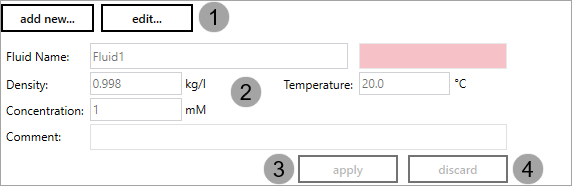{ .on-glb }

| #   | Field           | Description                                                 |
| --- | --------------- | ----------------------------------------------------------- |
| 1   | *add new*       | Add a new fluid                                             |
|     | *edit*          | Edit a fluid (first select a fluid)                         |
| 2   | *Fluid Name*    | Fluid name                                                  |
|     | *Density*       | Fluid density                                               |
|     | *Concentration* | Molar concentration of the fluid                            |
|     | *Color*         | Color identification of the fluid (from the palette or RGB) |
|     | *Comment*       | Comment on the fluid (e.g., composition)                    |
|     | *Temperature*   | Fluid temperature                                           |
| 3   | *apply*         | Confirm changes made                                        |
| 4   | *discard*       | Discard changes made                                        |

!!! note
    Units of fluid features can be adjusted in Settings. For more information see.

**Context menu**

When you right-click selected fluid, a context menu with more commands opens.

|                  |     |                                                |
| ---------------- | --- | ---------------------------------------------- |
| *Make permanent* |     | Switch the fluids from temporary to permanent. |
| *Delete*         |     | Delete the selected fluids.                    |
| *Export...*      |     | Export the selected fluids.                    |

### Valve

It is where all micro valves are managed:

#### Symbols in use

|                                                                     |                                       |
| ------------------------------------------------------------------- | ------------------------------------- |
| {width="32" height="32"} | Information (legend for micro valves) |
                                   

{ .on-glb width="550" height="450"}

#### Input area

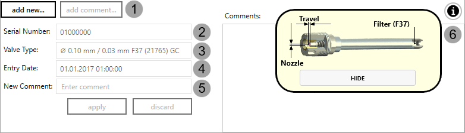{ .on-glb }

| #   | Field           | Description                                                                                                                               |
| --- | --------------- | ----------------------------------------------------------------------------------------------------------------------------------------- |
| 1   | *add new*       | Activates the text box for a new serial number                                                                                            |
|     | *add comment*   | A new comment can be added to the comment section                                                                                         |
| 2   | *Serial Number* | Text box for the serial number of a micro valve                                                                                           |
| 3   | *Valve Type*    | The valve type will be displayed by typing the serial number with the following order: Nozzle diameter / Travel (Filter) (product number) |
| 4   | *Entry Date*    | Entry date for the newly added micro valve                                                                                                |
| 5   | *New Comment*   | New comment to be attached to the comment section                                                                                         |
| 6   | *Info (i)*      | Visualization of a micro valve with labels                                                                                                |

!!! note
    Click on **HIDE** to hide the image.

#### Context area

Right-click the selected micro valves to open a context menu with more commands.

|                  |                                                      |
| ---------------- | ---------------------------------------------------- |
| *Make permanent* | Switch the micro valves from temporary to permanent. |
| *Delete*         | Delete the selected micro valves.                    |
| *Export...*      | Export the selected micro valves.                    |

### Well Plate

It is where all well plates are defined:

#### Symbols in use

|                                                                        |                        |
| ---------------------------------------------------------------------- | ---------------------- |
| {width="32" height="32"} | Warning about settings |

#### Well plate – definitions

{width="550" height="450"}

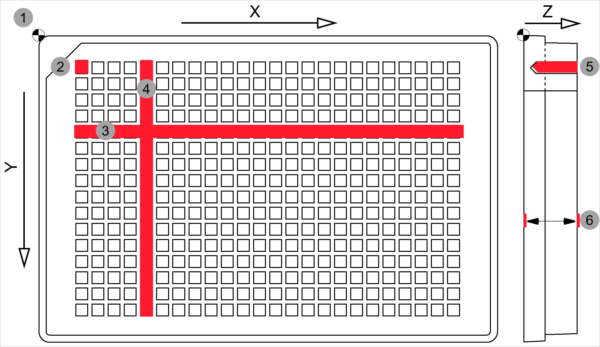{width="550" height="450"}

| #   | Term           | Definition                          |
| --- | -------------- | ----------------------------------- |
| 1   | *Reference*    | Reference point of the unit         |
| 2   | *Well*         | Single well plate cavity            |
| 3   | *Row (X)*      | Row across the entire well plate    |
| 4   | *Column (Y)*   | Column across the entire well plate |
| 5   | *Well Volume*  | Maximum well volume                 |
| 6   | *Plate height* | Well plate                          |

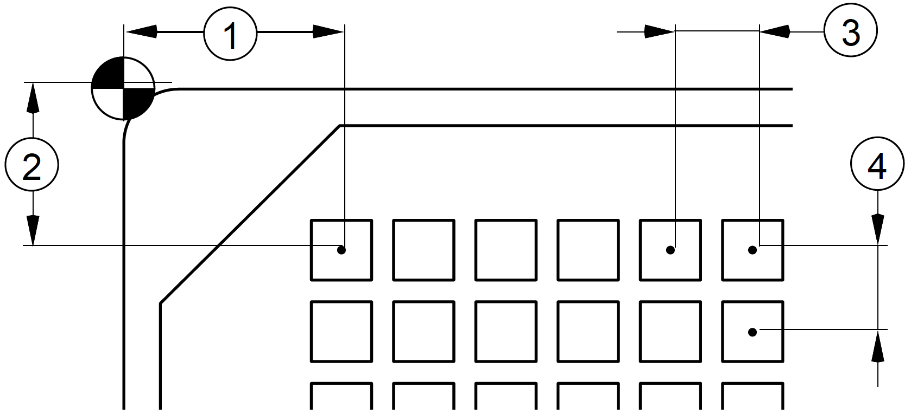{width="550" height="450"}

| #   | Term         | Definition                                                         |
| --- | ------------ | ------------------------------------------------------------------ |
| 1   | *Offset (X)* | Horizontal distance between the reference point and the first well |
| 2   | *Offset (Y)* | Vertical distance between the reference point and the first well   |
| 3   | *Pitch (X)*  | Horizontal distance between two wells                              |
| 4   | *Pitch (Y)*  | Vertical distance between two wells                                |

#### Input area

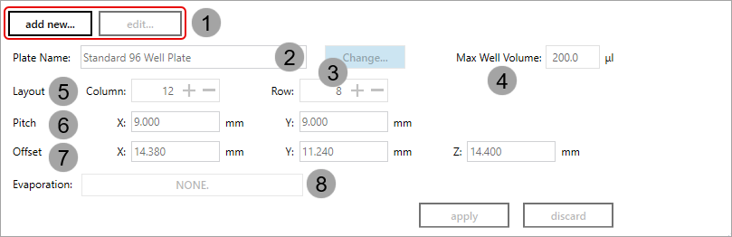{width="550" height="450"}

| #   | Field         |      | Description                                                            |
| --- | ------------- | ---- | ---------------------------------------------------------------------- |
| 1   | *add new*     |      | Add a new well plate                                                   |
|     | *edit*        |      | Edit a well plate (select it first)                                    |
| 2   | *Plate Name*  |      | Well plate name                                                        |
| 3   | *Color*       |      | Color identification of the well plate (palette or RGB)                |
| 4   | *Well Volume* |      | Maximum well volume                                                    |
| 5   | *Layout*      | Col: | Number of wells in a column (vertical)                                 |
|     |               | Row: | Number of wells in a row (horizontal)                                  |
| 6   | *Pitch*       | X:   | Distance between two wells in the X direction (horizontal)             |
|     |               | Y:   | Distance between two wells in the Y direction (vertical)               |
| 7   | *Offset*      | X:   | Distance to thefirst (upper left) well in the X direction (horizontal) |
|     |               | Y:   | Distance to the first (upper left) well in the Y direction (vertical)  |
|     |               | Z:   | Well plate height                                                      |
| 8   | Evaporation   |      | Optional use of an evaporation curtain                                 |
|     |               |      | Clicking **NONE** opens EDIT EVAPORATION CURTAIN.                      |

#### Context menu

Right-clicking the selected well plates opens a context menu with more commands.

|                  |                                                     |
| ---------------- | --------------------------------------------------- |
| *Make permanent* | Switch the well plates from temporary to permanent. |
| *Delete*         | Delete the selected well plates.                    |
| *Export...*      | Export the selected well plates.                    |

### Evaporation Curtain

!!! note
    An evaporation curtain is used to reduce evaporation deviations, also called edge effects, in border wells due to external factors such as ambient temperature.

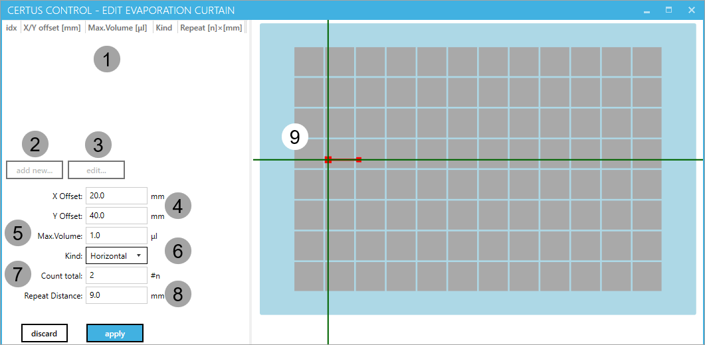{width="750" height="650"}

|     |                  |                                                                          |
| --- | ---------------- | ------------------------------------------------------------------------ |
| 1   | Evaporation list | List defined dispensing rows in this evaporation curtain                 |
| 2   | add new          | Add a new dispensing position                                            |
| 3   | edit             | Edit the dispensing position                                             |
| 4   | X Offset         | Horizontal distance between the reference point and the dispensing point |
|     | Y Offset         | Vertical distance between the reference point and the dispensing point   |
| 5   | Max. Volume      | Maximum volume of the evaporation zone                                   |
| 6   | Single           | Single dispensing                                                        |
|     | Horizontal       | Dispensations in the horizontal direction                                |
|     | Vertical         | Dispensations in the vertical direction                                  |
| 7   | Count total      | Number of dispensations in the relevant direction                        |
| 8   | Repeat Distance  | Distance between repeat dispensations                                    |
| 9   | Preview          | View dispensing positions for the evaporation zone                       |

#### Context menu

Right-clicking a dispensing row opens a context menu with more commands.

|                    |                                         |
| ------------------ | --------------------------------------- |
| Move-UP            | Move a dispensing point up              |
| Move-DOWN          | Move a dispensing point down            |
| Delete Evaporation | Delete a dispensing point from the list |

### Calibration

Viewing and managing all calibrations.

#### Symbols in use

| Symbol                                                                     | Description                                                                      |
| -------------------------------------------------------------------------- | -------------------------------------------------------------------------------- |
| {width="32" height="32"} | Flags calibrations which use a fluid that is currently missing from the library. |

!!! note

    Right-clicking a calibration opens the CERTUS VIEW CALIBRATION window. It shows individual calibration points, data, and curves. You cannot change them. For more information see [CERTUS Calibrator](#certus-calibrator).

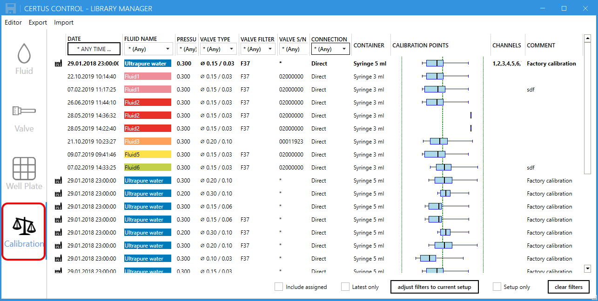{width="750" height="650"}

#### Filtering Possibilities

Filters can be used to partially reduce the number of all calibrations. Calibrations can be filtered by date (*Date*), fluid name (*Fluid name*), pressure (*Pressure*), micro valve type (*Valve Type*), micro valve filter (*Valve Filter*), micro valve serial number (*Valve S/N*), and connection (*Connection*).

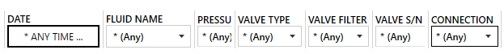{ .img-medium .on-glb width="750" height="650"}

#### Input area

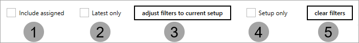{ .img-medium .on-glb width="750" height="650"}

| #   | Description                                                      |
| --- | ---------------------------------------------------------------- |
| 1   | Include calibrations assigned to the current dispensing head     |
| 2   | Show only the latest calibrations of each setup                  |
| 3   | List only calibrations suitable for the current dispensing head  |
| 4   | Show what calibrations are used with the current dispensing head |
| 5   | Delete all filters                                               |

#### Context menu

Right-clicking the selected calibrations opens a context menu with more commands.

| Action           | Description                                                   |
| ---------------- | ------------------------------------------------------------- |
| *Make permanent* | Switch the calibrations from temporary to permanent.          |
| *Delete*         | Delete the selected calibrations.                             |
| *Export...*      | Export the selected calibrations including the related fluids |
| *View...*        | Open a window showing calibration details.                    |

## Settings

{width="100" height="100"}

The *Settings* menu enables to customize {{variables.product.software.name.en }} or define general default values.

### Default Values

The default values of the measures and laboratory balances used are defined here.

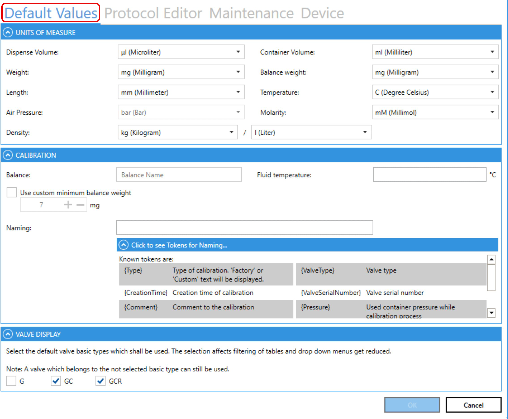{ .img-medium .on-glb width="750" height="650"}

!!! note
    Changes in the measures are automatically updated and the values entered converted accordingly.

#### Calibration

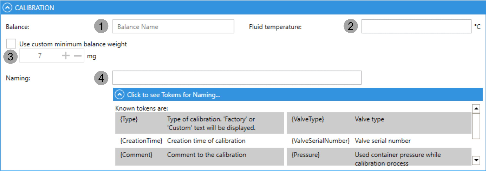{ .img-medium .on-glb width="750" height="650"}

| #   | Item              | Description                                                                                                                    |
| --- | ----------------- | ------------------------------------------------------------------------------------------------------------------------------ |
| 1   | Balance           | Define the default value of the balance name                                                                                   |
| 2   | Fluid temperature | Define the default value of fluid temperature                                                                                  |
| 3   | Minimum weight    | The dispensing weight during calibration (for laboratory balances with a rough reading accuracy)                               |
| 4   | Naming            | Defines the name of the calibration with tokens. It will be displayed in the channel configuration inside the protocol editor. |
|     |                   | See [Adjust the Calibration name](operations.md#adjust-the-calibration-name)                                                   |

#### Valve Display

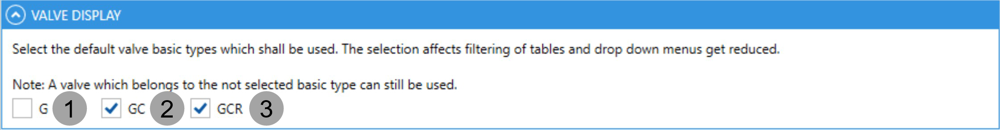{width="750" height="650"}

| #   | Valve Type     | Description                              |
| --- | -------------- | ---------------------------------------- |
| 1   | Valve type G   | Will be shown in the Library if selected |
| 2   | Valve type GC  | Will be shown in the Library if selected |
| 3   | Valve type GCR | Will be shown in the Library if selected |

!!! note
    The valve types can also be selected in the Library Manager. For Information about the different micro valve types, please contact your distributor.

### Protocol Editor

The settings of the *Protocol Editor* are defined here.

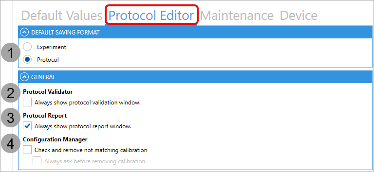{ .img-medium .on-glb width="750" height="650"}

| #   | Setting               | Description                                   |
| --- | --------------------- | --------------------------------------------- |
| 1   | Default saving format | Storage format (.expt/.protocol)              |
| 2   | Protocol Validator    | Show/hide the protocol inspection window      |
| 3   | Protocol Report       | Show/hide the protocol reporting window       |
| 4   | Configuration Manager | Check and remove non-matching calibration  |
|     |                       | Always ask before removing calibration        |

!!! note
    * **expt**: contains *Configuration* and *Protocol*
    * **protocol**: contains only *Protocol*

### Maintenance

Various maintenance settings are defined here.

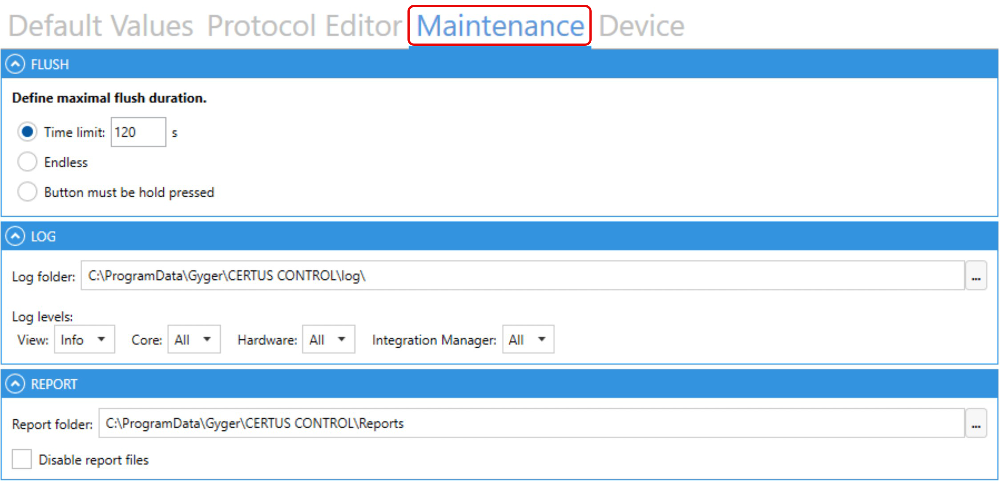{ .img-medium .on-glb width="750" height="650"}

#### Flush

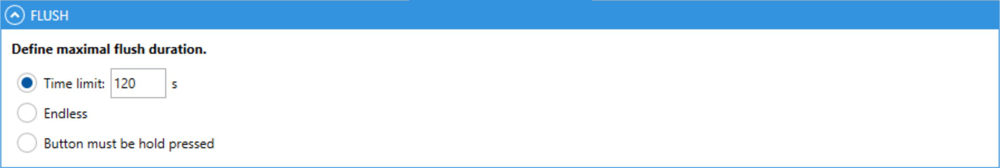{ .img-medium .on-glb width="750" height="650"}

|                               |                                                                       |
| ----------------------------- | --------------------------------------------------------------------- |
| *Time limit*                  | Define the maximum duration of a flush command                        |
| *Endless*                     | The flush command is executed until the stop button is pressed        |
| *Button must be hold pressed* | The flush command is executed until the stop button is released again |

#### Log

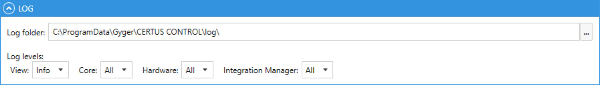{ .img-medium .on-glb width="750" height="650"}

|              |                                                                                                                                     |
| ------------ | ----------------------------------------------------------------------------------------------------------------------------------- |
| *Log folder* | Define a customized path for log files. Default: `C:\ProgramData\Gyger\CERTUS CONTROL\log`                                          |
| *Log levels* | Define a log level for each software module (*View*, *Core*, *Indel*, or SiLA). Levels: *All*, *Info*, *Warn* (sorted by priority). |

#### Report

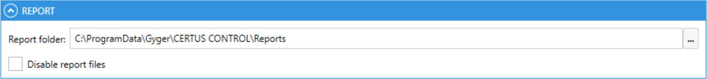{ .img-medium .on-glb width="750" height="650"}

|                        |                                           |
| ---------------------- | ----------------------------------------- |
| *Report folder*        | Define a customized path for report files |
| *Disable report files* | Disable report file settings              |

### Device

Various device settings are defined here.

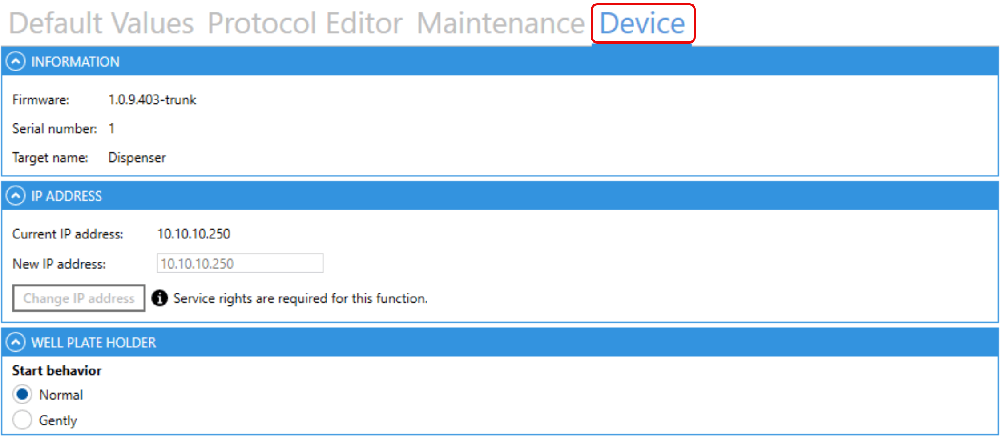{ .img-medium .on-glb width="750" height="650"}

#### Information

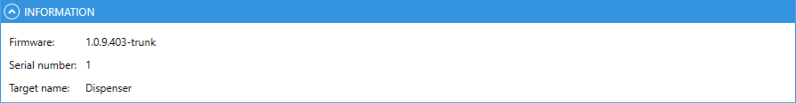{ .img-medium .on-glb width="750" height="650"}

| **Item**        | **Description**                                  |
| --------------- | ------------------------------------------------ |
| *Firmware*      | The currently installed {{ variables.product.name.en }} firmware.    |
| *Serial Number* | The serial number of the {{ variables.product.name.en }}.            |
| *Target Name*   | Name used for communication with CERTUS CONTROL. |

!!! note
    The IPaddress can only be changed as a user with service rights!

#### IP Address

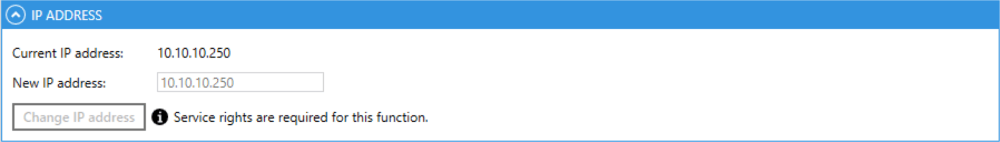{width="750" height="650"}

| Setting              | Description               |
| -------------------- | ------------------------- |
| *Current IP Address* | IP address currently used |
| *New IP Address*     | Defines a new IP address  |
| *Change IP*          | Set a new address         |

!!! note
    The IP address can only be changed by a user with support rights!

#### Well Plate Holder

Here the acceleration ramp of the well plate holder can be selected. To use this feature, the following requisites are required:

|                                         |                             |
| --------------------------------------- | --------------------------- |
| *{{ variables.product.software.name.en }}* | Version 2.1.15 or higher    |
| *{{ variables.product.name.en }} Firmware* | Version 1.0.9.403 or higher |

!!! note
    {{ variables.product.software.name.en }} 2.1.15 can also be used with an older firmware version. However, in this case this feature is not available.

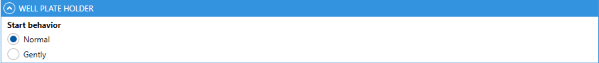{ .img-medium .on-glb width="750" height="650"}

|        |                                                                                                           |
| ------ | --------------------------------------------------------------------------------------------------------- |
| Normal | Normal acceleration of the well plate holder.                                                             |
| Gently | Slow acceleration of the well plate holder. The well plate is always clamped during a pre-dispense phase. |

## Help

{width="100" height="100"}

In the Help menu, you will find help on the program. In addition, the user manual in PDF format is available here.

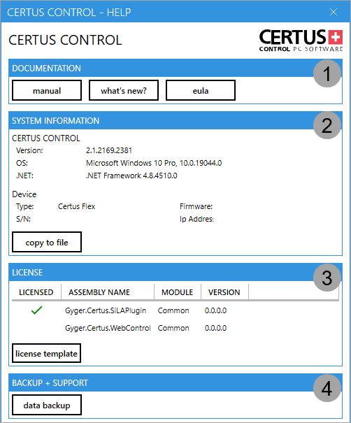{width="450" height="350"}

| #   | Item                 | Description                                                |
| --- | -------------------- | ---------------------------------------------------------- |
| 1   | *Documentation*      | Access documentation resources                             |
|     | *manual*             | Open this user manual                                      |
|     | *what's new?*        | Overview of {{ variables.product.software.name.en }} releases |
|     | *eula*               | End user license contract                                  |
| 2   | *System Information* | Software and hardware information                          |
|     | *copy to file*       | Export information as an XML file                          |
| 3   | *License*            | License overview                                           |
| 4   | *Backup + Support*   | Backup and support                                         |
|     | *data backup*        | Create a backup of all software related data               |

## Users

{width="100" height="100"}

In the *Users* menu, you can create new users or manage existing ones. {{ variables.product.software.name.en }} differentiates between three user levels: *Operator*, *Administrator* and *Service*.

!!! note
    You can only make changes to your own user details or those of users with lower user rights.

### Symbols in use

|                                                              |                                                                                                          |
| ------------------------------------------------------------ | -------------------------------------------------------------------------------------------------------- |
| {width="32" height="32"} | **Title bar**: Clicking saves the change and closes the window. (Active only if a change has been made.) |

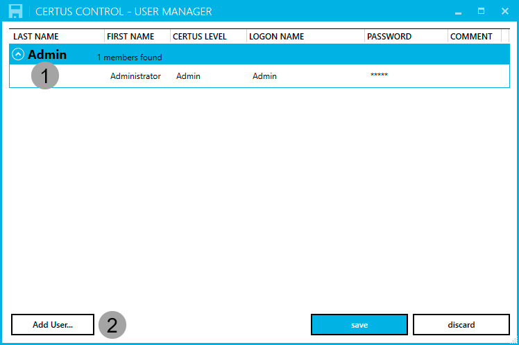{ .img-medium .on-glb width="550" height="550"}

| #   | Item          | Description                     |
| --- | ------------- | ------------------------------- |
| 1   | *Admin*       | Listing by user rights          |
| 2   | *Add User...* | Open a window to add a new user |

### Context menu

Right-clicking the listed user opens a context menu with more commands.

|               |                 |
| ------------- | --------------- |
| *Edit User*   | Edit user data  |
| *Delete User* | Delete the user |
| *Add User*    | Add a new user  |

### Adding Users

#### Logon through manual registration

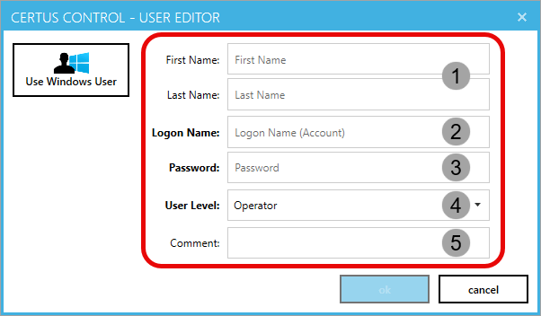{ .img-medium .on-glb width="550" height="550"}

| #   | Field        | Description                                   |
| --- | ------------ | --------------------------------------------- |
| 1   | *First Name* | User's first name                             |
|     | *Last Name*  | User's last name                              |
| 2   | *Logon Name* | Logon name                                    |
| 3   | *Password*   | User password                                 |
| 4   | *User Level* | Define the user level                         |
|     | *None*       | Disable the user account                      |
|     | *Operator*   | User with restricted access (predefined only) |
|     | *Admin*      | User with administrator rights                |
|     | *Service*    | For support staff only                        |
| 5   | *Comment*    | (Optional) Comment on the user account        |

#### Logon as a Windows User

When you log on as a Windows user, the user name and password of the current PC account is used to log on to CERTUS CONTROL. This helps the user log on faster.

!!! note
    As the user has already been authenticated by logging on to Windows, no {{ variables.product.software.name.en }} logon is required.

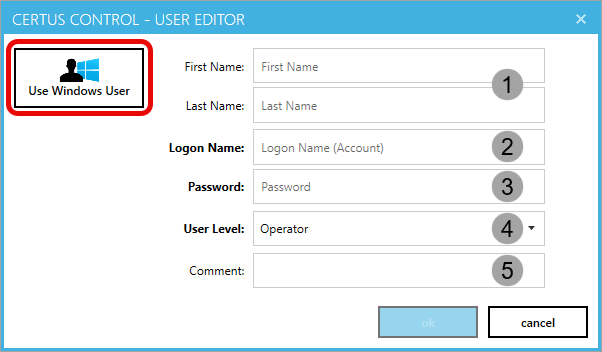{ .img-medium .on-glb width="550" height="550"}

#### Selecting users or groups

Clicking *Use Windows User* opens Window's *Directory Object Picker* Dialog. This dialog enables to select which Windows user is to be used.

!!! note
    When {{ variables.product.software.name.en }} is started next time, the software automatically uses the user account. 

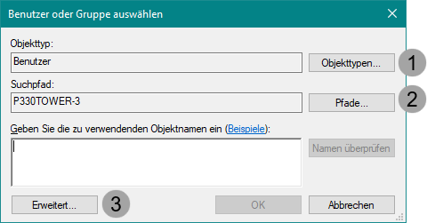{ .img-medium .on-glb width="550" height="450"}

| #   | Description                                |
| --- | ------------------------------------------ |
| 1   | Group or/and user                          |
| 2   | Search path (where should it be searched?) |
| 3   | Extended search settings                   |

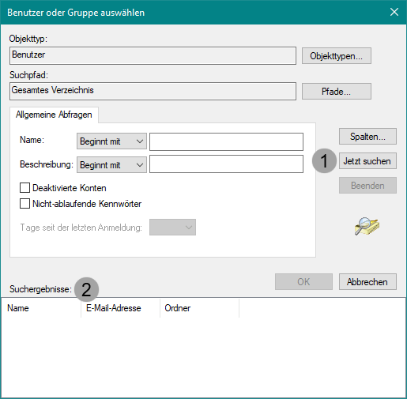{ .img-medium .on-glb width="450" height="350"}

| #   | Description                    |
| --- | ------------------------------ |
| 1   | Start search for Windows users |
| 2   | List Windows users found       |

* Select the desired user from the list and click **OK** to confirm.
    * The extension window is closed and user data are accepted.
* Confirm once again with **OK**.
    * The window is closed and user data (logon name and password) are imported into *USER EDITOR*.
* Where necessary, adjust the name and surname and define the user level.
    * Clicking OK creates a user, which is then listed in *USER MANAGER*.
    * The Windows user was successfully added.

## Protocol Editor

{ .img-medium .on-glb width="100" height="100"}

Clicking *Protocol Editor* in the start menu opens the *Protocol Editor* window. Experiments are prepared and executed in *Protocol Editor*.

!!! note
    Before you can start an experiment, all basic data (fluid, micro valve, well plate) has to be included in the library.

### Symbols in use

| Icons                                                                                | Description                                                                                              |
| ------------------------------------------------------------------------------------ | -------------------------------------------------------------------------------------------------------- |
| { .img-icon width="32" height="32"}         | **Title bar**: Clicking saves the change and closes the window. (Active only if a change has been made.) |
| { .img-icon width="32" height="32"} | **Title bar** (Quick Access): Opens a new protocol                                                       |

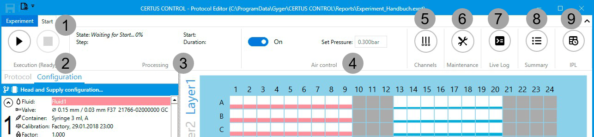{ .img-medium width="750" height="450"}

| #   | Item          | Description                                                              |
| --- | ------------- | ------------------------------------------------------------------------ |
| 1   | *Experiment*  | Clicking the Experiment tab opens the backstage view                     |
| 2   | *Execution*   | Execute, stop, and pause the experiment                                  |
| 3   | *Processing*  | Show the current execution status                                        |
| 4   | *Air control* | Switch on and off compressed air                                         |
| 5   | *Channels*    | Open Configuration Manager                                               |
| 6   | *Maintenance* | Open Flyout Maintenance. Enable manual execution of dispensing commands. |
| 7   | *Live Log*    | Open Flyout Live Log. Enable text-based monitoring of processing.        |
| 8   | *Summary*     | Open an overview of the current experiment                               |
| 9   | *IPL*         | Open Flyout Interval Purge Loop                                          |

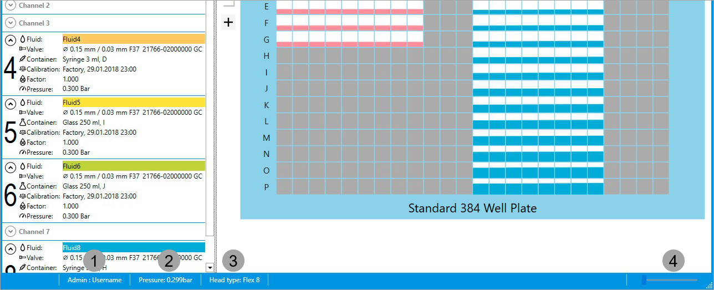{ .img-medium width="750" height="450"}   

| #   | Description                                    |
| --- | ---------------------------------------------- |
| 1   | Show the rights and name of the logged-on user |
| 2   | Show the compressed air in current use         |
| 3   | Show which dispensing head is connected        |
| 4   | Change the view zoom of the well plate         |

### Operating Principle

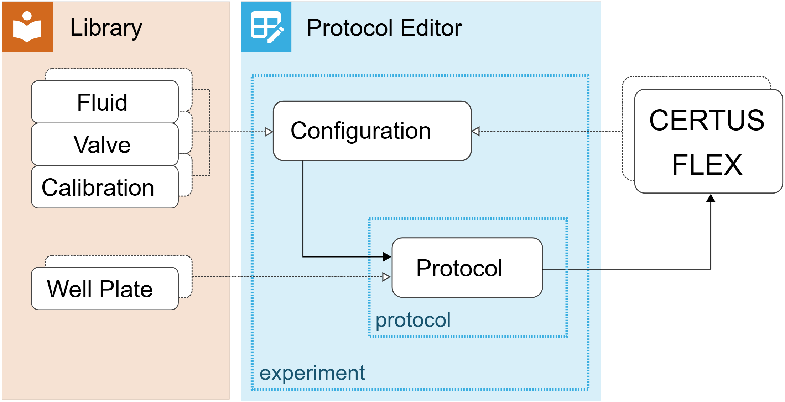{ .img-medium width="750", height="450"}

*Protocol Editor* sources its information in *Library*.

Information in *Configuration* should reflect {{ variables.product.name.en }} current status (such as fluid, connected channels, type of micro valve, and calibrations).

In *Protocol*, dispensing information and settings are defined (such as volume, well number, and fluid).

| File Type              | Description                                                                                                                                                                             |
| ---------------------- | --------------------------------------------------------------------------------------------------------------------------------------------------------------------------------------- |
| *experiment* (.expt)   | The experiment file consists of configuration and protocol parts. This format is suitable if you would like to repeat the same experiment with exactly the same configuration later on. |
| *protocol* (.protocol) | The protocol file consists of only the protocol part. No configuration data is saved. This format is suitable if you would like to start a protocol with various configurations.        |

### Experiment Menu

Clicking the *Experiment* tab brings you to the backstage view. Here you can save and open protocols and experiments, as well as enable the dispensing head view.

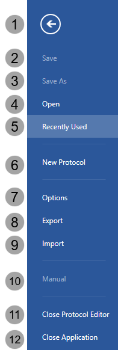{width="250", height="300"}

| #   | Item                                                                            |
| --- | ------------------------------------------------------------------------------- |
| 1   | Back to Protocol Editor                                                         |
| 2   | Save                                                                            |
| 3   | Save as (*.expt or *.protocol)                                                  |
| 4   | Open (*.expt or *.protocol)                                                     |
| 5   | Recently used files or folders (listed on the right)                            |
| 6   | Create a new protocol                                                           |
| 7   | Switch on and off the dispensing head view                                      |
|     | In the simulation mode, the following settings are available:                   |
|     | 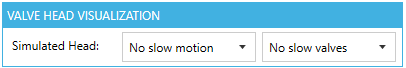{width="500", height="350"} |
|     | • Speed of the moving dispensing head (selection on the right)                  |
|     | • Dispensing speed (selection on the left)                                      |
| 8   | Export protocol to XML (SpreadsheetML 2003 format)                              |
| 9   | Import dosage volumes from CSV                                                  |
|     | The format of the csv file must correspond to the CERTUS CONTROL.               |
| 10  | Open the user manual                                                            |
| 11  | Close Protocol Editor                                                           |
| 12  | Close {{ variables.product.software.name.en }}                                     |

### Configuration

The Configuration tab shows the current channel configurations. The data used for that comes from the library. 

The defined channel configurations should reflect the current status of {{ variables.product.name.en }}, such as supply kits, fluid classifications, channel activations, etc.

#### Symbols in use

---

| Symbol                                                                                                                                                       | Description                                                                |
| ------------------------------------------------------------------------------------------------------------------------------------------------------------ | -------------------------------------------------------------------------- |
| {width="32" height="32"}                                                                         | Symbol standing for dispensing head configuration                          |
| {width="32" height="32"}                                                                                  | Symbol standing for supply configuration                                   |
| {width="32" height="32"}{width="32" height="32"} | Start/pause dispensing                                                     |
| {width="32" height="32"}                                                                                      | Stops dispensing                                                           |
| {width="32" height="32"}                                                                                         | Compatibility of all calibration properties with the channel configuration |
| {width="32" height="32"}                                                                                         | The volume factor is other than 1                                          |
| {width="32" height="32"}                                                                                       | Incompatible with the currently installed dispensing head                  |

---

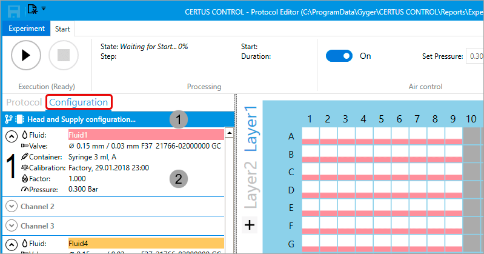{ .img-medium .on-glb width="750" height="550"} 

| #   | Item                               | Description                                                                                                       |
| --- | ---------------------------------- | ----------------------------------------------------------------------------------------------------------------- |
| 1   | *Head and Supply configuration...* | **Left-click**: Opens *Template Manager* (p. 102) for managing configuration templates.                           |
|     |                                    | **Right-click**: *Transfer configuration* (p. 161) for transferring configuration to other dispensing head types. |
|     |                                    | Management of dispensing head templates                                                                           |
| 2   | *Channel (#1)*                     | The channel overview provides information on configuration elements in use.                                       |

#### Context menu

Right-clicking *Channel* opens a context menu with more commands.

| Command         | Description                                        |
| --------------- | -------------------------------------------------- |
| *Edit Channels* | Edit channels. Opens Configuration Manager         |
| *Calibrate*     | Open the CERTUS Calibrator window for calibrations |
| *Verify*        | Verify the calibration                             |
| *Disable*       | Disable the channel                                |
| *Enable*        | Enable the channel (visible only when disabled)    |

### Template Manager

Clicking *Head and Supply configuration... Opens the *Template Manager* window. You can apply, save, and edit dispensing head templates here.

In principle, the dispensing head template consists of two parts:

1.  **Supply configuration**
    For each channel, it contains the assigned fluid, container, pressure, volume factor, and calibration.
2.  **Dispensing head configuration**
    For each channel, it contains the dispensing head (Flex8, Flex5, etc.) and the micro valve used, and informs if the channel is active.

!!! note
    A template may also contain only one of these parts. This can be defined when creating a dispensing head template.

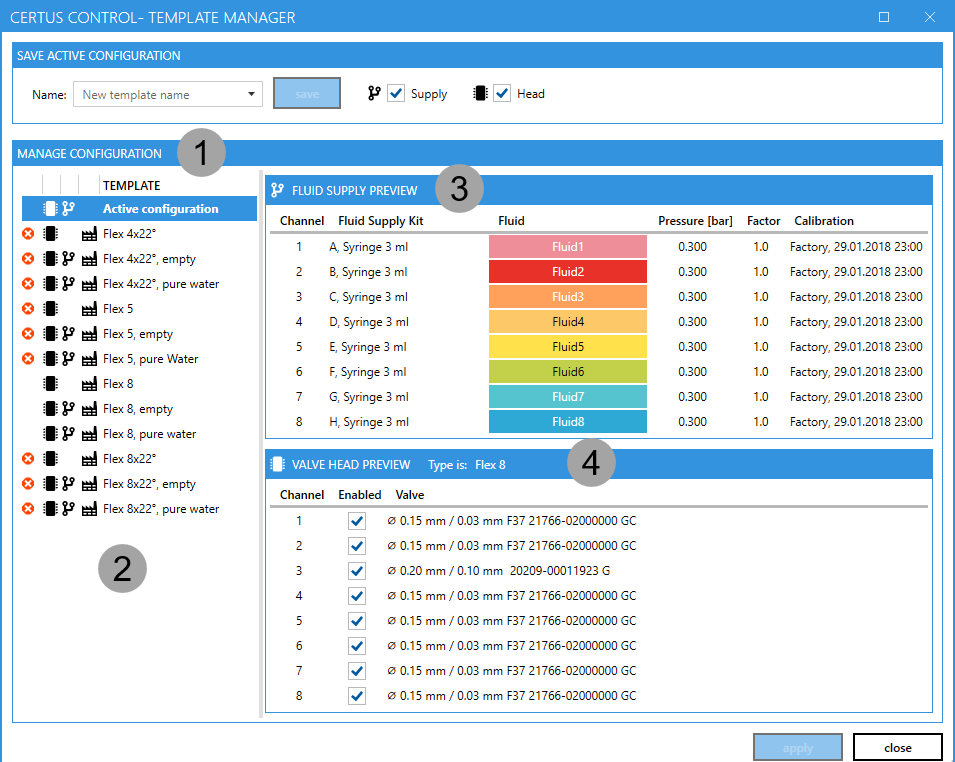{ .img-medium .on-glb width="750" height="550"} 

| #   | Item                        | Description                                   |
| --- | --------------------------- | --------------------------------------------- |
| 1   | *Save Active Configuration* | Save the currently active configuration       |
| 2   | *Templates*                 | List the saved dispensing head templates      |
| 3   | *Fluid Supply Preview*      | This template’s supply configuration          |
| 4   | *Valve Head Preview*        | This template’s dispensing head configuration |

#### Context menu

Right-clicking a Dispensing head template in the Template list opens a context menu with more commands.

| Command      | Description                                                                                                                   |
| ------------ | ----------------------------------------------------------------------------------------------------------------------------- |
| *Apply...*   | Apply the dispensing head template. [Using a Dispensing Head Template](operations.md#using-a-dispensing-head-template)        |
| *Rename*     | Rename the dispensing head template.                                                                                          |
| *Save as...* | Save a copy of the dispensing head template. [Copy the Configuration Template](operations.md#copy-the-configuration-template) |
| *Delete*     | Delete the dispensing head template. The active configuration as well as the factory templates cannot be deleted.         |

## CERTUS Calibrator

Right-click the channel under Configuration and select *Calibrate* to open the
*CERTUS Calibrator* window.

Here you can create calibrations to increase dispensing accuracy. For more information, see [Calibration](operations.md#calibration).

### Symbols in use
---

| Icon                                                                                   | Description                                                                          |
| -------------------------------------------------------------------------------------- | ------------------------------------------------------------------------------------ |
| {width="32" height="32"}                           | Flags the assigned calibration in the relevant channel                               |
| {width="32" height="32"}           | Calibration attribute incompatible with the relevant channel configuration attribute |
| {width="32" height="32"}           | Calibration successfully completed                                                   |
| {width="32" height="32"}           | Newly created calibration point does not lie within the tolerance range of +/- 5%    |
| {width="32" height="32"} | Marks a standard calibration point                                                   |
| {width="32" height="32"}            | Flags a customized calibration point (*! = most recently defined)                    |

---

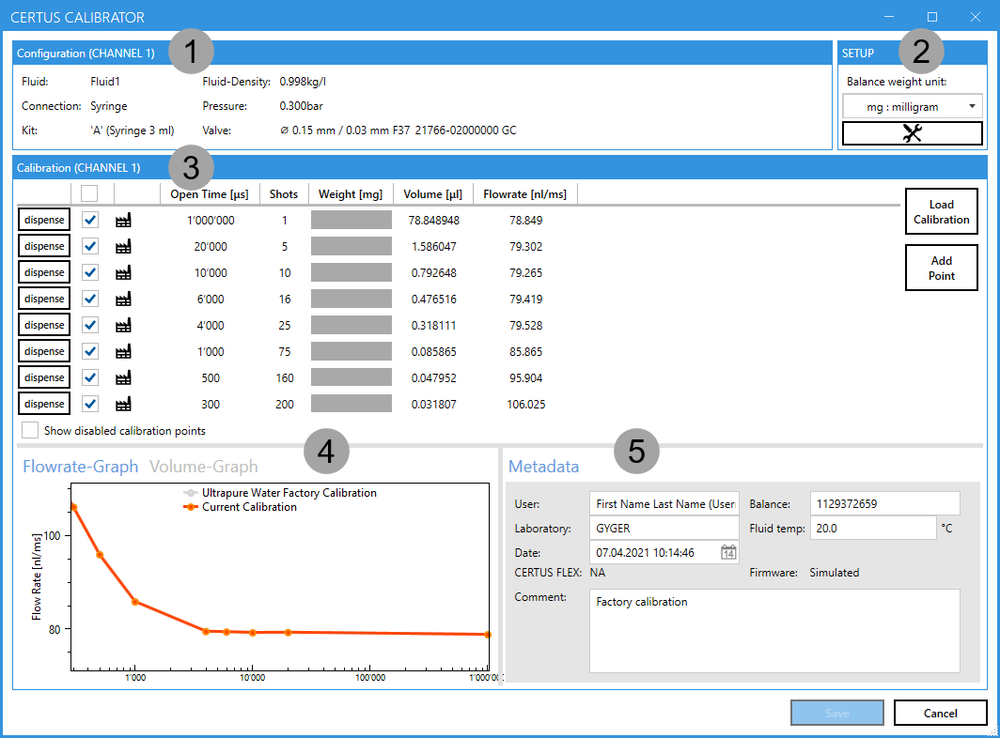{ .img-medium .on-glb width="750" height="350"}

| #   | Item            | Description                                               |
| --- | --------------- | --------------------------------------------------------- |
| 1   | *Configuration* | Overview of the current channel configuration             |
| 2   | *Setup*         | Open Flyout Maintenance (Fig. 61, p. 106)                 |
| 3   | *Calibration*   | Overview of calibration points (Fig. 62, p. 106)          |
| 4   | *Graph*         | Graphical representation of flow rate and volume (p. 106) |
| 5   | *Metadata*      | Calibration data (Fig. 65, p. 109)                        |

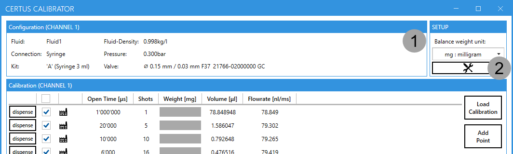{ .img-medium .on-glb width="750" height="350"}

| #   | Item                | Description                                                    |
| --- | ------------------- | -------------------------------------------------------------- |
| 1   | Balance weight unit | Set the currently used balance unit                            |
| 2   | Maintenance         | Open Maintenance Flyout for the flush and air ON/OFF functions |

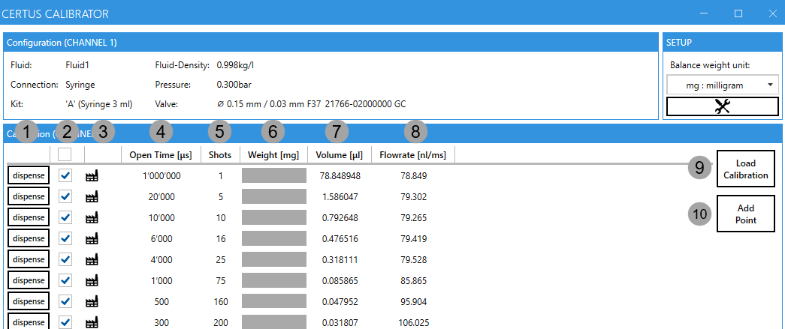{ .img-medium .on-glb width="650" height="450"}

| #   | Item/Action        | Description                                                                              |
| --- | ------------------ | ---------------------------------------------------------------------------------------- |
| 1   | *Dispense*         | Dispensing with a specified opening time and closing number                              |
| 2   | *Enable/Disable*   | Enabling/disabling of calibration points.                                                |
|     |                    | By selecting "Show disabled calibration points" the deactivated points are shown/hidden. |
| 3   | *Symbols*          | Tagging of standard and customer-specific calibration points                             |
| 4   | *Open Time*        | Valve opening time for this calibration point                                            |
| 5   | *Shots*            | Closing number with a specified opening time                                             |
| 6   | *Weight*           | Balance/measured weight of the dispensed quantity                                        |
| 7   | *Volume*           | Volume calculated from measured weight and density                                       |
| 8   | *Flowrate*         | Flow rate calculated from volume and opening time                                        |
| 9   | *Load Calibration* | Load calibration values from the library                                                 |
| 10  | *Add Point*        | Add a customized calibration value                                                       |

### Context menu

Right-click on a row with a calibration point opens the context menu enabling further commands.

| Command        | Description                                                                                                      |
| -------------- | ---------------------------------------------------------------------------------------------------------------- |
| Edit Volume... | Opens a menu for editing the volume. See [Calibration Point - Volume Editing](#calibration-point-volume-editing) |
| Delete Values  | Deletes calibration points. With the CTRL key pressed, multiple points can be selected.                          |

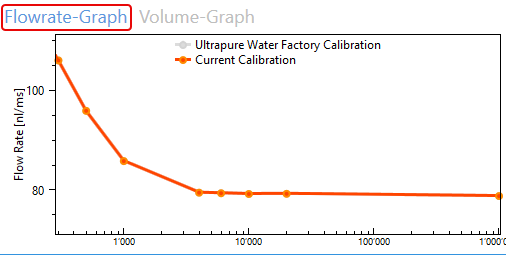{ .img-medium .on-glb width="650" height="450"}

| #   | Item        | Description              |
| --- | ----------- | ------------------------ |
| 1   | Flow rate   | Flow rate                |
| 2   | Open Time   | Micro valve opening time |
| 3   | Calibration | Calibration point        |

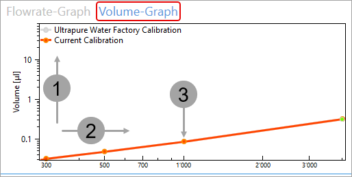{ .img-medium .on-glb width="650" height="450"}

| #   | Item        | Description              |
| --- | ----------- | ------------------------ |
| 1   | Volume      | Dispensed volume         |
| 2   | Open Time   | Micro valve opening time |
| 3   | Calibration | Calibration point        |

!!! note
    The graph can be zoomed in/outwith the mouse wheel and moved by holding down the right mouse button. See [Verification using the Graph](operations.md#verification-using-the-graph).

### Context menu

Right-click on a curve opens the following commands:

| Option               | Description                                                                                                                                                    |
| -------------------- | -------------------------------------------------------------------------------------------------------------------------------------------------------------- |
| *Show Factory*       | Enables/disables the display of the standard calibration curve (gray) for the corresponding current micro valve, supply kit, and ultrapure water as the media. |
| *Show Current*       | Enables/disables the display of the current calibration curve (orange).                                                                                        |
| *Linear Time Axis*   | Toggles the time axis scaling between logarithmic and linear.                                                                                                  |
| *Linear Volume Axis* | Toggles the volume axis scaling between logarithmic and linear.                                                                                                |
| *Reset Axis*         | Resets the graphs to default.                                                                                                                                  |

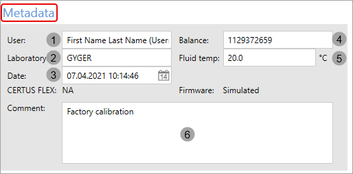{ .img-medium .on-glb width="650" height="450"}

| #   | Field      | Description                           |
| --- | ---------- | ------------------------------------- |
| 1   | User       | User name                             |
| 2   | Laboratory | Laboratory name                       |
| 3   | Date       | Date with time stamp                  |
| 4   | Balance    | Name of the laboratory balance used   |
| 5   | Fluid temp | Temperature of the calibrated fluid   |
| 6   | Comment    | (Optional) Comment on the calibration |

#### Calibration Point - Volume Editing

After selecting **Edit Volume** in the context menu of a calibration point (page 99), the *Calibration Point Volume Edit* window opens. Here the volume of the calibration point can be readjusted by entering the measured volume or a factor.

!!! note

    $$Factor = \frac{(V~Expected)}{(V~Measured)}$$
    
    → Hence + 1% corresponds with a factor of 1.010.

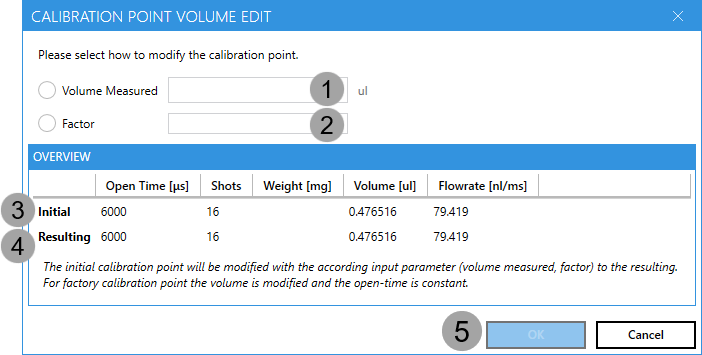{ .img-medium width="650" height="450"}

| #   | Field             | Description                                                 |
| --- | ----------------- | ----------------------------------------------------------- |
| 1   | *Volume Measured* | Entry of a measured volume.                                 |
| 2   | *Factor*          | Entry of a correction factor.                               |
| 3   | *Initial*         | The initial value of the calibration point to be corrected. |
| 4   | *Resulting*       | The calibration point resulting from the correction.        |
| 5   | *OK*              | Accepts the entered correction.                             |

#### Custom calibration by volume

Clicking **Add Values** opens the *Custom Calibration by Volume* window. Here you can calibrate a customized target volume.

See [Adding customized Calibration Points](operations.md#adding-customized-calibration-points)

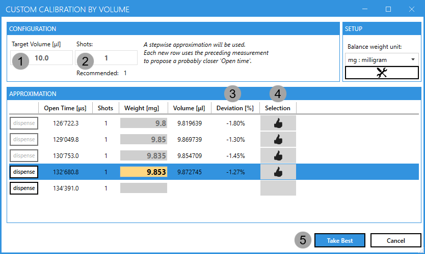{ .img-medium width="650" height="450"}

| #   | Field           | Description                                                                                          |
| --- | --------------- | ---------------------------------------------------------------------------------------------------- |
| 1   | *Target Volume* | Target volume for the calibration                                                                    |
| 2   | *Shots*         | Closing number                                                                                       |
| 3   | *Deviation*     | Deviation from the entered target volume                                                             |
| 4   | *Selection*     | Select the calibration point                                                                         |
| 5   | *Take Best*     | Select a calibration value with the lowest deviation (%), which is included in the calibration list. |

#### Calibration Selector

Clicking *Load Values* opens the *Calibration Selector* window. Here you can compare calibrations included in Library with those defined in the configuration and add them to the calibration list.

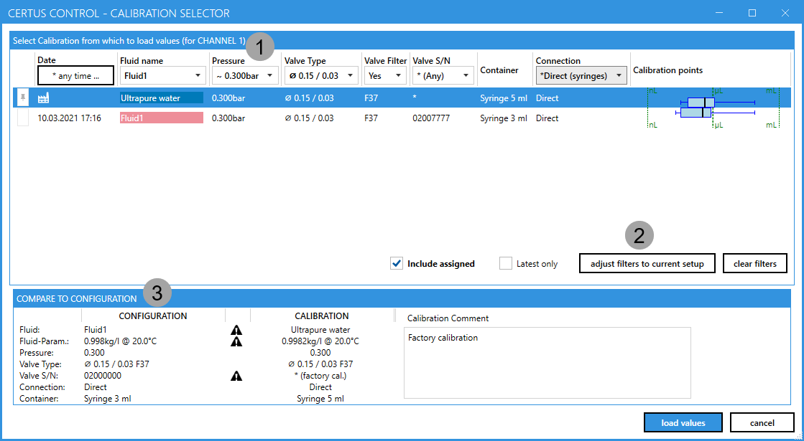{ .img-medium width="650" height="450"}

| #   | Item                                                                      |
| --- | ------------------------------------------------------------------------- |
| 1   | *Select Calibration from which to load values*                            |
|     | Selection of calibrations included in the library, which can be filtered. |
|     | (See [Filtering possibilities](#filtering-possibilities))                 |
| 2   | Text box with limiting possibilities                                      |
|     | (See [Input area](#input-area))                                           |
| 3   | *Compare to Configuration*                                                |
|     | Compare the selected calibration with the current channel configuration   |

!!! note
    To view calibration values in *Calibration Selector*: Right-click the calibration and click *View Calibration*.

### Configuration Manager

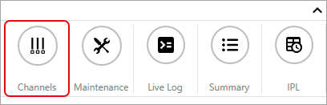{ .img-medium .on-glb width="450" height="250"}

Clicking the *Channels* symbol or double-clicking the channel area opens the *Configuration Manager* window.

Individual or multiple channels are configured here.

!!! note
    The behavior regarding the removal of calibrations can be set under Settings => Protocol Editor.

### Symbols in use

|                                                                                  |                                                                     |
| -------------------------------------------------------------------------------- | ------------------------------------------------------------------- |
| {width="32", height="32"} | The entered pressure is too high/low (allowable = 0.051 – 1.00 bar) |
  

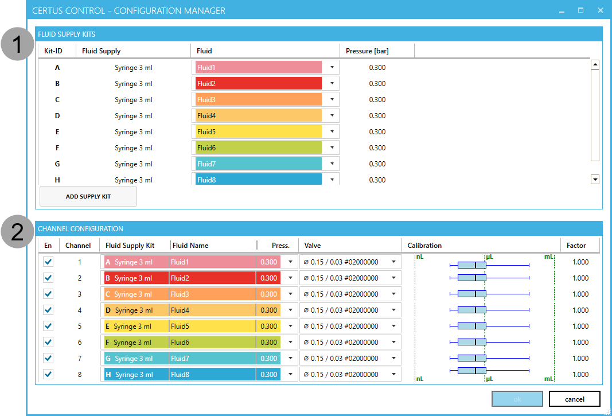{ .img-medium .on-glb width="750" height="450"} 

| #   | Item                      | Description                                                                                                              |
| --- | ------------------------- | ------------------------------------------------------------------------------------------------------------------------ |
| 1   | **Fluid Supply Kits**     | Create/manage bottle and syringe kits. Assign a fluid and pressure to each bottle or syringe kit.                        |
| 2   | **Channel Configuration** | Configure individual dispensing channels. A channel consists of a kit, a micro valve, a factor value, and a calibration. |

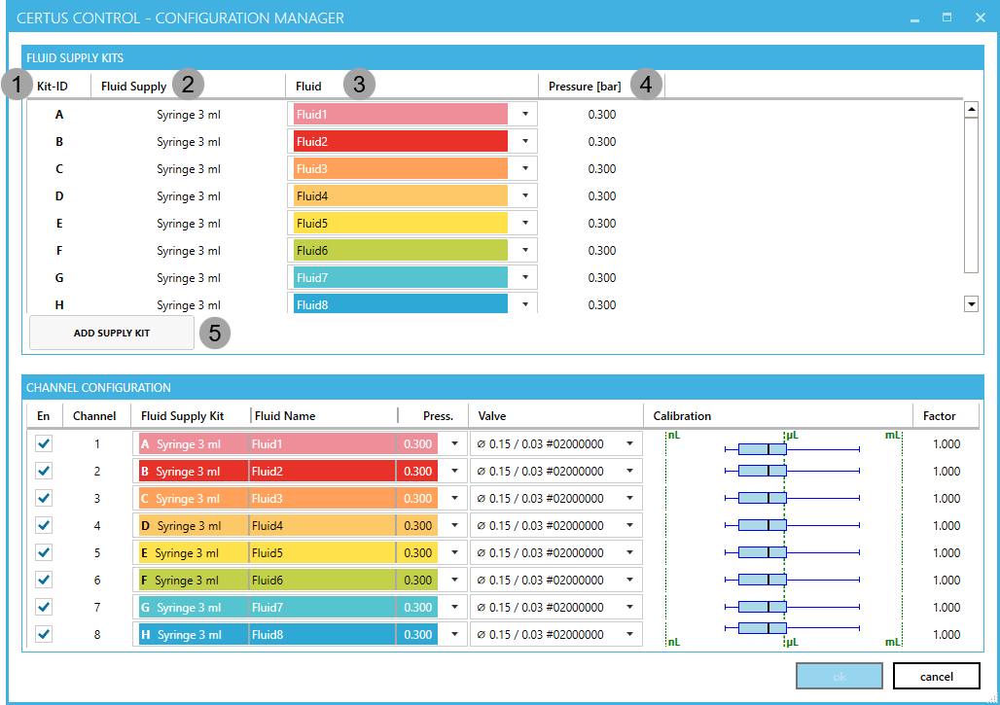{ .img-medium .on-glb width="750" height="450"} 

| #   | Item               | Description                                              |
| --- | ------------------ | -------------------------------------------------------- |
| 1   | **Kit-ID**         | Letter identification of the kit                         |
| 2   | **Fluid Supply**   | Supply kit with a number of outlets                      |
| 3   | **Fluid**          | Dedicated fluid in the container                         |
| 4   | **Pressure [bar]** | Operating pressure for the supply kit (0.01 to 1.00 bar) |
| 5   | **Add Supply Kit** | Add more bottle/syringe kits                             |

### Context menu

Right-clicking fluid Supply Kits opens a context menu with more commands:

| Command                | Description              |
| ---------------------- | ------------------------ |
| *Change Kit ID letter* | Change the kit ID letter |
| *Delete Kit*           | Delete the kit           |

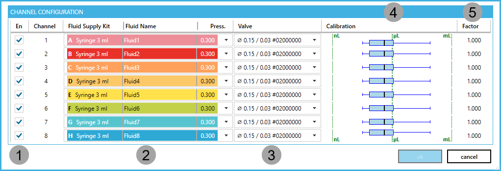{ .img-medium .on-glb width="650" height="450"} 

| #     | Item          | Description                                                              |
| ----- | ------------- | ------------------------------------------------------------------------ |
| **1** | *En (Enable)* | Enable or disable the channel                                            |
| **2** | *Supply Kit*  | Select the supply kit                                                    |
| **3** | *Valve*       | Select the micro valve                                                   |
| **4** | *Calibration* | Assigned calibration (clicking the Box Plot opens *Calibration Manager*) |
| **5** | *Factor*      | Correction factor of the dispensing volume                               |

### Context menu

Right-clicking the *Channel Configuration* opens the following commands:

| Command         | Description                                                        |
| --------------- | ------------------------------------------------------------------ |
| *Copy Channel*  | Copy the selected channel configuration                            |
| *Paste Channel* | Paste the copied channel configuration                             |
| *Move Channel*  | Replace or exchange the channel configuration with another channel |

### Calibration Manager

In *Calibration Manager*, the calibration is reassigned to the relevant channel.

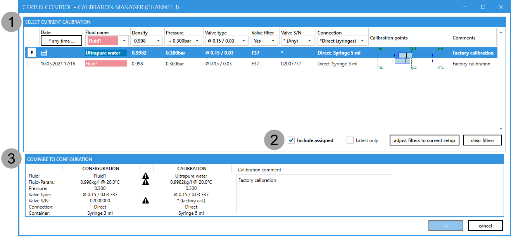{ .img-medium .on-glb width="650" height="450"}

| #     | Description                                                                            |
| ----- | -------------------------------------------------------------------------------------- |
| **1** | *Select current Calibration* -                                                         |
|       | Use various filtering possibilities to select a calibration suitable for this channel. |
|       | (See [Filtering possibilities](#filtering-possibilities))                              |
| **2** | Text box with limiting possibilities                                                   |
|       | (See [Input area](#input-area))                                                        |
| **3** | *Compare to Configuration*                                                             |
|       | Compare the selected calibration with the current channel configuration.               |

### Maintenance

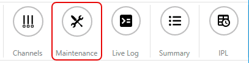{ .img-medium .on-glb width="350" height="150"}

Clicking the **Maintenance** symbol opens Maintenance Flyout on the right. Individual or multiple channels can be flushed here before a protocol is executed. 

Switching on/off compressed air is also made possible.

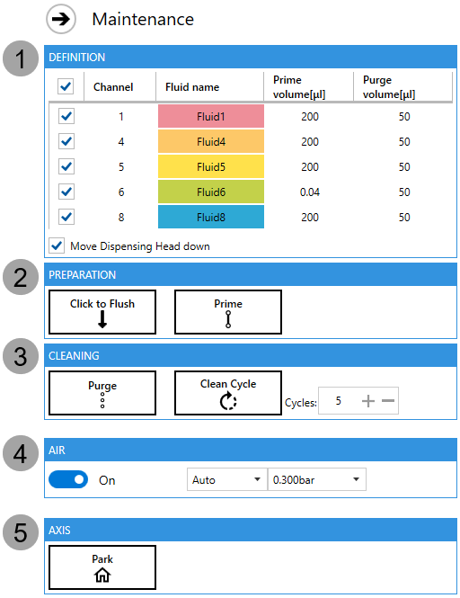{ .img-medium .on-glb width="350" height="150"}

| #     | Item          | Description                                                                      |
| ----- | ------------- | -------------------------------------------------------------------------------- |
| **1** | *Definition*  | Select the channel and defines operation of the dispensing head during execution |
| **2** | *Preparation* | Dispensing commands to prepare the channel                                       |
| **3** | *Cleaning*    | Dispensing commands to clean the channel                                         |
| **4** | *Air*         | Switch on/off compressed air (execution without compressed air is impossible)    |
| **5** | *Axis*        | Bring the axes back to their park position after collision                       |

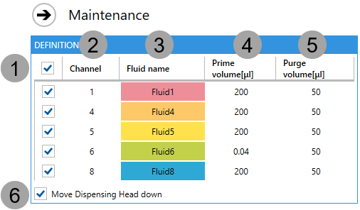{ .img-medium .on-glb width="450" height="250"}

| #     | Description                              |
| ----- | ---------------------------------------- |
| **1** | Select/disable all channels              |
| **2** | Channel number                           |
| **3** | Fluid assigned to the channel            |
| **4** | Define the prime volume                  |
| **5** | Define the purge volume                  |
| **6** | Move down the dispensing head before use |

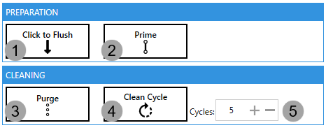{ .img-medium .on-glb width="450" height="250"}

| #     | Description                                                                                                                             |
| ----- | --------------------------------------------------------------------------------------------------------------------------------------- |
| **1** | As long as the key is pressed, the micro valve is flushed                                                                               |
| **2** | Open the micro valve until the prime volume is reached                                                                                  |
| **3** | Briefly opens and closes the micro valve until the purge volume is reached (the volume is further divided depending on the micro valve) |
| **4** | Cleaning cycle: a combination of *Prime* and *Purge*                                                                                    |
| **5** | Number of cleaning cycle repetitions                                                                                                    |

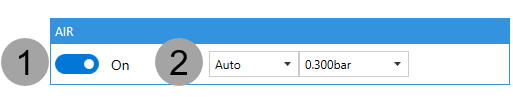{ .img-medium .on-glb width="400" height="200"}

| #     | Description                                                 |
| ----- | ----------------------------------------------------------- |
| **1** | Switch compressed air on / off.                             |
| **2** | Air pressure mode                                       |
|       | * Auto: The air pressure defined in the supply kit is used. |
|       | * Manual: Any air pressure can be selected. (0.051 - 1 bar) |

!!! note
    Air pressure mode set to **Manual** can cause deviations in the dispensed prime and purge volumes.

### Live Log

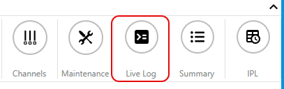{ .img-medium .on-glb width="400" height="200"}

Clicking the **Live Log** symbol displays a flyout window with completed protocol steps at the bottom part of the screen.

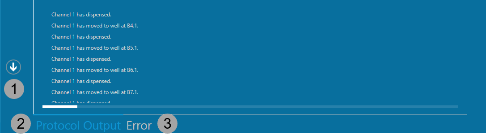{ .img-medium .on-glb width="450" height="250"}

Here you can view individual processes during dispensing.

| #   | Item                | Description                                                                            |
| --- | ------------------- | -------------------------------------------------------------------------------------- |
| 1   | **Back**            | Close the view and returns to Protocol Editor                                          |
| 2   | **Protocol Output** | List all protocol preparation steps                                                    |
| 3   | **Error**           | List protocol preparation errors, which have to be confirmed with *Cancel* to continue |

### Summary

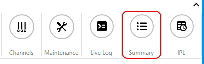{ .img-medium .on-glb width="450" height="250"}

Clicking the **Summary** symbol displays an overview of the current experiment. Here, the selected element is summarized in the protocol area.

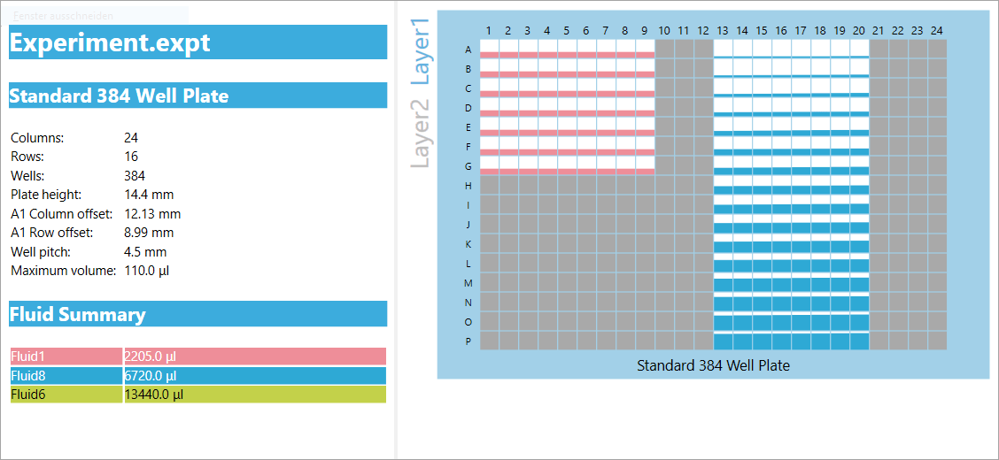{ .img-medium .on-glb width="650" height="350"}

### Interval Purge Loop (IPL)

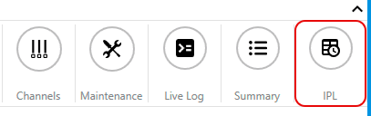{ .img-medium .on-glb width="450" height="250"}

Clicking the *IPL* symbol opens a flyout window on the right.

Here, a prime/purge cycle (which corresponds to a clean cycle) can be executed at the desired interval over a longer time period (up to three days).

It is used to prevent reactions such as fluid hardening/agglutination during longer down- times.

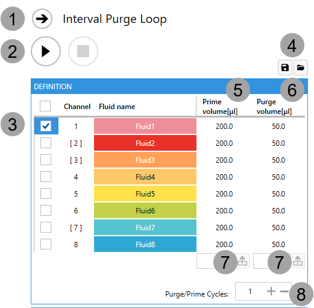{ .img-medium .on-glb width="450" height="250"}

| #     | Description                                                  |
| ----- | ------------------------------------------------------------ |
| **1** | Clicking the arrow closes the window                         |
| **2** | Start, pause, and stop execution                             |
| **3** | Select the channel for a prime/purge cycle                   |
| **4** | Save and load IPL settings                                   |
| **5** | Text box for the prime volume                                |
| **6** | Text box for the purge volume                                |
| **7** | Clicking the symbol copies the entered value to all channels |
| **8** | Number of cycles                                             |

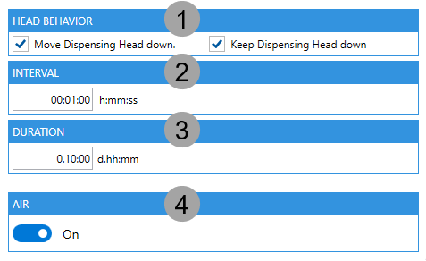{ .img-medium .on-glb width="450" height="250"}

| #     | Description                                                           |
| ----- | --------------------------------------------------------------------- |
| **1** | Behavior of the dispensing head                                       |
|       | *Move Dispensing Head down*: each time the dispensing head moves down |
|       | *Keep Dispensing Head down*: the dispensing head remains down         |
| **2** | Time interval until the next prime/purge cycle                        |
| **3** | Total time of the cycle                                               |
| **4** | Switch on and off compressed air                                      |

## Protocol

In *Protocol*, the well plate is provided with dispensing regions and layers.

It is possible to define exact dispensing volumes for individual wells or regions, as well as dispensing movement sequences.

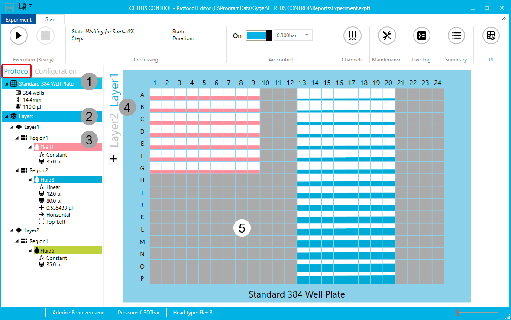{ .img-medium .on-glb width="650" height="450"}

| #     | Description                                                 |
| ----- | ----------------------------------------------------------- |
| **1** | Information on the well plate                               |
| **2** | List added layers                                           |
| **3** | Region within a layer                                       |
| **4** | Layer overview                                              |
|       | (A new layer can be created by clicking on the plus symbol) |
| **5** | Show the well plate with its regions                        |

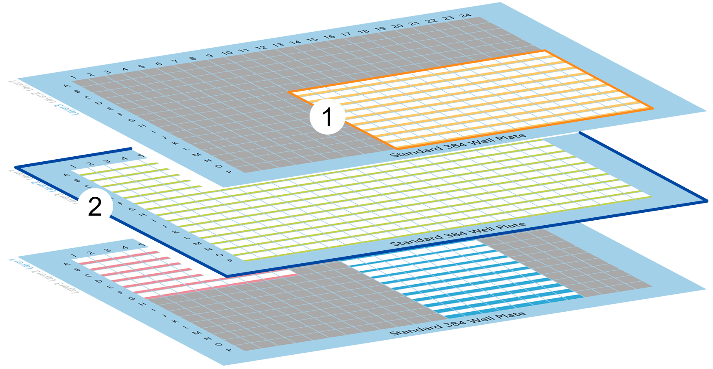{ .img-medium .on-glb width="650" height="450"}

| #     | Item     | Description                                    |
| ----- | -------- | ---------------------------------------------- |
| **1** | *Region* | Region on a layer                              |
| **2** | *Layer*  | Separate layer. Dispensing starts with Layer1. |

### Symbols in use

| Icon                                                                                                   | Description                                                           |
| ------------------------------------------------------------------------------------------------------ | --------------------------------------------------------------------- |
|                                              | Well plate name                                                       |
|                                              | Number of wells                                                       |
|                                           | Well plate height                                                     |
|                                          | Maximum well volume                                                   |
|                                      | Evaporation curtain with fluid data used                              |
|                                                          | Root node of all layers                                               |
|                                                    | Single layer                                                          |
|                                                   | Timer for dispensing pauses before or after a region                  |
|                                                                | Region                                                                |
|                          | Repetition within a region                                            |
|                                                                  | Fluid                                                                 |
|                                    | Active, temporarily loaded element                                    |
| 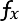                                                      | Function name                                                         |
|                                              | Constant volume                                                       |
|                                                    | Start volume                                                          |
|                                                        | End volume                                                            |
|                                   | Linear function increment                                             |
|                          | Line-by-line movement pattern                                         |
|                                       | Line-by-line S-line movement pattern                                  |
|                                   | Column-by-column movement pattern                                     |
|                               | Column-by-column S-line movement pattern                              |
|                               | Exponential function base                                             |
|    | Starting position of the volume calculation in a dispensing step      |
|                                 | Backfill function refilling until this volume                         |
|  | Only this region included in the calculation of the backfill function |
|                 | Backfill function for all preceding layers                            |
| 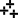                     | Number of self-specified volumes                                      |

### Context menu

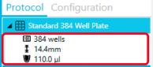{ .img-medium .on-glb width="350" height="150"}

Right-clicking well plate information opens a context menu with more commands:

| Icon                                                           | Action              | Description                                                |
| -------------------------------------------------------------- | ------------------- | ---------------------------------------------------------- |
|  | *Change Well Plate* | Open a dialog to change the well plate                     |
|  | *Set Evaporation*   | Determine the filling volume (%) of the evaporation column |

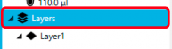{ .img-medium .on-glb width="350" height="150"}

Right-clicking *Layers* opens a context menu with more commands:

| Icon                                                | Action          | Description |
| --------------------------------------------------- | --------------- | ----------- |
|  | *Add new Layer* | Add a layer |

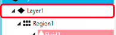{ .img-medium .on-glb width="350" height="150"}

Right-clicking *Layer* opens a context menu with more commands:

| Icon                                                   | Action          | Description              |
| ------------------------------------------------------ | --------------- | ------------------------ |
|    | *Rename Layer*  | Rename the layer         |
|    | *Delete Layer*  | Delete the layer         |
|  | *Import Region* | Import the region        |
|  | *Enabled Layer* | Disable/enable the layer |

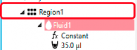{ .img-medium .on-glb width="350" height="150"}

Right-clicking *Region* opens a context menu with more commands:

| Icon                                                     | Action           | Description                                    |
| -------------------------------------------------------- | ---------------- | ---------------------------------------------- |
|        | *Edit Region*    | Opens Region Editor to edit the region         |
|    | *Rename Region*  | Rename the region                              |
|    | *Delete Region*  | Delete the region                              |
|  | *Save Region As* | Save the region as                             |
|  | *Enabled Region* | Disable/enable the region                      |
|     | *Add Timer*      | Add a timer for pauses before/after the region |

## Region Editor

To open Region Editor, double-click the Region or right-click the region and then Edit Region.
Region Editor makes it possible to define which fluid and how will be dispensed within the region.

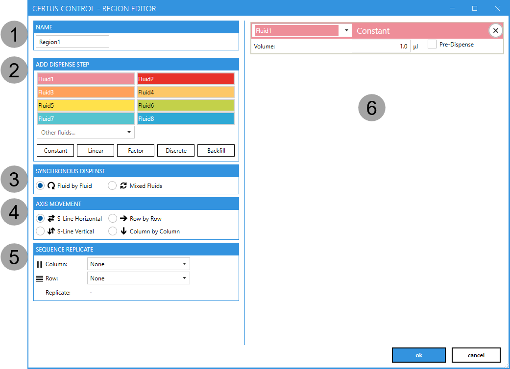{width="650" height="450"}

| #   | Item                   | Description                                                                    |
| --- | ---------------------- | ------------------------------------------------------------------------------ |
| 1   | *Synchronous Dispense* | Dispense fluids synchronously or sequentially                                  |
| 2   | *Fluid Selection*      | Choose single or mixed fluids                                                  |
| 3   | *Axial Movement*       | Define processing direction (row-by-row, column-by-column, or S-line patterns) |
| 4   | *Sequence Replicates*  | Define number and sequence of replicates                                       |
| 5   | *Dispense Steps*       | Configure individual dispensing steps                                          |
| 6   | *Region Overview*      | Lists all dispensing steps within the region                                   |

### Add dispense step

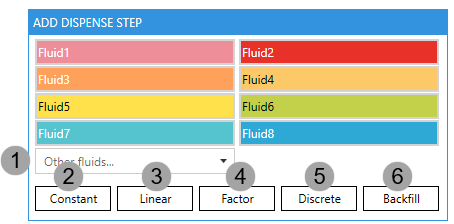

Clicking the **Add Dispense Step** symbol opens a menu with dispensing functions.

|     |                                                                                                             |                                                                                            |
| --- | ----------------------------------------------------------------------------------------------------------- | ------------------------------------------------------------------------------------------ |
| 1   | *fluids*                                                                                                    | Selection of non-assigned fluids                                                           |
| 2   | { .img-icon width="80" height="80"}       | Constant dispensing of dispensing volumes                                                  |
| 3   | { .img-icon width="80" height="80"}             | Linear increase in dispensing volumes                                                      |
| 4   | { .img-icon width="80" height="80"}   | Exponential increase in dispensing volumes                                                 |
| 5   | { .img-icon width="80" height="80"}         | Dispensing volume in accordance with tabulated values                                      |
| 6   | { .img-icon width="80" height="80"} | Well refilling up to the specified value while taking into account precedingd ispensations |

!!! note
    For a more detailed description of the dispensing functions: See [Dispensing Functions](#dispensing-functions).

### Synchronous dispense

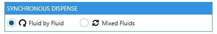

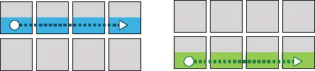

In fluid *by fluid*, only one fluid is dispensed during the experiment.

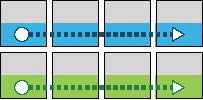

In *Mixed fluids*, multiple fluids are simultaneously dispensed during the experiment.

### Axial movement

Defines the processing direction in a region.

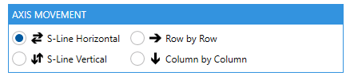

|   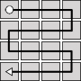   |   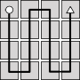   |   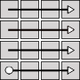    |  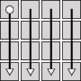   |
| :-----------------------------------------------------------: | :-------------------------------------------------------: | :-----------------------------------------------------: | :---------------------------------------------------------: |
|  |  |  |  |
|                       S-Line Horizontal                       |                      S-Line Vertical                      |                       Row by Row                        |                      Column by Column                       |
"Axial Movement Visuals"

### Sequence Replicate

Defines the number and sequence of replicates.

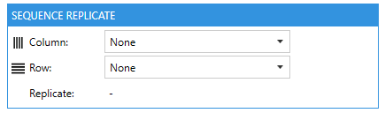

**Example**: 4x4 well region with linear dispensing

| 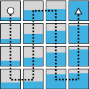 | 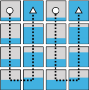 | 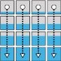                                     |
| :---------------------------------------------------------------------------------: | :---------------------------------------------------------------------------------: | :----------------------------------: |
|                                       Column                                        |                                       Column                                        |                Column                |
|                                        None                                         |                        2 replicates (each is two wells wide)                        | 4 replicates (each is one well wide) |
"Sequence Replicate - Wells Wide"

|  | 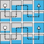 | 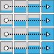 |
| :---------------------------------------------------------------------------: | :-------------------------------------------------------------------------------: | :-------------------------------------------------------------------------------: |
|                                      Row                                      |                                        Row                                        |                                        Row                                        |
|                                     None                                      |                       2 replicates (each is two wells high)                       |                       4 replicates (each is one well high)                        |
"Sequence Replicate - Wells High"

!!! note
    * An indivisible number of wells (3, 5, 7, 11,...) can onlybe divided by itself. 
    * A combination of row and column subdivisions is also possible.

## Dispensing Functions

Dispensing functions with the most important settings are described here. (Supplement to [Region Editor, Add Dispense Step](#add-dispense-step))

### Constant

{ .img-medium width="150" height="150"}

Constant dispensing. Each well is refilled with the same volume.

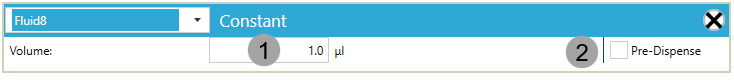{ .img-medium .on-glb width="550" height="450"}

| #   | Item           | Description                                                       |
| --- | -------------- | ----------------------------------------------------------------- |
| 1   | *Volume*       | Desired dispensing volume                                         |
| 2   | *Pre-Dispense* | Optional dispensing into the waste tray before dispensing proper. |
|     |                | Make sure that the micro valve is completely refilled with fluid. |

### Linear

Defines a linear increase in the dispensing volume.

* Enter the end volume → factor calculation.
* Enter the factor value → end volume calculation.

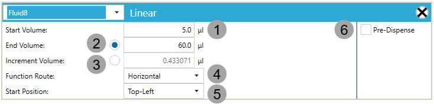{ .img-medium .on-glb width="550" height="450"}

| #   | Item               | Description                                                                 |
| --- | ------------------ | --------------------------------------------------------------------------- |
| 1   | *Start Volume*     | Volume of the first well                                                    |
| 2   | *End Volume*       | Volume of the last well                                                     |
| 3   | *Increment Volume* | Change the volume of each well (both positive and negative)                 |
| 4   | *Function Route*   | Set the function route of the calculated dispensing volume.                 |
|     |                    | See [Function route and start position](#function-route-and-start-position) |
| 5   | *Start Position*   | Sets the start position for the function route.                             |
|     |                    | See [Function route and start position](#function-route-and-start-position) |
| 6   | *Pre-Dispense*     | Optional dispensing into the waste tray before dispensing proper.           |
|     |                    | Make sure that the micro valve is completely refilled with fluid.           |

### Factor

Defines an exponential increase in the dispensing volume. Dosage exponentially increasing according to the following values:

* Enter the end volume → factor calculation.
* Enter the factor value → end volume calculation.

{ .img-small width="200" height="200"}

| #   | Item             | Description                                                                 |
| --- | ---------------- | --------------------------------------------------------------------------- |
| 1   | *Start Volume*   | Volume of the first well                                                    |
| 2   | *End Volume*     | Volume of the last well                                                     |
| 3   | *Factor*         | Exponential increase base                                                   |
| 4   | *Function Route* | Set the function route of the calculated dispensing volume.                 |
|     |                  | See [Function route and start position](#function-route-and-start-position) |
| 5   | *Start Position* | Sets the start position for the function route.                             |
|     |                  | See [Function route and start position](#function-route-and-start-position) |
| 6   | *Pre-Dispense*   | Optional dispensing into the waste tray before dispensing proper.           |
|     |                  | Make sure that the micro valve is completely refilled with fluid.           |

### Discrete

Default from the table or copied Excel files.

{ .img-small width="150" height="150"}

| #   | Item           | Description                                                       |
| --- | -------------- | ----------------------------------------------------------------- |
| 1   | *Edit List*    | Opens the *Discrete Volumes Editor* window.                       |
| 2   | *Pre-Dispense* | Optional dispensing into the waste tray before dispensing proper. |
|     |                | Make sure that the micro valve is completely refilled with fluid. |

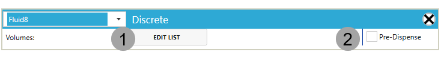{ .img-medium .on-glb width="550" height="450"}

| #   | Description                                                                                                                  |
| --- | ---------------------------------------------------------------------------------------------------------------------------- |
| 1   | Table for manually entering the dispensing volume                                                                            |
| 2   | Values copied from an Excel file are included in the table.                                                                  |
|     | For this purpose, flag the desired rows in Excel and copy them to the clipboard.                                             |
|     | The position of the values to be imported is defined by designating target wells (in the top left corner) of the new region. |

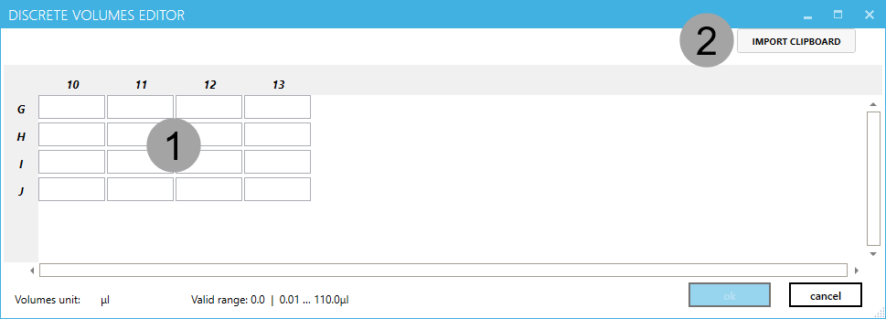

| #   | Item                                                                                                                                         |
| --- | -------------------------------------------------------------------------------------------------------------------------------------------- |
| 1   | Table for manually entering the dispensing volume                                                                                            |
| 2   | Values copied from an Excel file are included in the table. For this purpose, flag the desired rows in Excel and copy them to the clipboard. |
|     | 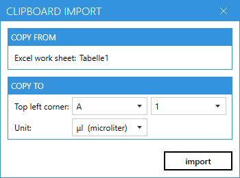                                                                                                                                             |
|     | The position of the values to be imported is defined by designating target wells (in the top left corner) of the new region.                 |

!!! note
    How to add an Excel table with the dispensing function Discrete is described in [Adding a dispensing quantity as an Excel table](operations.md#adding-a-dispensing-quantity-as-an-excel-table).

### Backfill

{ .img-small width="150" height="150"}

The well is refilled up to the specified value while taking into account preceding dispense ations.

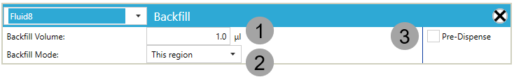{width="729" height="89"}

|     |                   |                                                                                    |
| --- | ----------------- | ---------------------------------------------------------------------------------- |
| 1   | *Backfill Volume* | Refill the well up to this volume.                                                 |
|     |                   | *This region:*                                                                       |
|     |                   | Refill while taking into account preceding dispensations within the region         |
| 2   | *Backfill Mode*   | *Preceding Layers:*                                                                |
|     |                   | Refill while also taking into account previous dispensations from preceding layers |
| 3   | *Pre-Dispense*    | Optional dispensing into the waste tray before dispensing proper.                  |
|     |                   | Make sure that the micro valve is completely refilled with fluid.                  |

!!! note
    The Backfill function is always performed as the last step. 

#### Function Route and Start Position

!!! note "Note Confusion"
    The function route (FR) and start position (SP) should not be confused with the travel of the dispensing head. Function-related settings are only meant here.

|     | 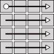 | 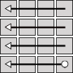 | 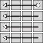 |  |
| --- | :--------------------------------------------: | :------------------------------------------------: | :---------------------------------------------: | :-----------------------------------------------: |
| FR  |                   Horizontal                   |                     Horizontal                     |                   Horizontal                    |                    Horizontal                     |
| SP  |                    Top left                    |                    Bottom right                    |                    Top right                    |                    Bottom left                    |
"Function Route Horizontal"

|     |  | 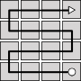 | 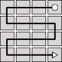 | 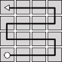 |
| --- | :--------------------------------------: | :---------------------------------------------------: | :------------------------------------------------: | :--------------------------------------------------: |
| FR  |            Horizontal S-Line             |                   Horizontal S-Line                   |                 Horizontal S-Line                  |                  Horizontal S-Line                   |
| SP  |                 Top left                 |                     Bottom right                      |                     Top right                      |                     Bottom left                      |
"Function Route S-Line Horizontal"

|     |  | 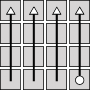 | 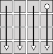 | 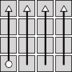 |
| --- | :--------------------------------------: | :-------------------------------------------: | :---------------------------------------------: | :------------------------------------------: |
| FR  |                 Vertical                 |                   Vertical                    |                    Vertical                     |                   Vertical                   |
| SP  |                 Top left                 |                 Bottom right                  |                    Top right                    |                 Bottom left                  |
"Function Route Vertical"

|     |  |  |  |  |
| --- | :--------------------------------------------: | :------------------------------------------------: | :---------------------------------------------: | :-----------------------------------------------: |
| FR  |                Vertical S-Line                 |                  Vertical S-Line                   |                 Vertical S-Line                 |                  Vertical S-Line                  |
| SP  |                    Top left                    |                    Bottom right                    |                    Top right                    |                    Bottom left                    |
"Function Route S-Line Vertical"