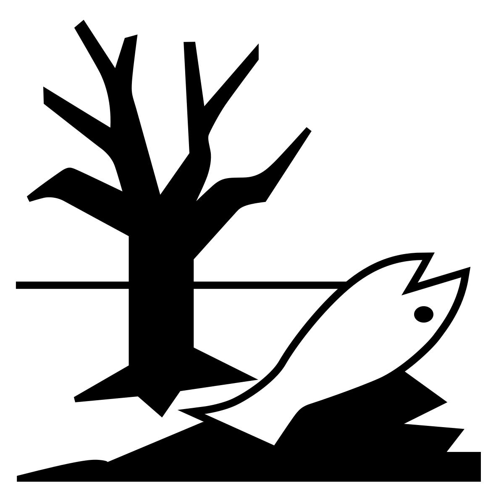

# Decommissioning and Disposal

## General Safety Instructions

!!! note
    In addition, follow the instructions of the safety section. See [Safety Instructions](safety.md).

!!! warning "Risk of electrical injury"
    { .img-icon width="80px" height="80px"}
    
    ► Maintenance and repair work may only be performed by qualified maintenance and service personnel.

<!-- The content is reused from the common warnings file -->

-8<- "docs/common_content/warnings.md::7"

<!-- The content is reused from the common warnings file -->

-8<- "docs/common_content/warnings.md:9:31"

## Decommissioning the Unit

If {{ variables.product.name.en }} is no longer used, proceed as follows:

1. Switch off compressed air in {{ variables.product.software.name.en }}.
2. Remove all fluids from the container, tube, waste tray, etc.
3. Switch off the main switch at the back of the base unit and remove the power cord.
4. Remove the tube from the compressed air supply.
5. Remove the Ethernet cable.

## Storing the Unit

Before storing {{ variables.product.name.en }}:

► Clean all components with a cleaning agent.

► Protect components against dust using appropriate packaging.

► Add a desiccant bag into the packaging.

!!! note
    It is recommended using Fritz Gyger AG original packaging as packaging. Therefore, the original packaging should not be disposed after unpacking. See [Packaging](packaging.md).

The following data should be observed for storage purposes:

| Aspect              | Requirement                                             |
| ------------------- | ------------------------------------------------------- |
| Identification      | Packaging provided with necessary storage/safety labels |
| Storage method      | Room, protected against direct sunlight (UV)            |
| Ambient temperature | 12° -30°C                                               |
| Air humidity        | ~30% -70%                                               |

!!! note
    If stored for more than three months, regularly check the general condition of all parts and packaging.

## Disposing Unit

???+ note "Note: Environmental risk due to improper disposal"

    { .img-icon width="80px" height="80px"} 
    
    ► Dispose electronic and recyclable materials separately.
    
    ► Dispose all components in accordance with national legislation and the company’s guidelines.
    
    ► It is strictly forbidden to dispose working materials, components, or their parts (e.g., to waters, with household garbage, etc.). If necessary, have disposal arranged by a specialized collector.