# Operation

This section describes how to properly use {{ variables.product.software.name.en }} software, as well as all necessary measures to ensure successful dispensing with {{ variables.product.name.en }}.

## Safety Instructions for Operators

!!! warning "Warning: Risk of electrical shock injury"
    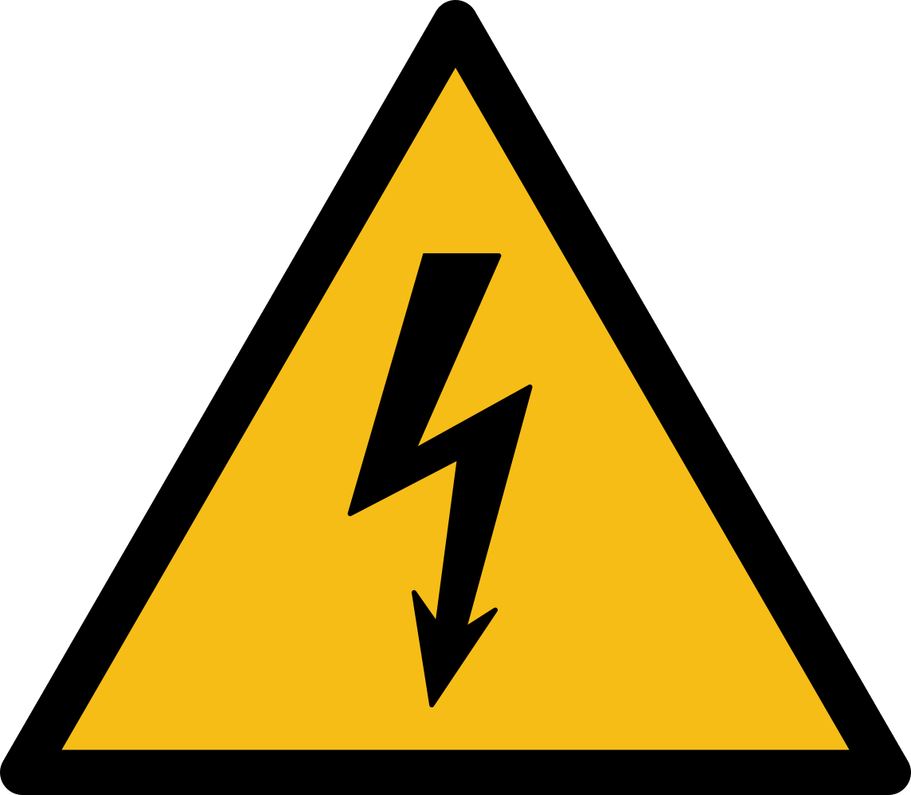{ .img-icon width="80px" height="80px"}
    
    ► Maintenance and repair works may only be performed by qualified maintenance and service personnel.

!!! caution "Caution: Danger from skin irritation and intoxication due to contact with substances harmful to human health (e.g., cleaning agents)"
    
    { .img-icon width="80px" height="80px"}
        
    ► The end user has to provide the workstation with, for example, additional ventilation, gloves, goggles, protective clothing, protective headgear, etc. to be able to handle substances harmful to human health.
    
    ► Observe warnings of the respective safety datasheets.
    
    ► Wear protective equipment suitable for substances used.

!!! caution "Caution: Risk of crushing due to axial movement" 

    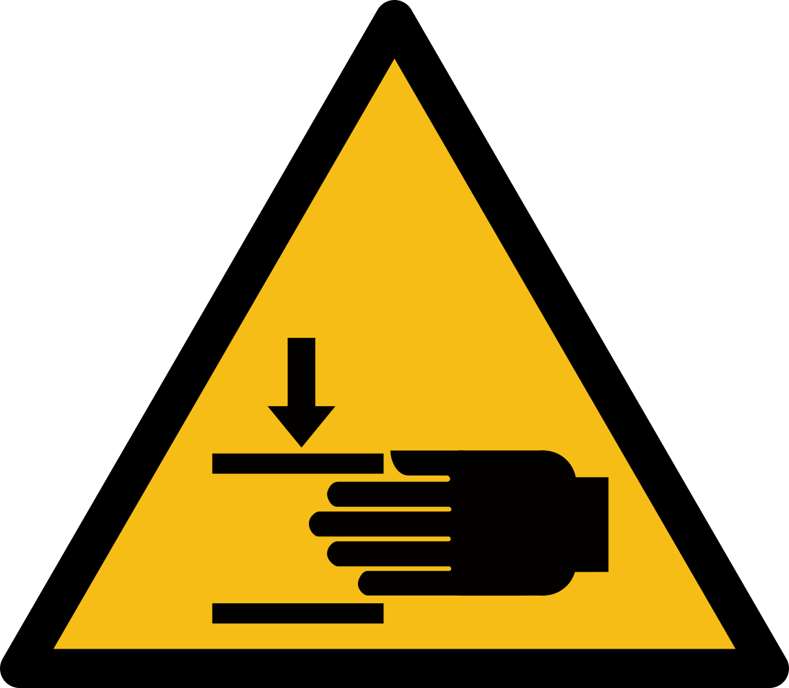{ .img-icon width="80px" height="80px"}

    ► Maintenance and repair works may only be performed by qualified maintenance and service personnel.
    
    ► Hands should be kept away during axial movement.

## Actions Prior to Use

Prior to operation, you should read section [Start-Up](start-up.md) and carry out the following steps:

* All necessary interfaces (cables and tubes) are properly connected.

    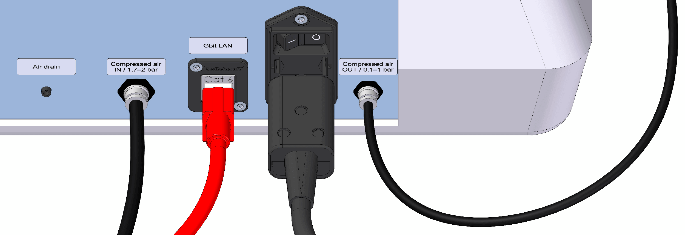{ .img-medium width="550px" height="250px"}
    
* The waste tray is installed.
(For the discharge function, an appropriate catch device should be provided.)

* The dispensing head is installed on a Y axis, and the screw is tightened.

* All the micro valves to be used are screwed onto the dispensing head.
(The serial number and type of each micro valve and the channel number are recorded.)

* The bottles are refilled with fluid and the bottle cap is tightened hand-tight.

* The bottle/syringe kits are properly installed, and the inlet adapter is connected to the relevant micro valve at the dispensing head and tightened using the hand screw.

* All the compressed air and fluid tubes are connected.

* All the open outlets at the bottle cap and the compressed air manifold are provided with a plug.

* CERTUS CONTROL is installed on a PC and connected with {{ variables.product.name.en }}.

## Power-Up

!!! caution "Caution: Risk of crushing due to axial movement"
    
    { .img-icon width="80px" height="80px"}    
    
    ► Hands should be kept away during axial movement.

1. Prior to power-up, make sure that there are no tools or other foreign objects near the axes.

2. Press the main switch at the back of the base unit.
   
    * The status LED lights up green, and the axes move until they reach stop (reference travel).
    
        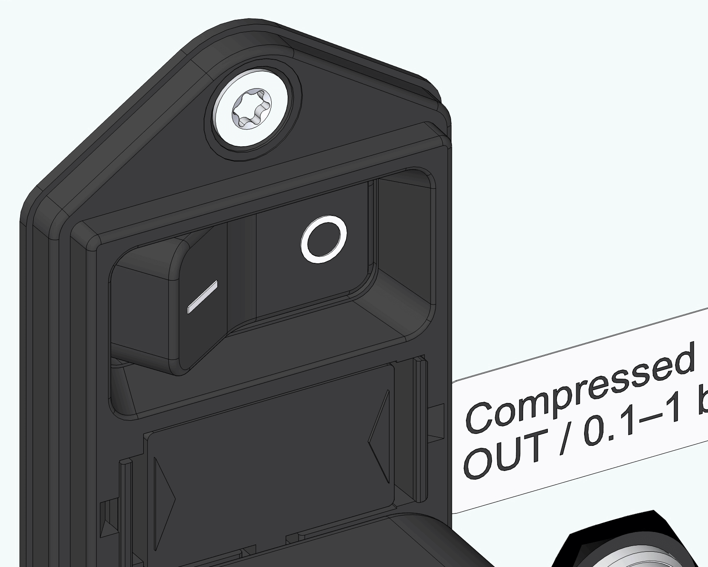{ .img-small width="180px" height="180px"}

3. Switch on the PC and start up {{ variables.product.software.name.en }}.
4. Log on to {{ variables.product.software.name.en }} as a user.

!!! note
    For more operational possibilities, you have to log on as a user with administrator rights. For more information,[Users](certus_controls.md#users).

## Overview - Experiment

The flow chart provides an overview when setting up an experiment and shows the neces- sary steps until its completion.

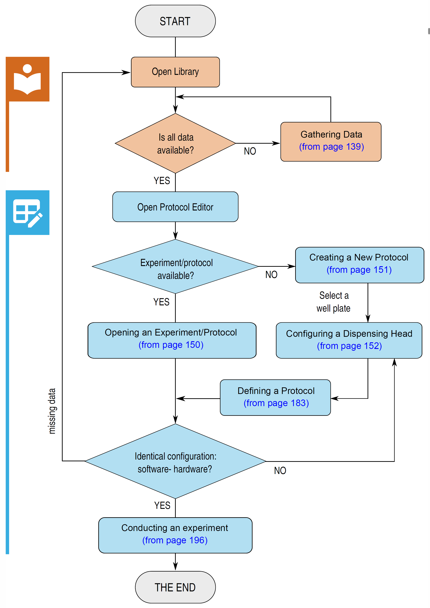{: usemap="#experiment_flowchart" width="550px" height="400px"}

<map name="experiment_flowchart">
  
  <!-- Generating Data -->
  <area target="" alt="Hotspot1" title="Generating Data" href="http://127.0.0.1:8000/docs/en/products/certus-flex/operations/#gathering-data" coords="350,150,500,200" shape="rect">

  <!-- Creating a New Protocol -->
  <area target="" alt="Hotspot2" title="Creating a New Protocol" href="http://127.0.0.1:8000/docs/en/products/certus-flex/operations/#creating-a-new-protocol" coords="375,275,550,400" shape="rect">

</map>

## Gathering Data

Before you can start an experiment, you have to gather all data (fluid, micro valve and well plate) in the library. For more information, see [Library](certus_controls.md#library).

### Fluid

Fluids to be used for an experiment have first to be added to the library. For more information, see [Fluid](certus_controls.md#fluid).

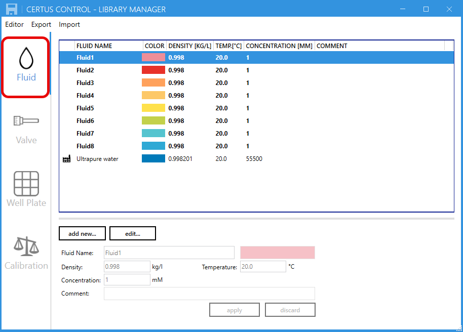{ .img-medium .on-glb width="400px" height="250px" }

#### Adding a fluid

By clicking *add new*, you can enter data for a new fluid. Clicking *apply!* completes the input, and the new fluid appears in the list. For more information, see [Fluid](certus_controls.md#fluid)

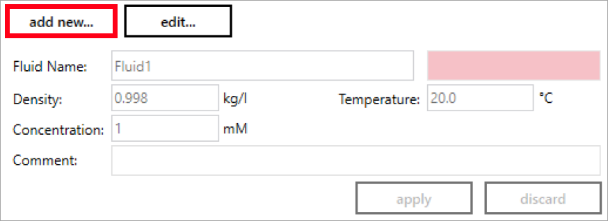{ .img-medium .on-glb width="400px" height="250px" }  

!!! note
    Avoid white when defining fluid color as it would not differ from the white background in Protocol Editor.

#### Editing a fluid

By clicking *edit*, you can edit data of any existing fluid. For more information, see [Fluid](certus_controls.md#fluid).

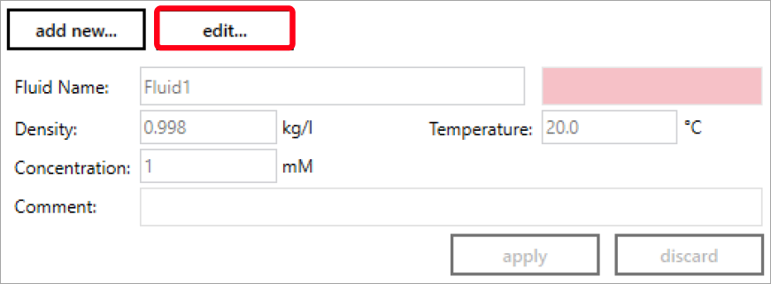{ .img-medium .on-glb width="400px" height="250px" }  


#### Deleting a fluid 

Right-clicking an existing fluid can delete it with the command *Delete fluid*.
   
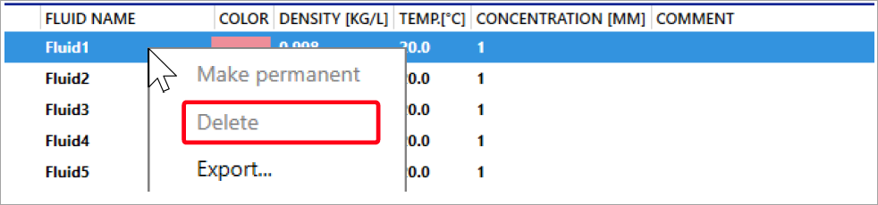{ .img-medium .on-glb width="400px" height="250px" }

#### Adding a temporary fluid

If a fluid not listed in the library was used to configure an opened experiment, a temporary fluid appears. It is marked with a red symbol.

Right-clicking the temporary fluid and *Make fluid permanent* permanently adds the fluid to the library.

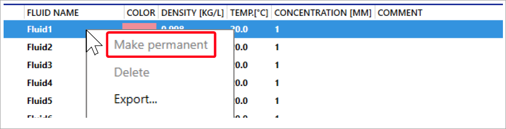{ .img-medium .on-glb width="400px" height="250px" }   


### Micro valves

The micro valves installed on the dispensing head have first to be added to the library. For more information, see [Valve](certus_controls.md#valve).

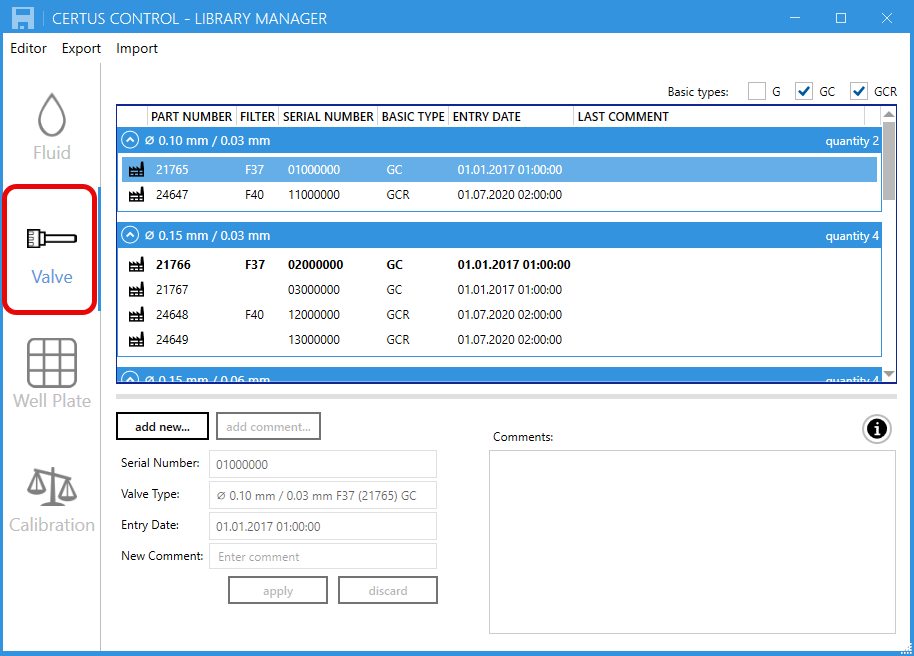{ .img-medium .on-glb width="400px" height="250px" }

#### Adding a new micro valve

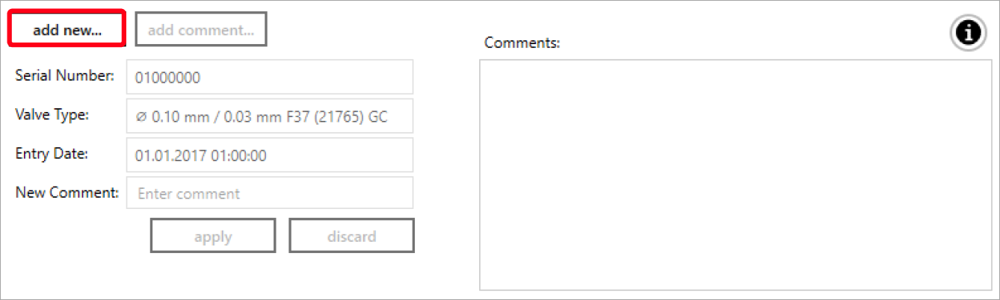{ .img-medium .on-glb width="400px" height="250px" }

* Click on *add new\...* and type in the serial number of the micro valve.
    * The entry date will be generated in the *Entry Date* text box.
    * The valve type will be displayed in the *Valve Type* text box.
* Type in a comment (optional) and click *apply* to add the valve into the library.

!!! note 
    Only micro valves with an 8 digits serial number will be detected automatically. For 4-6 digits, the valve type has to be selected in a separate window

#### Deleting a micro valve

Right-click on an existing micro valve and delete it with the command *Delete Valve*.

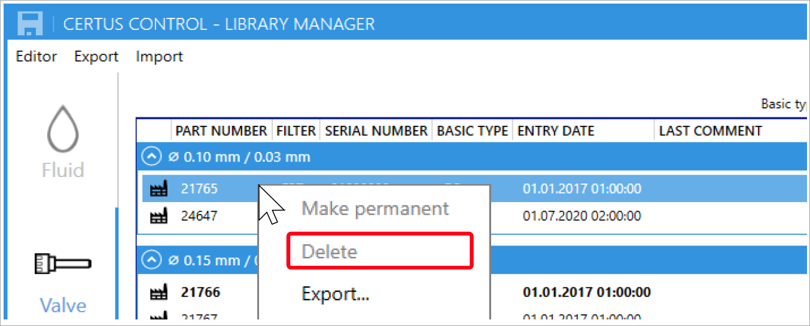{ .img-medium .on-glb width="500" height="350" }

#### Adding a temporary micro valve

If a micro valve not listed in the library was used to configure an opened experiment, a temporary micro valve appears. It is marked with
a red symbol.

Right-click the temporary micro valve and *Make Valve permanent* permanently adds the micro valve to the library.

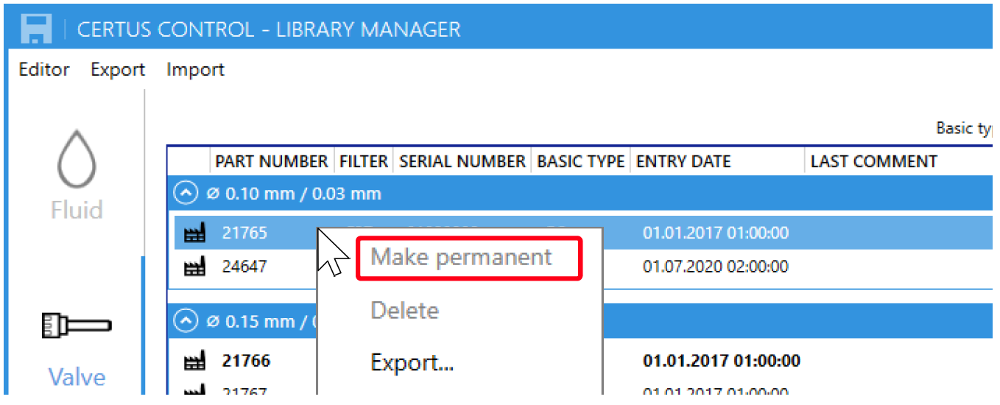{ .img-medium .on-glb width="500" height="350" }

### Well Plates

A well plate to be used for an experiment has first to be added to the library. For more information, see [Well Plate](certus_controls.md#well-plate).

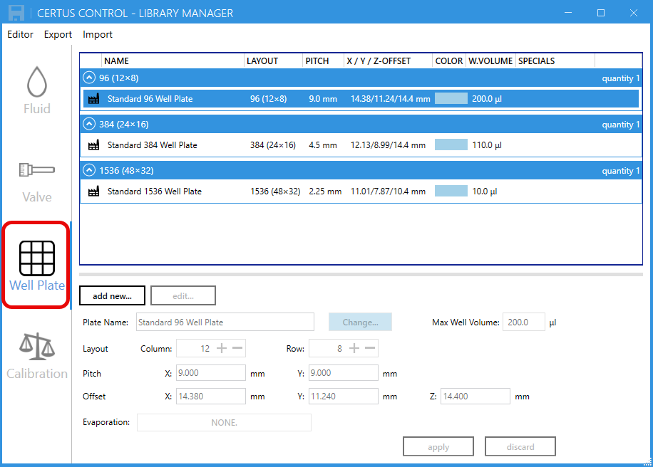{ .img-medium .on-glb width="400px" height="250px" }

!!! note
    Depending on the configuration of the well plate holder, well plate heights ranging from 1 to 49 mm can be used.

#### Adding a Well Plate

{{ variables.product.software.name.en }} is supplied with three popular well plate formats. You can neither edit nor delete them.

*   Standard 96, 384 and 1536 well plates
*   Select a standard well plate from the list to copy the data to the new well plate.

    !!! note
        If the new well plate you add is non-standard, you can skip this step.

* Click *add new* to define data for a new well plate.

    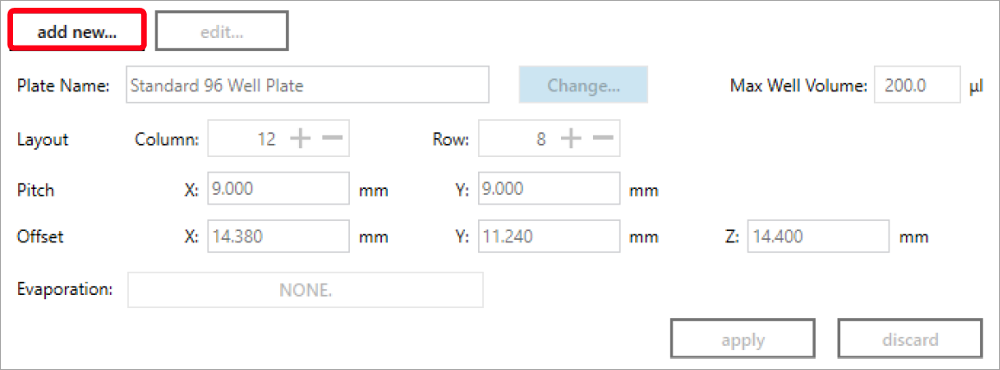{ .img-medium .on-glb width="500px" height="300px" }

To change well plate height, edit the value under „Z:". For more information, see [Well Plate--definitions](certus_controls.md#well-plate-definitions).

!!! note "Note: Risk of collision due to the wrong wall plate height"
    { .img-icon width="80px" height="80px"}
    
    If a well plate higher than specified is used, the dispensing head may collide with the well plate during axial movement.

    * Make sure that the entered well plate height is correct.
    * During dispensing, use no well plate other than specified in the software.

### Standard 96 Well Plate

| Well Volume | Layout Col. | Layout Row. | Pitch X | Pitch Y | Offset X | Offset Y |   Z   |
| ----------- | :---------: | :---------: | :-----: | :-----: | :------: | :------: | :---: |
| 200 µl      |     12      |      8      |  9.00   |  9.00   |  14.38   |  11.24   | 14.40 |


### Standard 384 Well Plate

| Well Volume | Layout Col. | Layout Row. | Pitch X | Pitch Y | Offset X | Offset Y |   Z   |
| ----------- | :---------: | :---------: | :-----: | :-----: | :------: | :------: | :---: |
| 110 µl      |     24      |      16      |  4.50   |  4.50   |  12.13   |  8.99   | 14.40 |

### Standard 1536 Well Plate

| Well Volume | Layout Col. | Layout Row. | Pitch X | Pitch Y | Offset X | Offset Y |   Z   |
| ----------- | :---------: | :---------: | :-----: | :-----: | :------: | :------: | :---: |
| 10 µl       |     48      |     32      |  2.25   |  2.25   |  11.01   |   7.87   | 10.40 |

#### Adding an Evaporation Curtain

In addition, you can define an evaporation curtain for each well plate using the *Edit Evaporation Curtain* window.

An evaporation curtain is used to reduce evaporation differences of border wells due to external factors (such as ambient temperature).

For the explanation of the user interface, see [Evaporation Curtain](certus_controls.md#evaporation-curtain).

!!! note
    By default, no evaporation curtain is defined when creating a new wellplate. Itis shown as *NONE*.

* Click *add new* or *edit* to enable the input area.

* Click the button in the input area to the right of *Evaporation:*
    
    ✔ The *Edit Evaporation Curtain* window opens.

    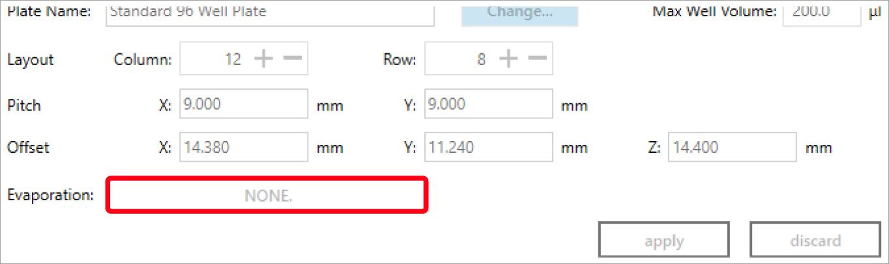{ .img-medium .on-glb width="550px" height="300px" }

* Click *add new* to define a new dispensing position:

    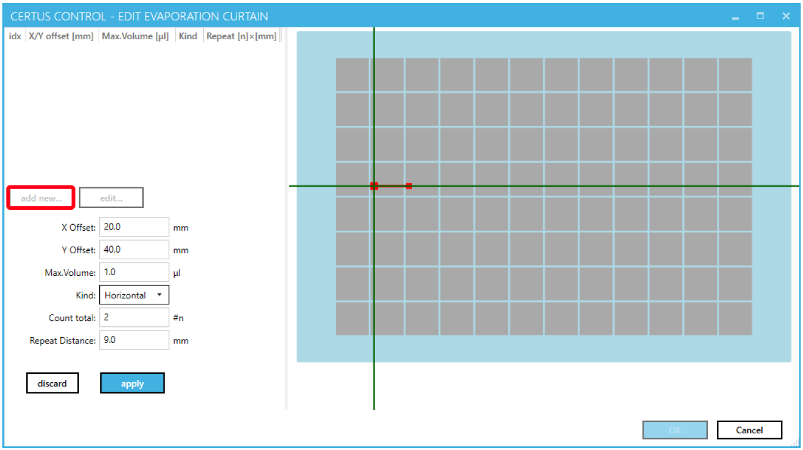{ .img-medium .on-glb width="550px" height="300px" }

* Redefine the position by editing the offset values.

* Enter the maximum possible filling volume.

#### Evaporation curtain -- sample use 1

In this example, the evaporation curtain runs along the outer moat of the well plate. It is usually subdivided, so multiple dispensing points have to be defined.

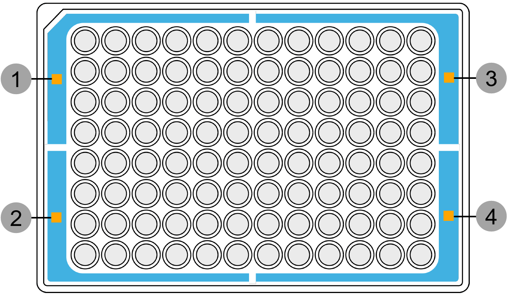{ .img-medium .on-glb width="400px" height="250px" }

* Click *add new* to define dispensing point 1 by editing the offset values. Example: X Offset=6 mm, Y Offset=23 mm

    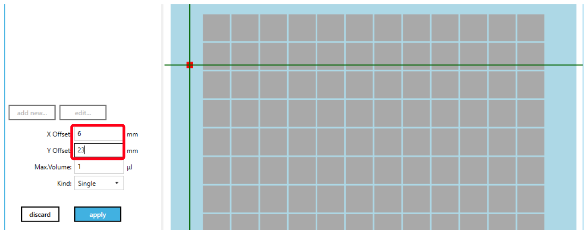{ .img-medium .on-glb width="550px" height="300px" }

* Define the filling volume and select the *Vertical* pattern function. Multiple dispensations can thus be carried out in the vertical direction.

    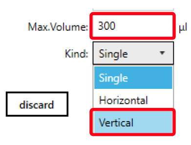{ .img-medium .on-glb width="350px" height="200px" }

* Define the number of dispensations in the vertical direction and the interval between dis- pensations.
    
    Example: Count total=2, Repeat Distance=40 mm
    
    ✔ Dispensing point 2 is defined.

* Use *apply* to confirm dispensing point 1 and 2.
    
    ✔ Dispensing points 1 and 2 are added to the list.

    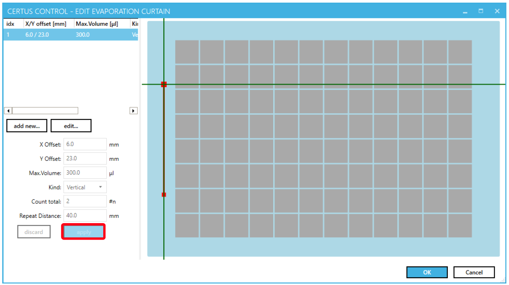{ .img-medium .on-glb width="550px" height="300px" }

* Use *add new* to add dispensing points 3 and 4 and adapt X Offset. Example: X Offset=122 mm

    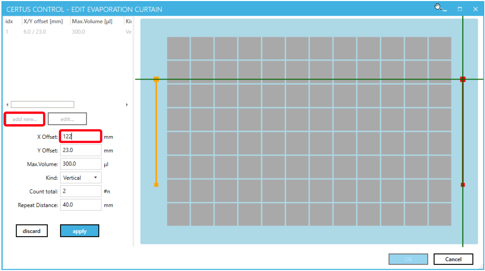{ .img-medium .on-glb width="550px" height="300px" }

* Use *apply* to confirm dispensing points 3 and 4.
    
    ✔ All dispensing point 1-4 are added to the list.

* Click *OK* to save the settings and close the window.
    
    ✔ The evaporation curtain is finally defined.

For refilling in *Protocol,* see [Refilling the Evaporation Curtain](#refilling-the-evaporation-curtain).

#### Evaporation curtain -- sample use 2

All inter wells of the well plate are refilled here. Each well is thus shrouded in fluid, and all wells show the same evaporation behavior.

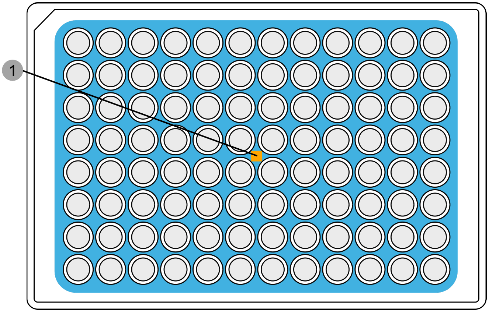{ .img-medium .on-glb width="400px" height="250px" }

* Click *add new* and define dispensing point 1 by editing the offset values.
    
    Example: X Offset=63.88 mm, Y Offset=42.74 mm

* Define the filling volume and select the *Single* pattern function.

* Use *apply* to confirm dispensing point 1 and use *OK* to save the settings.

    ✔ Dispensing point 1 is added to the list.

For more information, see [Refilling the Evaporation Curtain](#refilling-the-evaporation-curtain).

### Calibrations

For information regarding the user interface, see [Calibration](certus_controls.md#calibration).

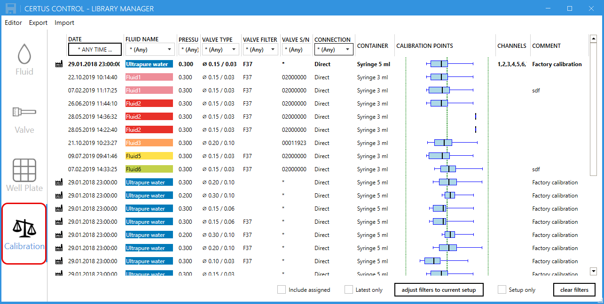{ .img-medium .on-glb width="550" height="450" }

#### Importing a calibration

Click *Import* under the menu bar and select the desired function.

For a more detailed description, see [Calibration](certus_controls.md#calibration).

## Opening an Experiment/Protocol

If an experiment or protocol already exists, you can open it as follows:

* Opens *Protocol Editor*.

    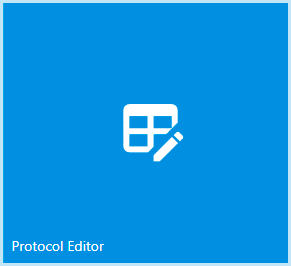{ .img-icon width="80" height="80" }

    ✔ Clicking the *Experiment* tab opens the backstage view.

    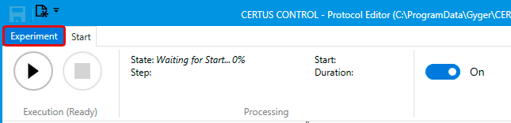{ .img-medium .on-glb width="400" height="250" }

    For more information, see [Experiment Menu](certus_controls#experiment_menu)

* Click *Open*.

    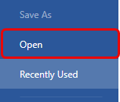{ .img-medium .on-glb width="100" height="100" }

    ✔ The directory window opens.

* Select the experiment file (.expt) or switch the file type to protocol file (.protocol) to open a protocol.

    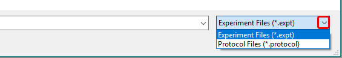{ .img-medium .on-glb width="500" height="300" }

!!! note
    By default, the *.expt file type is used. This can be changed under Default saving format as explained in [Protocol Editor](certus_controls.md#protocol_editor) to *.protocol.

## Creating a New Protocol

* Open *Protocol Editor*.

    { .img-icon width="80" height="80" }

    ✔ Clicking the *Experiment* tab opens the backstage view.

    { .img-medium .on-glb width="400" height="250" }

    For more information, see [Experiment Menu](certus_controls.md#experiment_menu).

* Click *New Protocol*.

    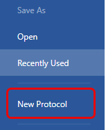{ .img-medium .on-glb width="100" height="100" }
    
    ✔ The *Select Well Plate for New Protocol* window opens.

* Select the desired well plate.

    ✔ The selected well plate is visually shown in *Protocol Editor*.

!!! note 
    
    To create a new protocol, you can also click the symbol in the quick menu.The *Select Well Plate for New Protocol* window opens.
    
    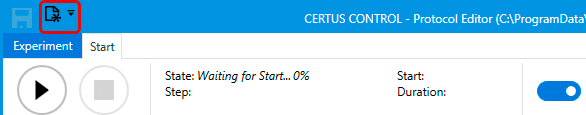{ .img-icon .on-glb width="400" height="250" }

## Configuring a Dispensing Head

The left column under *Configuration* should reflect the dispensing head installed on the base unit.

Each channel has to match the configurations of the dispensing heads (container, fluid, micro valve, and pressure) here.

For more information, see [Configuration](certus_controls.md#configuration).

In addition, a calibration should be assigned to each channel. For more information, see [Calibration](certus_controls.md#calibration).

!!! note
    The settings made in `Configuration` are automatically saved and also exist after CERTUS CONTROL is restarted. In this context, the configuration is regarded as active. During use,it is regularly adjusted and modified.

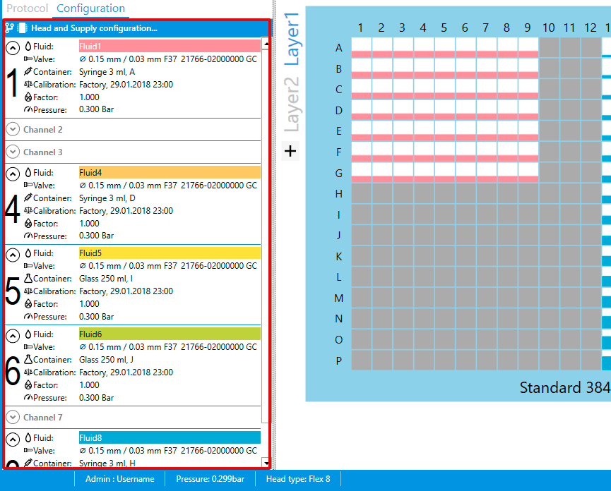{ .img-medium .on-glb width="550" height="250" }

!!! note
    The following sections explain step by step how to use an empty template for a Flex8 dispensing head.

### Using a Dispensing Head Template

* Click Head and Supply configuration\...
  
    ✔ The *Template Manager* window opens.

    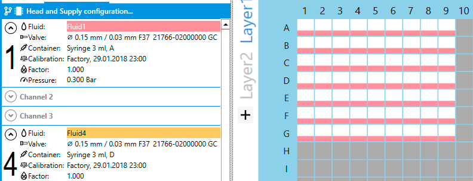{ .img-medium .on-glb width="550" height="250" }

* Under the *TEMPLATE* column, select the *Flex 8, emplty* template and apply by double-clicking it. Alternatively right-click > *apply*.

    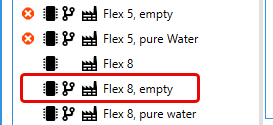{ .img-medium .on-glb width="350" height="150" }

    
    ✔ The template is added to the configuration.
    
    ✔ All channels in *Valve Head Preview* are disabled.
    
    ✔ No micro valve was defined yet (*NO VALVE*).

!!! note
    
    By right-clicking => apply,the configuration of the supply (Supply) and the dispensing head (Head) can be applied separately. If both are marked, the supply as well as the dispensing head configuration is taken over.

    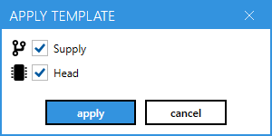{ .img-medium .on-glb width="350" height="150" }

!!! note
    A red cross sign to the left of the template in forms that the installed dispensing head is in compatible with the template and cannot be used.

### Copy the Configuration Template

Right-click on template =\> *Save as\...* opens the following window: [Template Manager](#template_manager)

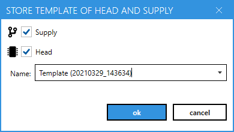{ .img-medium .on-glb width="350" height="150" }

* Select the part to be copied. (*Supply* and / or *Head*)

* Define/enter the name of the template.

    * Default = template (creation date \[YY / MM / DD\] \_time \[hh / mm /ss\])
        
        ✔ Select *ok* to add the template to the list.

### Saving an Active Configuration

The active dispensing head configuration can be saved in *Template Manager*.

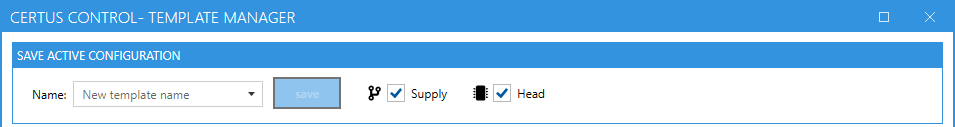{ .img-medium .on-glb width="550" height="350" }

* Name the active template under *Template Manager \> Save active configuration*.

* Check to define the contents of the configuration.
    
    * *Head*: Saves configurations along with the dispensing head configuration.
    * *Supply*: Saves configurations along with the supply configuration.

* Click *save* to save the configuration.

### Defining a Supply Kit

Supply kits are registered and managed in *Configuration Manager*. They are supposed to help avoid wrong configurations. Thus, only one output of the relevant kit is always assigned to a channel at a later stage.

In addition to the kit type proper and a selection of various bottle and syringe types, the supply kit contains the fluid and pressure used.

The kit ID makes subsequent identification easier.
For more information, see [Configuration Manager](certus_controls.md#configuration_manager).

* To open *Configuration Manager*, double-click the channel or click > the *Channels* symbol.

    { .img-medium .on-glb width="350" height="150" }
    
    ✔ *Configuration Manager* opens.

    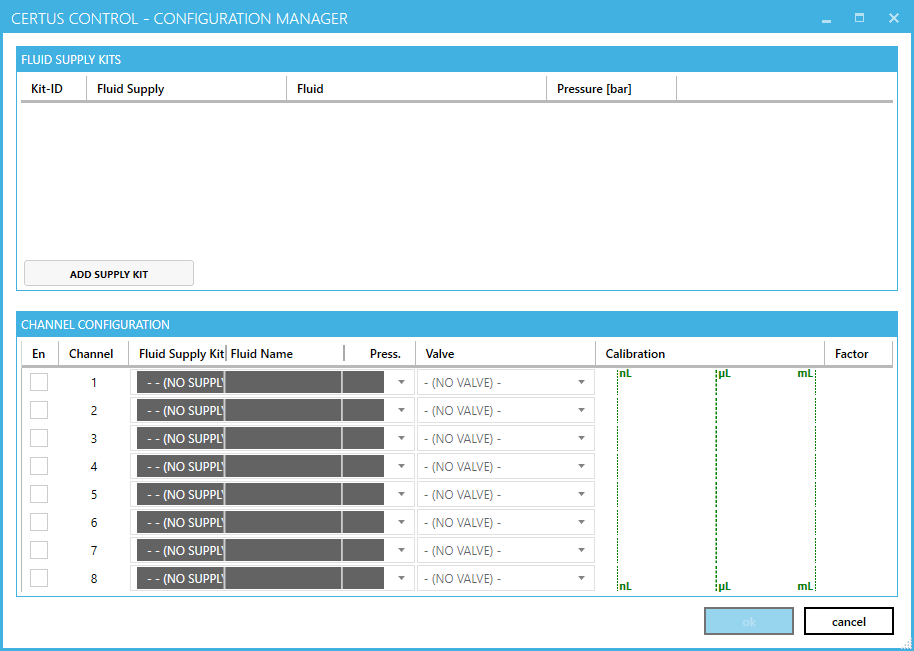{ .img-medium .on-glb width="550" height="350" }

* Click ADD SUPPLY KIT
    
    ✔ The *Kit Supply Selector* window opens.

    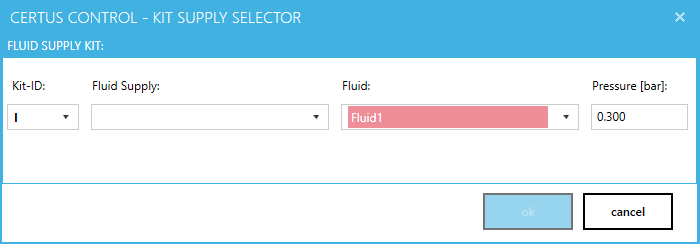{ .img-medium .on-glb width="550" height="350" }

* Select the ID, the type of kit, and the fluid, and set the pressure.

* Confirm with *ok*.

    ✔ The supply kit is added to the list.

* Repeat the same steps to add all supply kits needed for the installed dispensing head.

    ✔ All supply kits are shown in the list.

    ✔ Proceed to configure individual channels.

!!! note
    Data for the supply kit can be edited directlyin the list. You have to create a new entry if you would like to change kit type.

#### Configuring Channels

In the *Channel Configuration* area, a supply kit, a micro valve, and a calibration are defined for each channel.

In the *En* column, you can enable or disable individual channels. By using a factor in the Factor column, you can edit the dispensing volume.

Factor column, you can edit the dispensing volume.

For more information, see [Configuration Manager](certus_controls.md#configuration_manager).

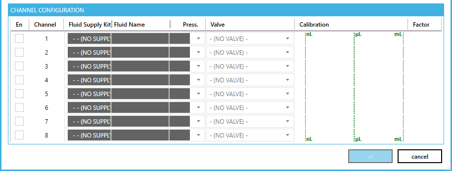{ .img-medium .on-glb width="550" height="350" }

#### Enabling/Disabling a Channel

If not all channels are used with the installed dispensing head, you can disable (=no check) or enable (=check) the channel you want.

!!! note
    A channel can also be disabled if a fluid is assigned to multiple channels, but you would like to use only a specific channel for dispensing.

* In the *En* column, check all channels to be used.
    
    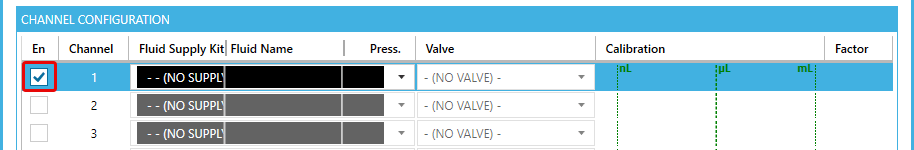{ .img-medium .on-glb width="550" height="350" }
    
    ✔ You can select the *Supply Kit* column.
    
    ✔ Proceed to define a (B) supply kit.

* In *Protocol Editor*, right-click the channel to enable/disable it with the *Disable/ Enable* command.

    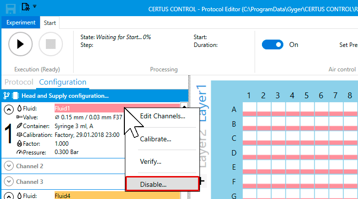{ .img-medium .on-glb width="450" height="250" }

#### Defining a Supply Kit

In the next column, a supply kit is defined for the selected channel as explained in [Defining a Supply Kit](#defining-a-supply-kit).

* Click to the right of the channel number.
    
    ✔ The list of the supply kit added above is expanded.

    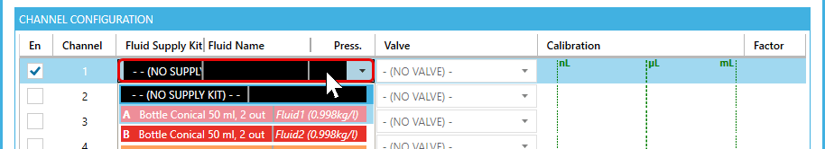{ .img-medium .on-glb width="550" height="350" }

* Select the desired the supply kit.
    
    ✔ You can select the *Valve* column.

    ✔ Proceed to define a (C) micro valve.

#### Selecting a micro valve

Here, you can select the micro valve installed on the dispensing head.

* In the Valve column, open the selection list.
    
    ✔ The list of micro valves added to the library is expanded.

    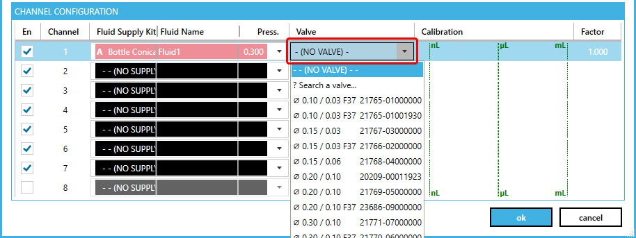{ .img-medium .on-glb width="550" height="350" }

* Select the micro valve installed on the dispensing head under this channel number.
    
    ✔ Proceed to assign a (D) calibration.

!!! note 
    
    If it is difficult to select a micro valve due to a large number of added micro valves, you can use the `? search function` to filter out the desired micro valve by serial number or type.

#### Assigning a Calibration

If a calibration already exists for the desired channel, it can be assigned to the channel.

* Click the row in the *Calibration* column.

    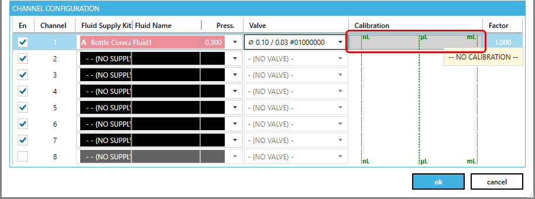{ .img-medium .on-glb width="550" height="350" }
    
    ✔ Open *Calibration Manager* for the selected channel number. For more information, see [Calibration Manager](certus_controls.md#calibration_manager).

    !!! note "Calibration Manager sets filtering in accordance with the selected values."

* Select the listed Calibration and confirm with *ok*.
    
    ✔ The channel configuration was successfully completed.
    
    ✔ Optionally, you can change the factor.

!!! note
    
    If no calibration is listed, it has to be repeated. For this purpose, see [Calibration](#caliberation).
    
    Alternatively, a calibration with a similar configuration can be selected by editing the set filters.

#### Adapting the Factor Value (Option)

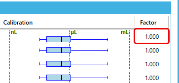{ .img-medium .on-glb width="350" height="250" }

By editing the factor value (the default value is 1.0), you can change a calibration upward or downward.

Factor = V~expected~ ÷ V~measured~ => Thus, +1% corresponds to a factor value of 1.010.

It is used, for instance, to take into account temporary factors such as temperature, pressure deviation, etc.

!!! note "Avoid changing the factor"
    
    { .img-icon width="80" height="80" }

    The possibility to edit the factor value is only a transitional solution to avoid a calibration. To make dispensing accurate, a clean calibration is indispensable. For more information, see [Calibration](#calibration).

* Repeat steps A to D until all needed channels are configured.

* Click ok to confirm the configuration of all channels.
    
    ✔ The completion of the dispensing head is complete.

### Configuration transfer to another dispensing head type

After installing a new type of dispensing head, the configuration can be adapted to the new head type.

**Procedure**:

1.  Change the dispensing head on the {{ variables.product.name.en }}.

2.  CERTUS CONTROL detects the change of the dispensing head.

3.  Select *confirm* to confirm the change of the dispensing head.

    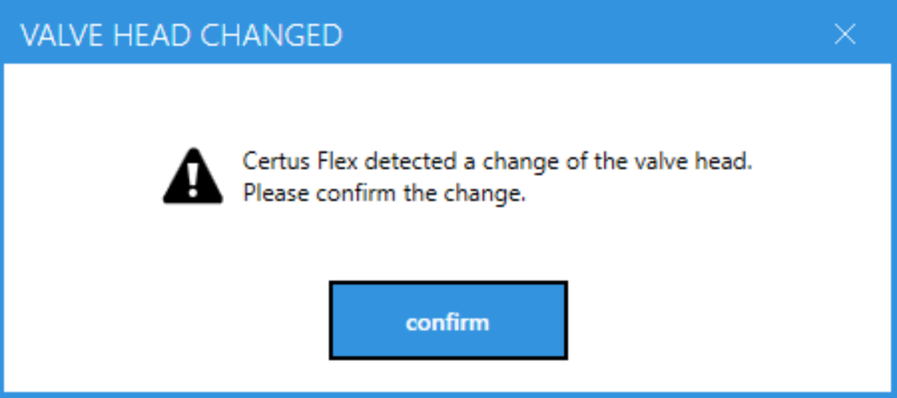{ .img-medium .on-glb width="350" height="150" }     

    1.  Readout if the configuration matches the installed dispensing head:
    
        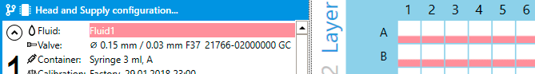{ .img-medium .on-glb width="450" height="200" }

    1.  Readout if the configuration is incompatible with the installed dispensing head:

        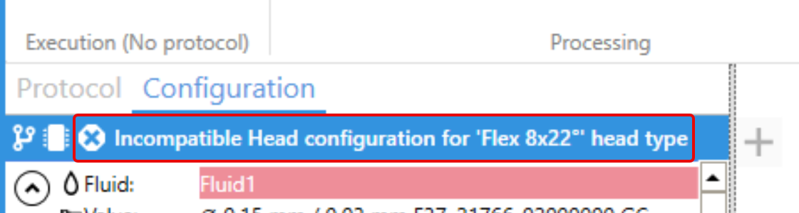{ .img-medium .on-glb width="450" height="200" }

4.  Right-click the blue area *Incompatible Head config\...* and select *Transfer configuration*.

    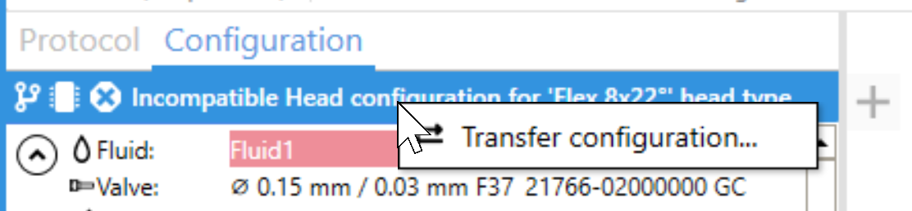{ .img-medium .on-glb width="450" height="200" }

6.  Confirm the message for the configuration transfer.

    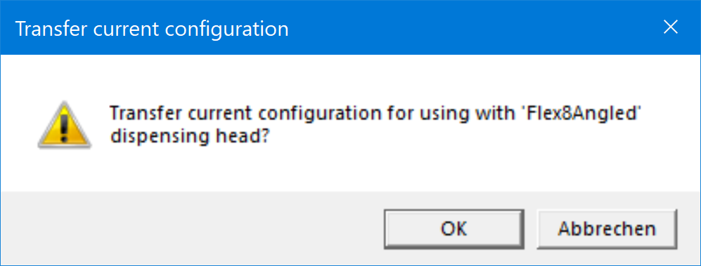{ .img-medium .on-glb width="450" height="200" }


!!! note
    With a configuration transfer, the channels are transferred according to the channel numbers.If a channel number is not available in the new configuration, it will be lost! Any empty media kits that are eventually created are not deleted and still can be used.

## Maintenance

{ .img-medium width="450" height="350" }

Individual maintenance functions to prepare and clean channels/micro valves are described here. You can find them in *Protocol Editor* under *Maintenance*. For more information, see [Maintenance](certus_controls.md#maintenance).

!!! warning "Warning: Risk of fluid spillage"
    
    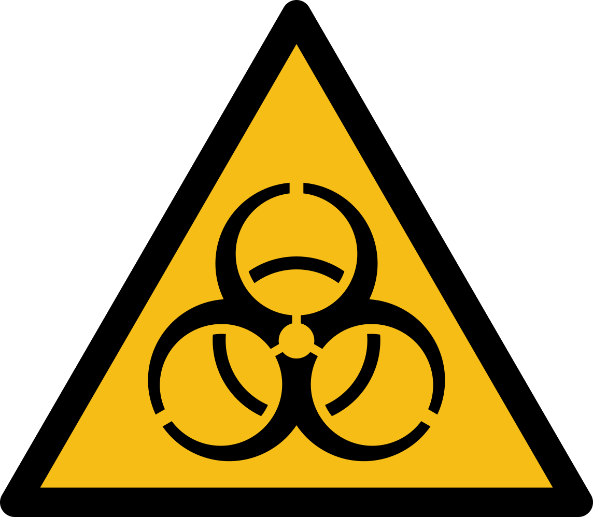{ .img-icon width="80" height="80px"}

    Fluid may spill into the waste tray during the execution of maintenance functions (Flush, Prime, and Purge). This may cause malfunctions (if fluid spills into the housing) and have health consequences.
    
    ► Manually remove fluid before it spills out.
    
    ► Use a waste tray with discharge function.

!!! caution "Caution: Risk of crushing due to axial movement"
    
    { .img-icon width="80" height="80"}

    If the *Move Dispensing Head down* option is checked, the dispensing head moves down. Which creates a risk of crushing during axial movement.
    
    ► Hands should be kept away during axial movement.

!!! note "Note: Avoid idle dispensing"

    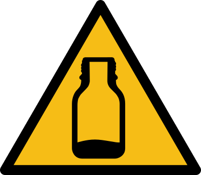{ .img-icon width="80" height="80"}

    Dispensing without fluid could reduce the life of the micro valve.
    
    ► Always dispense with fluid.
    
    ► Make sure that there is enough fluid in the container.
    
    ► Before proceeding with dispensing, check that the micro valve is supplied with fluid.

### Preparation

Before starting an experiment, you should make sure that the fluid tubes and micro valves are completely refilled with fluid and there are no air bubbles in the fluid channel.

To achieve this, the *Flush* and *Prime* functions are used for one or more channels.

!!! note
    
    If there is no pressure or no calibration was performed, you cannot use the *Flush* or *Prime* function. 
    
    (The keys are grayed out)

#### Flush

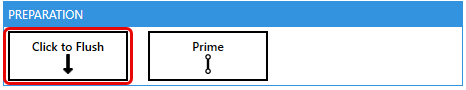{ .img-medium .on-glb width="550" height="350" }

During flushing, the micro valve remains open until the set time is over. (the default value is 120 s).

!!! note 
    The duration of the flushing function can be edited under Settings. See [Flush](certus_controls.md#flush)

Enable compressed air, under Air.

{ .img-medium .on-glb width="550" height="350" }

!!! note 
    * *Optional*: Set the air pressure mode toAuto or Manual.
    * *Auto*:The air pressure defined for the supply kit is used for the maintenance commands. Refer to [Defining a Supply Kit](#defining_a_supply_kit).
    * *Manual*:The manually set air pressure is used, the configured air pressure is ignored. The dispensed volumes of the maintenance commands issued may differ

* Select a channel to be flushed.
* (Option) Disable *Move Dispensing Head down* if the dispensing head should not move down.
* Click the *Click to Flush* key under *Preparation*.
    ✔ Flushing starts and automatically stops after 120 s.

!!! note
    Clicking *Click to STOP* stops the flushing function.

#### Prime

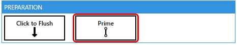{ .img-medium .on-glb width="550" height="350" }

During priming, the micro valve is opened until the defined volume is dispensed.

* Select the channel for priming.
* Enter a priming volume in the *Prime volume* column.
* (Option) Disable *Move Dispensing Head down* if the dispensing head should not move down.
* Click the *Prime* key under *Preparation*.
    
    ✔ Priming starts and dispenses the set volume.

#### Cleaning

If a problem occurs during dispensing or the micro valve is not used for a longer period of time, it is recommended cleaning the micro valve.
A micro valve can be cleaned by using the *Purge* and *Clean Cycle* functions.

Before using *Purge* and *Clean Cycle*, read [Cleaning the micro valve](maintenance.md#cleaning-the-micro-valve).

!!! note
    The Purge and Clean Cycle functions can be used for multiple channels simultaneously.

#### Purge

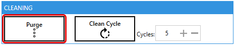{ .img-medium .on-glb width="550" height="350" }

Briefly open and close the micro valve until the quantity set under *Purge volume* is reached. The opening time depends on the type of valve here.

* Select a channel to be purged.
* Enter a purging volume in the *Purge volume* column.
* (Option) Disable *Move Dispensing Head down* if the dispensing head should not move down.
* Click the *Cleaning* key under *Purge*.
    
    ✔ The purging function starts.
    
    ✔ The micro valve opens/closes until the set volume is dispensed.

#### Clean cycle

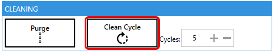{ .img-medium .on-glb width="550" height="350" }

*Clean Cycle* is a combination of the *Prime* and *Purge* functions.
The cleaning cycle is repeated as many times as set under *Cycles*.

* Select a channel for the cleaning cycle.
* Enter a priming volume in the *Prime volume* column.
* Enter a priming volume in the *Purge volume* column.
* (Option) *Move Dispensing Head down* if the dispensing head should not move down.
* (Option) Define the number of cleaning cycle repetitions under *Cleaning* next to *Cycles* (the default value is 5).
* Click the *Cleaning* key under *Clean Cycle*.
    
    ✔ The cleaning cycle (Prime and Purge) starts.

## Calibration

{{ variables.product.name.en }} dispenses in a combination of multiple factors.

When you use a factor, the dispensing volume can differ even if the valve opening time remains the same.

!!! note
    Example: Compressed air pushes fluid out of the container. If the valve opening time remains the same, dispensing with higher pressure yields a larger volume.

The dispensing volume is influenced by the following factors:

*   Compressed air
*   Fluid density
*   Fluid viscosity
*   Position of the supply kit
*   Micro valve
*   Use of a feed tube or syringe
*   Tube diameter and length where a feed tube is used

!!! note
    If you use an original supply kit, you can be sure that you always use the right tube length/diameter.
    
For a calibration, these factors have to be correctly predefined in the software. See [Configuring a Dispensing Head](#configuring-a-dispensing-head).

!!! note
    A calibration always affects the entire channel setup, but not only a micro valve.

To make dispensing accurate, each combination needs to be configured. See [Overview -- Calibration](#overview-calibration).

#### Calibration -- Optimization

To make the calibration as accurate as possible, the following steps have to be taken prior to calibration:

* Before calibration, clean the calibration jar.
* Protect the laboratory balance against the following disturbances:
    electrostatic/magnetic forces, air flow, and ambient variations.
* Avoid direct sunlight.
* To prevent evaporation of dispensed fluid, the calibration cap should always be left on.
* Short distance between {{ variables.product.name.en }} and the laboratory balance. This helps reduce evaporation of dispensed fluid.

#### Overview -- Calibration

The flow diagram shows the sequence and necessary steps of the calibration.

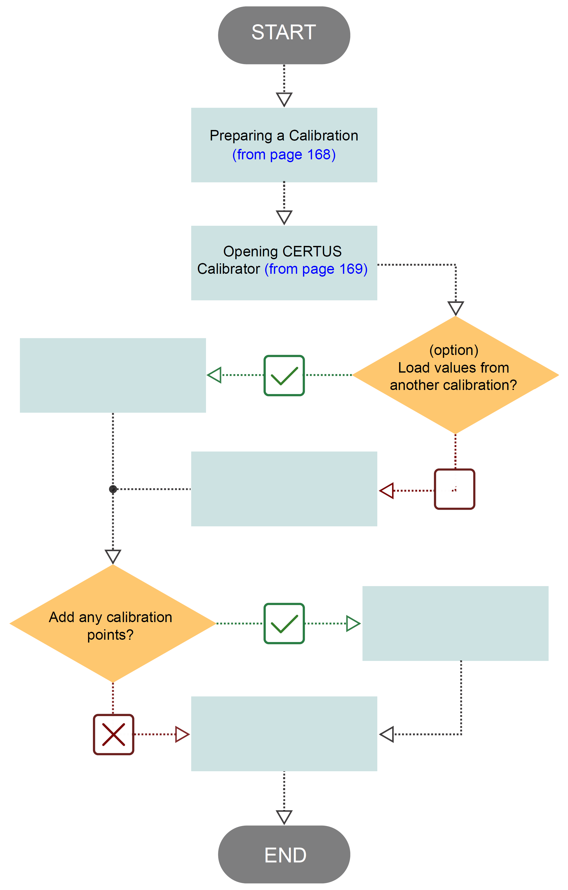{ .img-medium .on-glb width="650" height="450" }

#### Preparing a Calibration

Before you can start a calibration, the following preparations have to be made:

✔ CERTUS CONTROL is opened and connected to the base unit.

✔ The base unit is provided with necessary compressed air.

✔ The calibration channel was flushed with the *Flush* function.

For more information, see [Preparation](#preparation).

!!! note
    The fluid channel connected to the micro valve must not develop any air bubbles. A constant fluid jet has to be ejected from the micro valve when Flush is executed.

✔ A calibration kit (type 2) is available.
    It consists of an adapter plate, a calibration cap, and a calibration jar.

✔ The well plate holder, the adapter plate, the calibration jar, and the calibration cap have to be clean and dry to avoid undesired weight losses.

✔ A laboratory balance with a reading accuracy of 0.1 mg is available.

!!! note "Note: Do not use an inaccurate laboratory balance"

    { .img-icon width="80" height="80"}

    The more accurate the dispensed quantity can be measured during calibration, the more accurate the result is
    
    ► Use a laboratory balance with a reading value of at least 0.1 mg (0.0001 g).
    
    ► Protect the laboratory balance against external factors.
    
► Put the adapter plate on the well plate holder. Orientation is irrelevant here.

#### Adjust the Calibration name

The displayed name of the calibration in the protocol editor can be adjusted with defined tokens and text.

* Open the settings window see [Default Values](certus_controls.md#default-values).

* Define the naming for the calibration by using tokens and any text.

!!! note
    
    When typing the token, make sure to add the curly brackets „{ „ and „}“. 
    
    All usable tokens are listed underneath the input field.
    
    If left blank, the following tokens will be used: {Type}, {CreationTime}

For example:

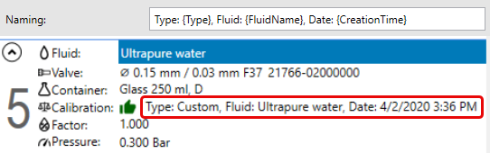{ .img-medium .on-glb width="550" height="350" }

#### Opening CERTUS Calibrator

* *Protocol Editor* \> *Configuration* Right-click the desired channel.
* Select the *Calibrate* command from the context menu.
    
    ✔ The *CERTUS Calibrator* window opens.

    For more information on the window, see [CERTUS Calibrator](certus_controls.md#certus-calibrator).

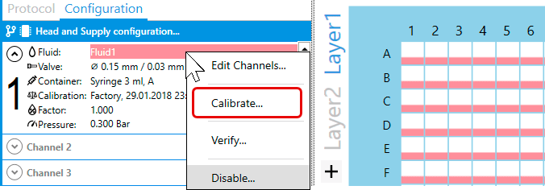{ .img-medium .on-glb width="550" height="350" }

#### Loading Values

At first when creating a new calibration, the values of an existing calibration can be loaded. Subsequently the desired calibration values can be determined or deactivated.

!!! note
    
    It is recommended that within desired dispensing range at least the standard values are calibrated. In the lower valve region in particular, the ratio of opening time - dispensing volume is not linear and a certain number of calibration points essential.
    
    As a reference, within the curve ([CERTUS Calibrator](certus_controls.md#certus-calibrator)) the gray Standard calibration curve is displayed.

* Click *Load Values* in the *CERTUS Calibrator* window.
    
    ✔ The CALIBRATION SELECTOR window opens. For more information, see the [Calibration Selector](certus_controls.md#calibration-selector).

    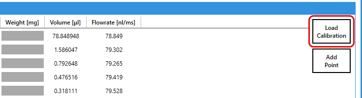{ .img-medium .on-glb width="550" height="350" }

* Select a calibration template with a configuration that is as identical as possible and load it by clicking *load values*.
    
    ✔ The loaded values can be seen in the *Volume and Flowrate* column.

* *dispense* at the desired calibration point to start dispensing.

    For this purpose, see [Determining Calibration Points](#determining-calibration-points).

### Determining Calibration Points

* Put an empty calibration jar with calibration cap on the laboratory balance and reset it.

    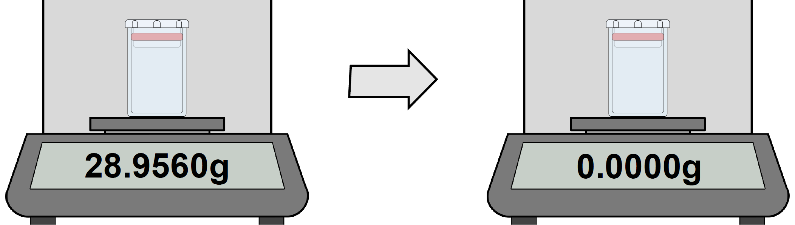{ .img-medium .on-glb width="550" height="350" }

* Insert the calibration jar with calibration cap into the hole of the adapter plate.

    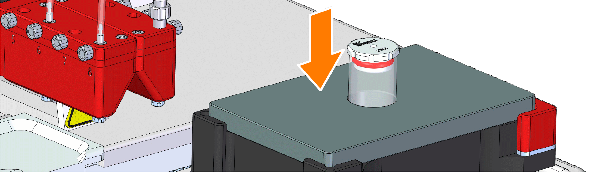{ .img-medium .on-glb width="550" height="350" }

* Click *dispense* in the *CERTUS Calibrator* window.

    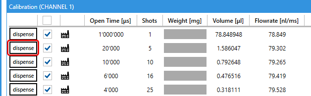{ .img-medium .on-glb width="550" height="350" }

* The well plate holder travels under the dispensing head and the micro valve dispenses with the set opening time (*Open Time*) and number of shots.

    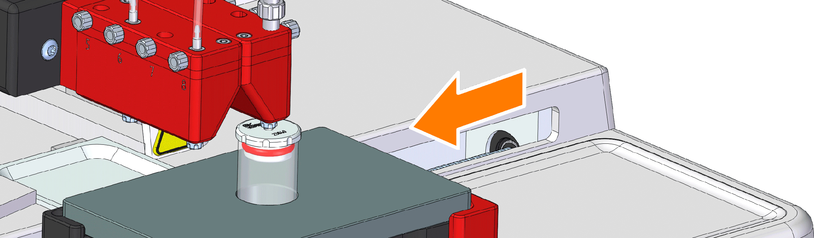{ .img-medium .on-glb width="550" height="350" }

* As soon as the well plate holder comes back to the starting position, pull the calibration jar out of the adapter plate and determine the weight difference using the laboratory balance.

    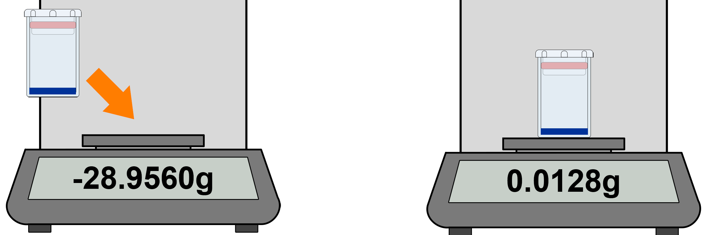{ .img-medium .on-glb width="550" height="350" }

!!! note "Note: Weight deviation due to evaporation"

    { .img-icon width="80" height="80"}

    After dispensing into the calibration jar, there may be some weight loss due to fluid evaporation. 
    
    Therefore:
    
    ► As soon as the well plate holder with calibration jar comes back to the starting position, determine the weight using the laboratory balance to reduce volume losses due to evaporation.
    
    ► Determine the weight of the calibration jar at equal intervals. From the completion of dispensing to weight determination using the laboratory balance.

* Enter the measured weight in the *Weight* column. Watch out for the measure unit!

    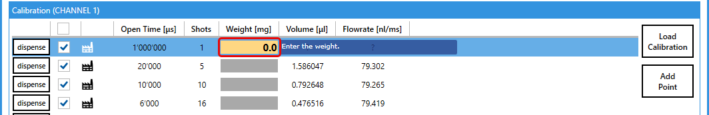{ .img-medium .on-glb width="650" height="450"}

* Reset the weight of the filled calibration jar before proceeding with the next calibration points.

    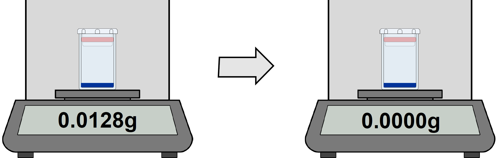{ .img-medium .on-glb width="550" height="350"}

* Take the same steps for the remaining calibration points.

!!! note
    A calibration can only be completed if the weight determination of all active standard calibration points has been carried out. Standard calibration points can also be deactivated. Particularly in the lower valve region, a certain resolution of the points is recommended due to its non-linear behavior. 
    
    The gray standard calibration curve ([CERTUS Calibrator](certus_controls.md#certus-caliberator)) can be used as an aid.

### Adding customized Calibration Points

* Click *Add Value* in the *CERTUS Calibrator* window.

    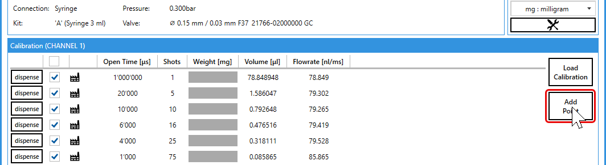{ .img-medium .on-glb width="550" height="350" }
    
    ✔ The *Custom Calibration by Volume* window opens.

* Define the target volume and number of shots for calibration purposes.

    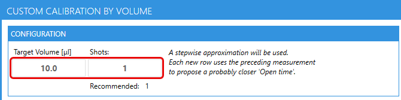{ .img-medium .on-glb width="550" height="350" }

!!! note
    * If the target volume is low (<10 μl), a higher number of shots is recommended. Each shot stands for the target volume.
    * For the measurement to be reliable, the total dispensed volume, which is the target volume multiplied by the number of shots, has to be heavy enough on the laboratory balance.

* Put an empty calibration jar with calibration cap on the laboratory balance and reset it.

    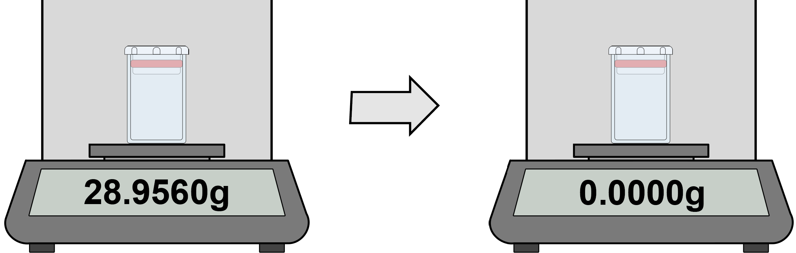{ .img-medium .on-glb width="550" height="350" }

* Insert the calibration jar with calibration cap into the hole of the adapter plate.
* Click *dispense* in the *Custom Calibration by Volume* window.

    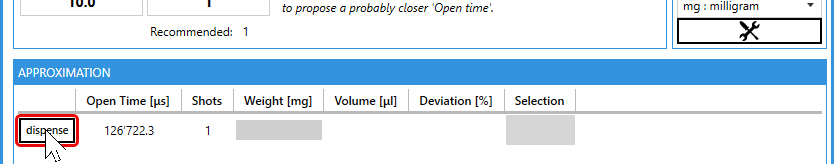{ .img-medium .on-glb width="650" height="450" }    

    ✔ The well plate holder travels under the dispensing head and the micro valve dispenses with the set opening time (*Open Time*) and number of shots (*Shots*).

    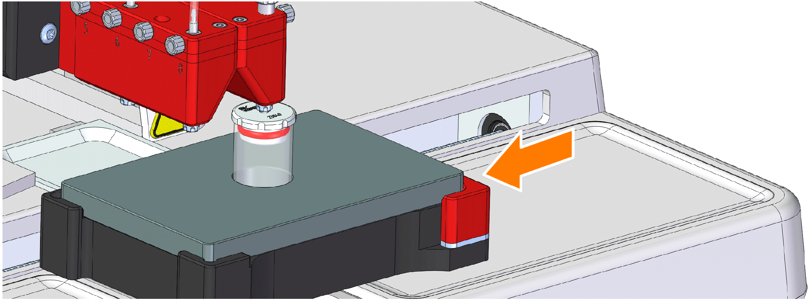{ .img-medium .on-glb width="550" height="350" }

* As soon as the well plate holder comes back to the starting position, pull the calibration jar out of the adapter plate and determine the weight difference using the laboratory bal- ance.

    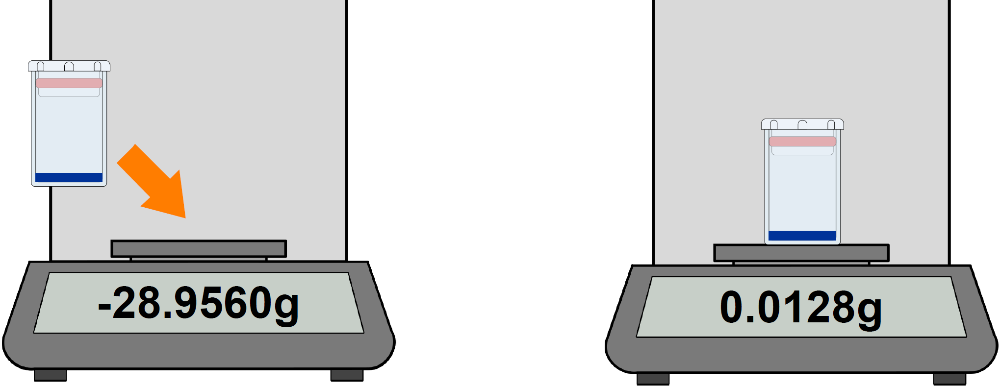{ .img-medium .on-glb width="550" height="350" }

!!! note "Note: Weight deviation due to evaporation"

    { .img-icon width="80" height="80"}
    
    After dispensing into the calibration jar, there may be some weight loss due to fluid evaporation.
    Therefore:

    ► As soon as the well plate holder with calibration jar comes back to the starting position, determine the weight using the laboratory balance to reduce volume losses due to evaporation.

    ► Determine the weight of the calibration jar at equal intervals. From the completion of dispensing to weight determination using the laboratory balance.

* Enter the measured weight in the *Weight* column. Watch out for the measure unit!

    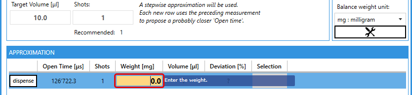{ .img-medium .on-glb width="550" height="350" }
    
    ✔ As soon as the measured weight is entered, the volume (*Volume*) and the deviation (*Deviation*) are automatically calculated, and a new row is added for further test dispensations.
    
    ✔ A deviation of +/- 5% is flagged with a thumbs up sign in the *Selection* column.

    !!! note

        Once a dispensation is flagged with a thumbs up sign, you can take it for calibration. However, to obtain a better deviation, it is advisable to conduct some more dispensations.

* Reset the weight of the filled calibration jar before proceeding with the next dispensation.

    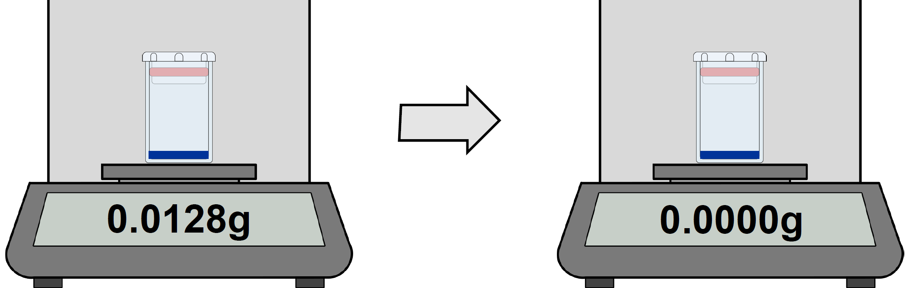{ .img-medium .on-glb width="550" height="350" }

* Once multiple dispensations are performed, select for calibration the value with the low- est deviation by clicking *Take Best* or the desired entry by clicking the thumbs up sign.
    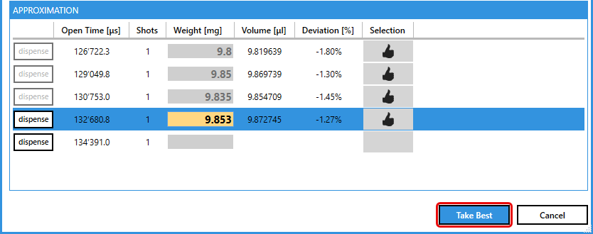{ .img-medium .on-glb width="550" height="350" }

### Completing Metadata

Before you save the calibration, complete missing information under Metadata.

!!! note
    Designations for the laboratory balance (Balance) and fluid temperature (fluid temp) can be predefined under Settings. See [Settings](certus_controls.md#settings).

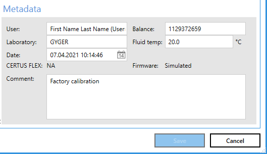{ .img-medium .on-glb width="550" height="350" }

### Verification using the Graph

To make sure that individual calibration points are within the correct area, the dispensing flow rate and the dispensed volume can be visually verified under *Flowrate-Graph* and *Volume-Graph*, respectively.

!!! note "Viewing tools"

    ► Holding down the left mouse button = show details
    
    ► Holding down the right mouse button = move the image
    
    ► Scrolling the mouse wheel = zoom in or out
    
    ► Double-clicking the mouse wheel = adjust the view
    
    ► Pulling the mouse wheel = define the zoom area

#### Flowrate-Graph

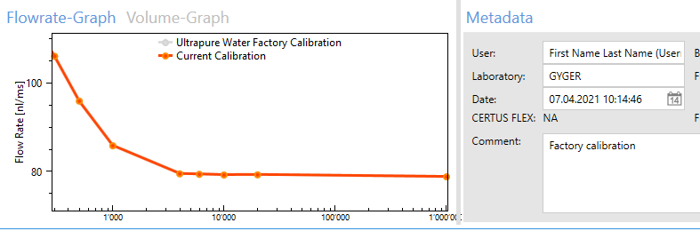{ .img-medium .on-glb width="650" height="450" }

### Volume-Graph

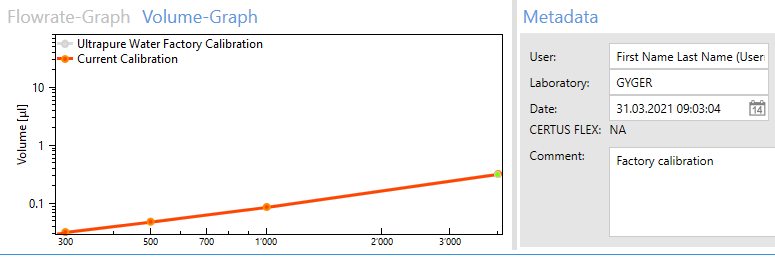{ .img-medium .on-glb width="650" height="450" }

!!! note

    If the graph increases steadily, the calibration areas are correctly applied. Otherwise, the calibration point in question has to be dispensed once again.

### Verifying a Calibration

CERTUS CONTROL enables to verify the calibration used. This option can also be used to regularly check dispensing accuracy.

* Right-click the calibrated channel under *Protocol Editor* > *Configuration*

!!! note
    Calibrated channels are flagged with a thumbs up sign. This means that the calibration is just right for this setup.

* Click the *Verify* command in the context menu.
    
    ✔ The *CERTUS Verificator* window opens.

    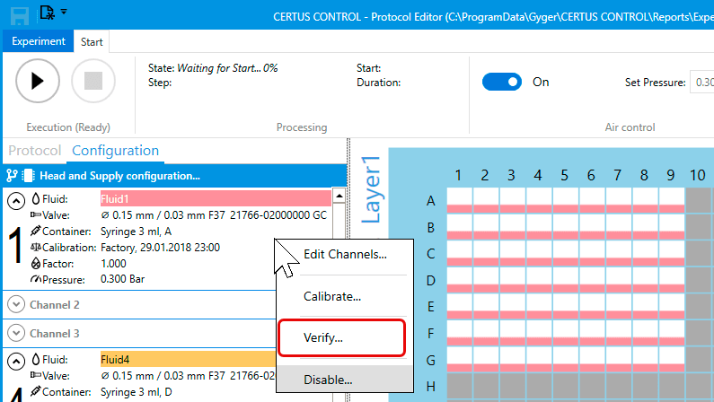{ .img-medium .on-glb width="550" height="350" }

* Put a calibration jar with calibration cap on the laboratory balance and reset it.

    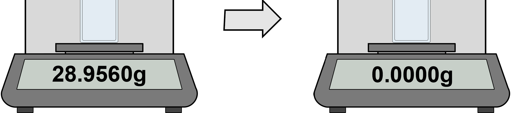{ .img-medium .on-glb width="550" height="350" }

* Insert the calibration jar with calibration cap into the hole of the adapter plate.

* In the *CERTUS Verificator* window, click *dispense* at the volume area to be verified.

    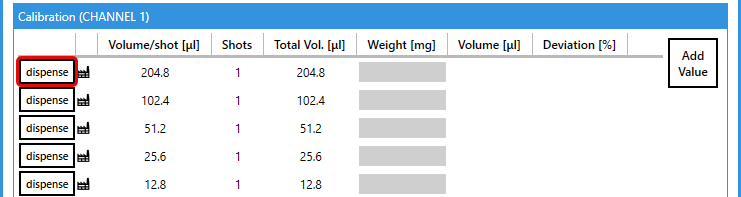{ .img-medium .on-glb width="550" height="350" }
    
    ✔ The well plate holder travels under the dispensing head and the micro valve dispenses with the set volume(*Volume*) and number of shots (*Shots*).

    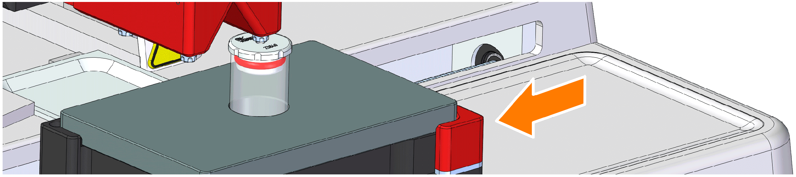{ .img-medium .on-glb width="550" height="350" }

* As soon as the well plate holder comes back to the starting position, pull the calibration jar out of the adapter plate and determine the weight difference using the laboratory balance.

    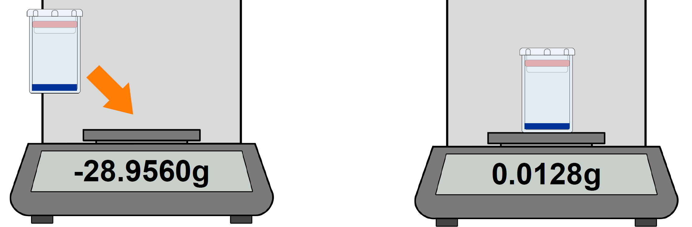{ .img-medium .on-glb width="550" height="350" }

!!! note "Weight deviation due to evaporation"

    After dispensing into the calibration jar, there may be some weight loss due to fluid evaporation.
    Therefore:
    
    ► As soon as the well plate holder with calibration jar comes back to the starting position, determinetheweightusing the laboratory balanceto reduce volume lossesdue to evaporation.
    
    ► Determine the weight of the calibration jar at equal intervals. From the completion of dispensing to weight determination using the laboratory balance.

* Enter the measured weight in the *Weight* column. Watch out for the measure unit!

    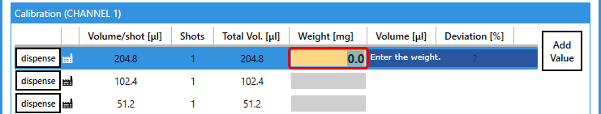{ .img-medium .on-glb width="550" height="350" }

* Reset the weight of the filled calibration jar before proceeding with the next dispensation.

    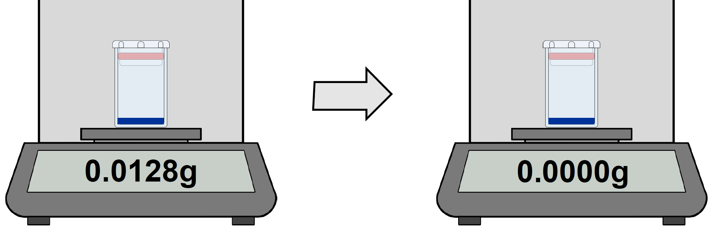{ .img-medium .on-glb width="550" height="350" }

* Take the same steps for the remaining volumes.

### Verifying a User-Defined Volume

* Click *Add Value* in the *CERTUS Verificator* window.

    How to open *CERTUS Verificator*, see [Verifying a Calibration](#verifying_a_calibration).

    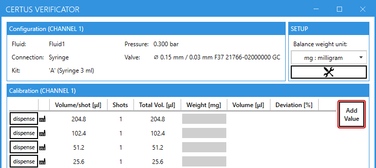{ .img-medium .on-glb width="550" height="350" }
  
    ✔ The *Custom Point for Verification* window opens.

* Enter the desired volume and number of shots.

    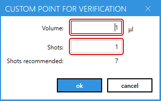{ .img-medium .on-glb width="350" height="150" }
    
!!! note
    For the number of shots, you can use a recommended value (Shots recommended). The predefined number of shots also takes into account the entered minimum weight of the balance, see [Calibration](certus_controls.md#calibration).

* Once you confirm with *ok*, the value is temporarily added to the list. The temporary volume entry is flagged with an icon.

    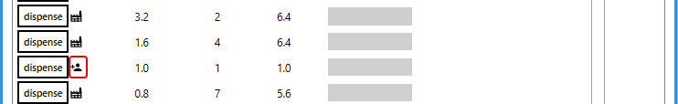{ .img-medium .on-glb width="550" height="350" }

* Put a calibration jar with calibration cap on the laboratory balance and reset it.

    { .img-medium .on-glb width="550" height="350" }

* Insert the calibration jar with calibration cap into the hole of the adapter plate.
* For a temporary volume entry, click *dispense*.

    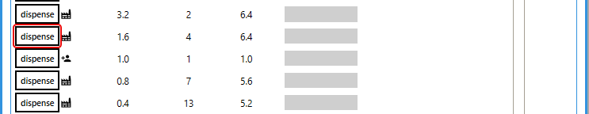{ .img-medium .on-glb width="550" height="350" }

    ✔ The well plate holder travels under the dispensing head and the micro valve dispenses with the set volume (*Volume*) and number of shots (*Shots*).

    { .img-medium .on-glb width="550" height="350" }

* As soon as the well plate holder comes back to the starting position, pull the calibration jar out of the adapter plate and determine the weight difference using the laboratory bal- ance.

    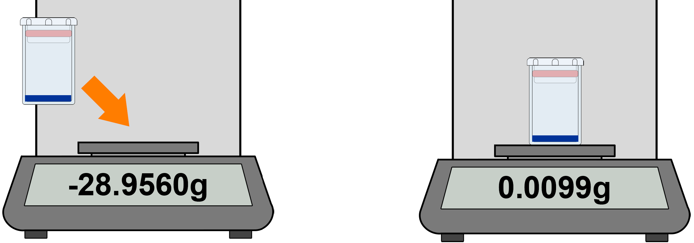{ .img-medium .on-glb width="550" height="350" } 

!!! note "Weight deviation due to evaporation"

    { .img-icon width="80" height="80"}

    After dispensing into the calibration jar, there may be some weight loss due to fluid evaporation.
    
    Therefore:
    
    ► As soon as the well plate holder with calibration jar comes back to the starting position, determine the weight using the laboratory balance to reduce volume losses due to evaporation.
    
    ► Determine the weight of the calibration jar at equal intervals. From the completion of dispensing to weight determination using the laboratory balance.

* Enter the measured weight in the *Weight* column. Watch out for the measure unit!

    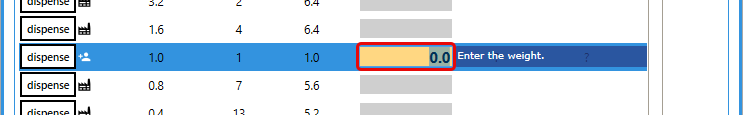{ .img-medium .on-glb width="550" height="350" }

* Reset the weight of the filled calibration jar before proceeding with the next dispensation.

    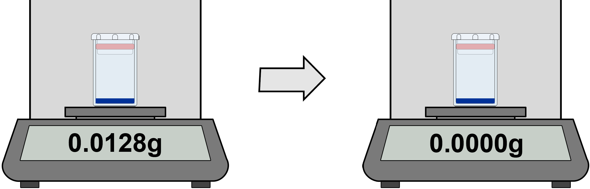{ .img-medium .on-glb width="550" height="350" }

* Take the same steps for the remaining volumes.

## Defining a Protocol

### Creating a New Protocol

A new protocol can be created as follows:

* Ctrl + N
* Click the symbol in the Quick access bar.

    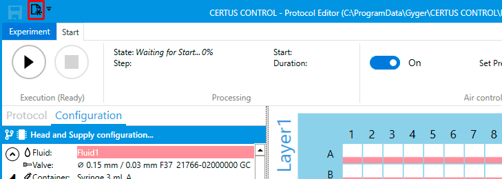{ .img-medium .on-glb width="450" height="250" }

* Click *New Protocol* in the Experiment Menu. For more information, see [Experiment Menu](certus_controls.md#experiment-menu).
    
    ✔ A *Select Well Plate for new Protocol* window opens.

    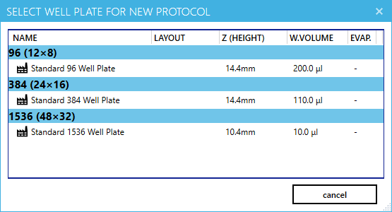{ .img-medium .on-glb width="450" height="250" }

* Click the well plate to be used.
    
    ✔ A new protocol was successfully created.

    ✔ The well plate is visualized.

### Refilling the Evaporation Curtain

An evaporation curtain was set for the well plate, it can be defined in *Protocol* with the required filling volume (%) and fluid.

For more information, see [Adding an Evaporation Curtain](#adding-an-evaporation-curtain).

!!! note
    The volume to be refilled is shown as a percentage as areas can be defined with various filling volumes.

* Right-click in the area under *Well Plate* and click *Set Evaporation*.

    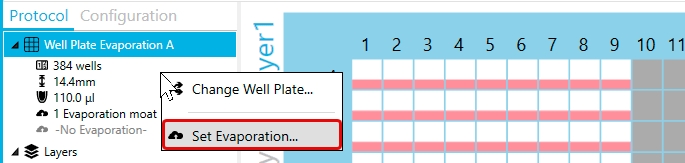{ .img-medium .on-glb width="450" height="250" }
    
    ✔ The *Set Evaporation Dispense* window opens.

    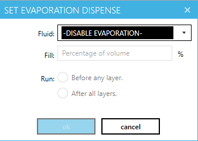{ .img-medium .on-glb width="350" height="150" }

* Define fluid to refill the evaporation curtain and enter the filling volume in percent. (The default value is 10%)

    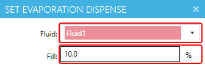{ .img-medium .on-glb width="450" height="250" }

* Define if the evaporation curtain should be refilled before (*Before any layer*) or after (*After all layers*) dispensing of all layers.

    { .img-medium .on-glb width="450" height="250" }

* Confirm with *OK* to close the evaporation curtain.

!!! note
    To disable the evaporation curtain, you have to set fluid to *Disable Evaporation*.

### Regions

Read first section [Protocol](certus_controls.md#protocol).

#### Creating a region

* Place the cursor in a corner of the region to be created.

    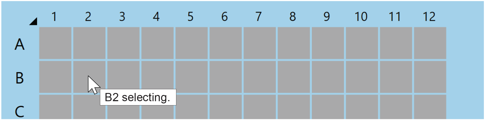{ .img-medium .on-glb width="450" height="250" }

* Holding down the left mouse button, define a region by diagonally dragging across it.
    
    ✔ Visualize the region by means of a selection rectangle (green).

    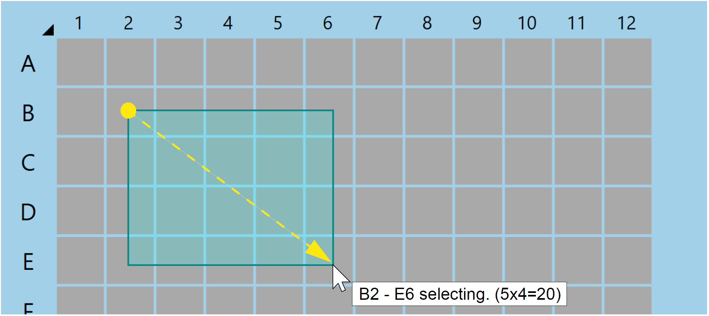{ .img-medium .on-glb width="450" height="250" }

* Release the left mouse button.
    
    ✔ The region is outlined in yellow.

    For more selections, see [Region – highlighting functions](#region--highlighting-functions).

* Right-click in the area and click *New Region*.
    
    ✔ The *Region Editor* window opens.

    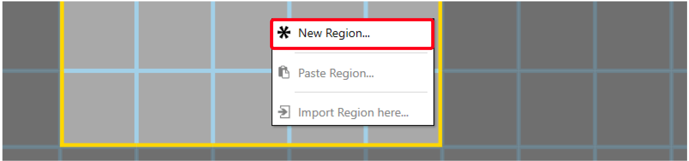{ .img-medium .on-glb width="550" height="350" }

* Go to [Defining a dispensing function (Region Editor)](#defining-a-dispensing-function-region-editor).

#### Region -- Highlighting Functions

##### Defining a whole well plate as a region

* If no region is defined in a layer, all wells of the well plate can be defined as a region by clicking the black triangle (top left).

    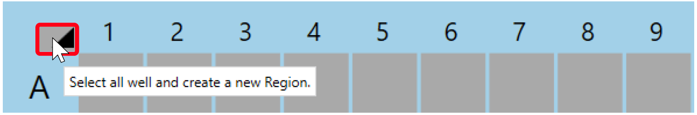{ .img-medium .on-glb width="450" height="250" }

##### Defining independent regions

* By holding down the Ctrl key, you can select various wells, which can subsequently be treated as a combined region.

    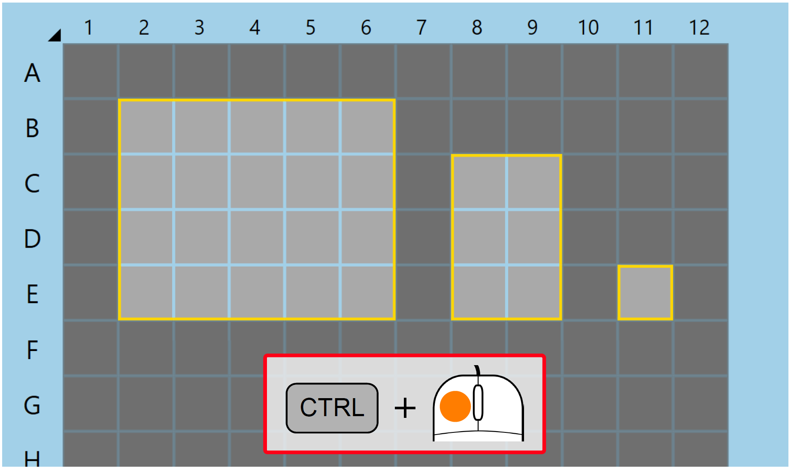{ .img-medium .on-glb width="450" height="250" }

##### Highlighting a whole row or column

* Clicking a number highlights a whole column (or multiple columns if you hold down the Ctrl key)

* Clicking a letter highlights a whole row (or multiple rows if you hold down the Ctrl key)

    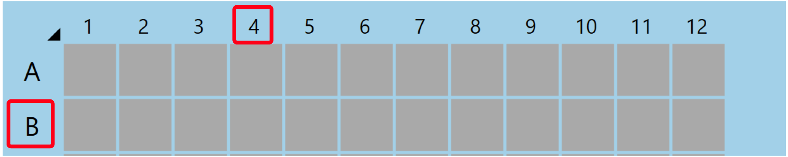{ .img-medium .on-glb width="450" height="250" }

!!! note
    If wells are already defined in a column or row as a region, you cannot use this function.

#### Defining a dispensing function (Region Editor)

* (Option) Rename the region.

    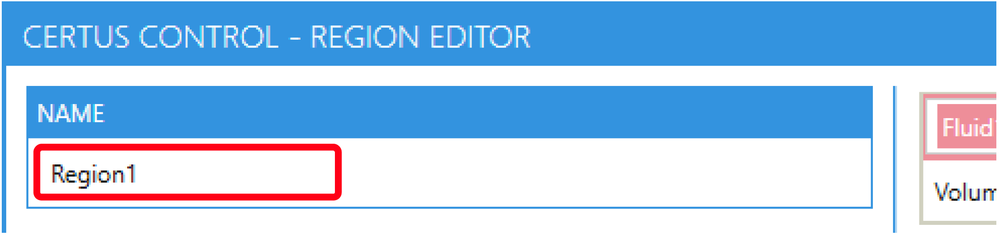{ .img-medium .on-glb width="550" height="350" }

* Define fluid and a dispensing function for a region.
  
    For more information, see [Dispensing Functions](certus_controls.md#dispensing-functions).

    ✔ The dispensing function along with the fluid are listed in the right column.

    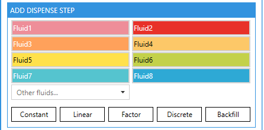{ .img-medium .on-glb width="550" height="350" }

* Define synchronous dispensing under *Synchronous Dispense*. For more information, see [Synchronous dispense](certus_controls.md#synchronous-dispense).

    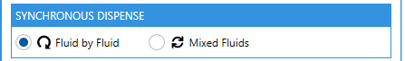{ .img-medium .on-glb width="550" height="350" }

* Under *Axis Movement*, define the axial movement of dispensing. For more information see [Axial movement](certus_controls.md#axial-movement).

    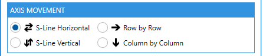{ .img-medium .on-glb width="550" height="350" }

!!! note "Confusion: dispensing and functional movements"

    { .img-icon width="80" height="80" }

    Axial movement should not be confused with the route of a dispensing function. Axial movement determines how the dispensing head moves and is not affected by the route of the dispensing function.

* Under *Sequence Replicate,* replicates within a region can be defined. For more information see [Sequence Replicate](certus_controls.md#sequence-replicate).

    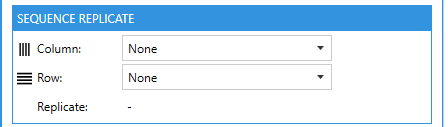{ .img-medium .on-glb width="550" height="350" }

#### Adding a dispensing quantity as an Excel table

The *Discrete* dispensing function can be individually used to define the dispensing volume for each well.

In addition, it is possible to enter values copied from an Excel table.

* In Region Editor, select the Discrete dispensing function.

    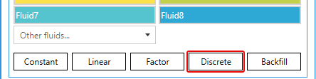{ .img-medium .on-glb width="550" height="350" }

* In the right column, click the *EDIT LIST* key.

    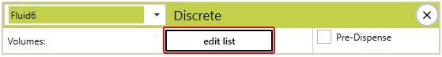{ .img-medium .on-glb width="550" height="350" }
    
    ✔ The *Discrete Volumes Editor* window opens.

* Open the Excel file and select and copy the desired values.

    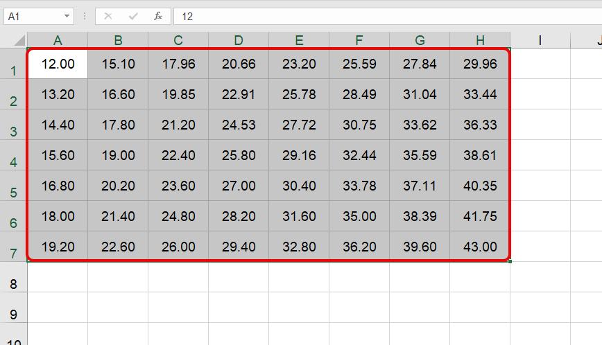{ .img-medium .on-glb width="550" height="350" }


* In the *Discrete Volumes Editor* window, click *IMPORT CLIPBOARD*.

    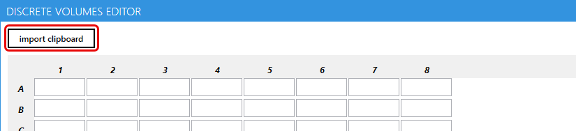{ .img-medium .on-glb width="550" height="350" }
    
    ✔ The *Clipboard Import* window opens.

* Define the top left input position and the unit of Excel values.

    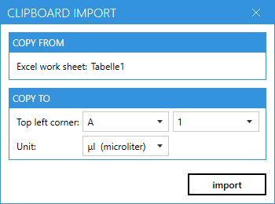{ .img-medium .on-glb width="550" height="350" }

* Click *IMPORT* to confirm the Excel values to be added.

    ✔ The Excel values are added to *Discrete Volumes Editor*.

!!! note
    The entered values can be subsequently edited.

* Click *ok* to confirm the entered values.
    
    ✔ The Excel values were successfully added to the *Discrete* dispensing function.

### Layer

Read first section [Protocol](certus_controls.md#protocol).

!!! note
    Once a new experiment is opened, the first layer (Layer1) is automatically created. Right-click Layers to add further layers.

#### Moving a layer

The sequence of individual layers determines what will be processed first. Fluid will be dispensed first to the top layer and finally to the bottom one.

Individual layers can be moved as follows:

* Holding down the left mouse button, move the layer to the desired place.
   
    ✔ A *Move to* Tooltip appears at the place to be moved.
    
    ✔ A gray bar is displayed across the whole column width.

    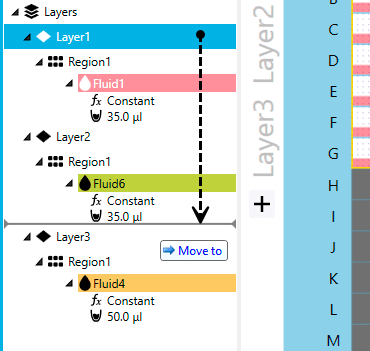{ .img-medium .on-glb width="450" height="250" }

#### Disabling and enabling a layer

If you would like to leave out a layer during an experiment, it can be disabled.

* Right-click the layer and click on *Enabled Layer* command.
    
    ✔ The layer is disabled (grayed out).

    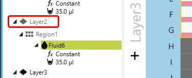{ .img-medium .on-glb width="450" height="250" }

## Import CSV file

Dosage volumes, which are saved as a CSV file can be imported into the protocol. In this case, the volumes are being imported as a cohesive region.

!!! note
    
    The CSV file cannot be imported into the protocol if there is a conflict with the occupied position in the existing Layer.

### Import CSV-volumes into a new layer

* In the protocol editor, click on *Experiment* to open the experiment menu.
* Under *Import* click on *Import CSV File* and choose the desired CSV file.
    
    ✔ *CSV Import Wizard* will open with the content of the CSV file.

    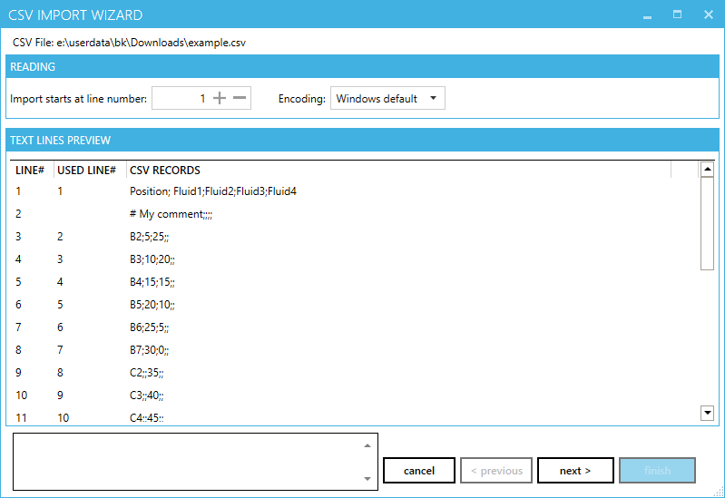{ .img-medium .on-glb width="550" height="350" }

* Click on *next >* to proceed.

    Optional: the starting line and the encoding can be chosen.

    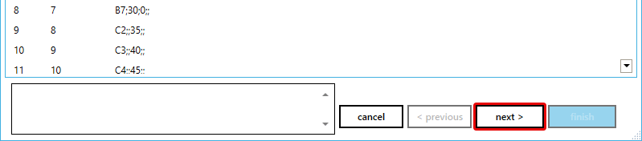{ .img-medium .on-glb width="550" height="350" }


* Choose the corresponding separator, decimal symbol and volume unit.

    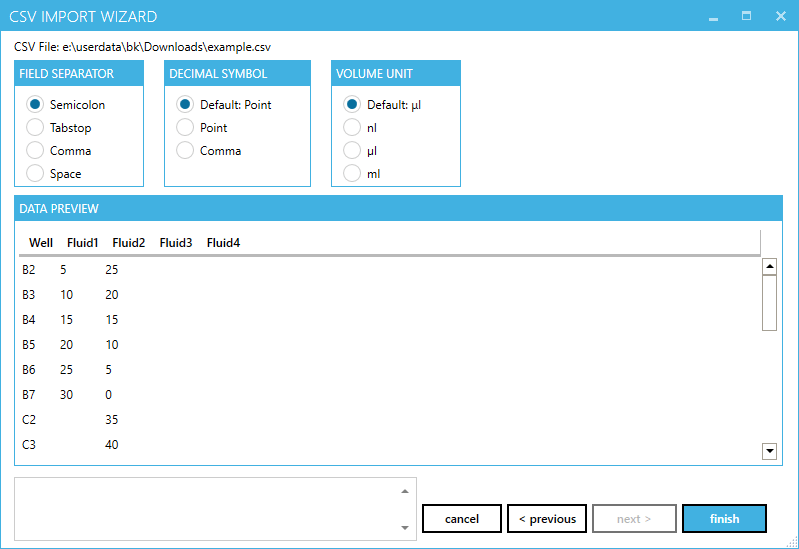{ .img-medium .on-glb width="550" height="350" }

* Click on *finish* to import the data into the protocol.

    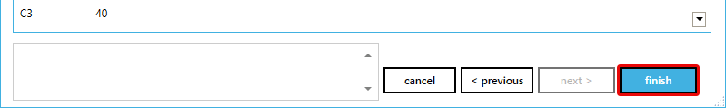{ .img-medium .on-glb width="550" height="350" }

#### Import CSV-volumes into an existing layer

* In the protocol editor, right click on an existing layer and choose *Import CSV data*.

    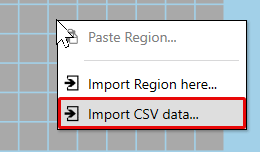{ .img-medium .on-glb width="350" height="150" }

* Choose and open the desired CSV file.

    ✔ *CSV Import Wizard* will open with the content of the CSV file.

    { .img-medium .on-glb width="550" height="350" }

* Click on *next* to proceed.

    ✔ Optional: the starting line and the encoding can be chosen.

    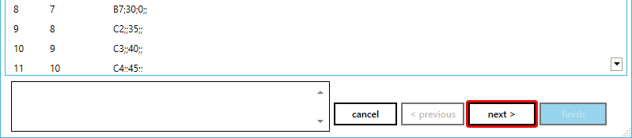{ .img-medium .on-glb width="550" height="350" }

* Choose the corresponding separator, decimal symbol and volume unit.

    { .img-medium .on-glb width="550" height="350" }

* Click on *finish* to import the data into the protocol.

    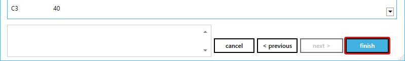{ .img-medium .on-glb width="550" height="350" }

### Edit CSV volumes

The CSV volumes must be edited in the CSV file and imported again in order to change the volumes.

* Double-click the desired region to open the region editor. (Or right click on the region and select *Edit Region\..*)

* Click on *Import CSV\...* and choose the CSV file.

!!! note

    The well positions in the CSV file will be processed according to the travel path specified in the AXIS MOVEMENT. By selecting the `Enforce strict CSV well order moving path`, the processing sequence will be in accordance with the CSV file.

### CSV format

If dispensing volumes are imported as a CSV file, the formatting should be as follows:


Position;DNA;NaCl;BSA 

\# Comment section 

*A1;0.1;10;5*

*A2;0.05;5;5*

*A3;0.2;20;5*

*A4;0.5;50;5*

Examples for CSV files can be found in:

`%ProgramData%\\Gyger\\CERTUS CONTROL\\doc`

!!! note
    Import of older V1 CSV files is still supported.

Position;Vol_Ch01;Vol_Ch02;Vol_Ch03

\# Comment section

*A1;1;6;5*

*A2;2;5;5*

*A3;3;20;5*

*A4;4;50;5*

## Conducting an experiment

The following items have to be completed before an experiment can be conducted:

* All following items have to be completed before an experiment can be conducted. See [Actions Prior to Use](#actions-prior-to-use) and [Preparation](#preparation)

* The base unit is ready to use. See [Power-Up](#power-up)

* The well plate defined in the protocol is in the well plate holder.

    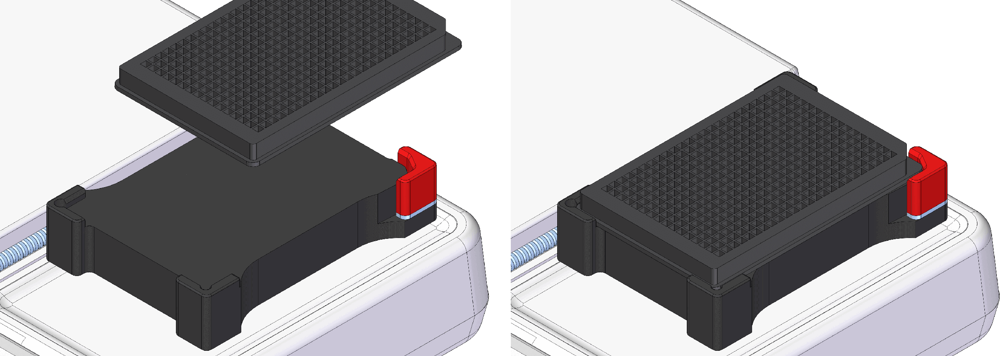{ .img-medium .on-glb width="550" height="350" }

* The data defined in *Configuration* is compliant with the hardware.

    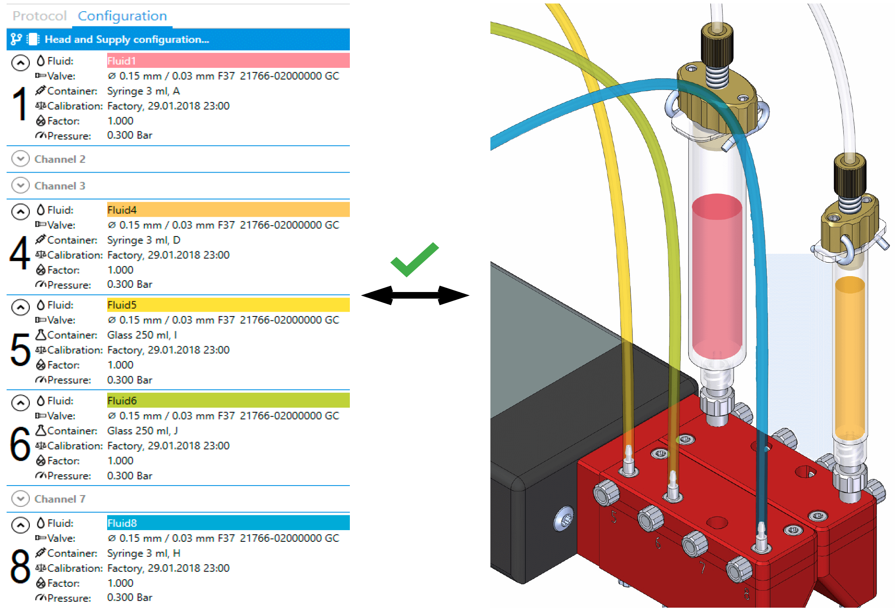{ .img-medium .on-glb width="550" height="350" }

* Compressed air is enabled in *Protocol Editor*.

    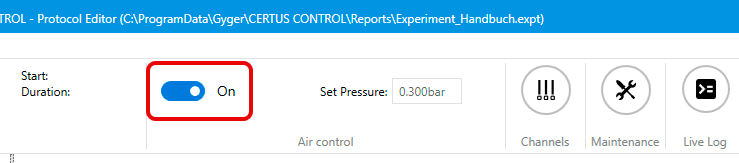{ .img-medium .on-glb width="550" height="350" }

* Click the start symbol. under *Execution (Ready)*.

    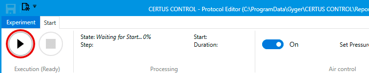{ .img-medium .on-glb width="550" height="350" }

    ✔ The *Protocol Validator* window opens.

    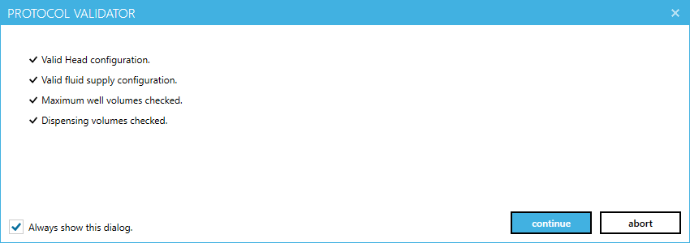{ .img-medium .on-glb width="550" height="350" }

!!! note
     For more information on error messages, see [Certus Control Protocol Validator](troubleshooting.md#certus-controls-protocol-validator).

* Click *continue* to conduct the experiment.
    Click *abort* to interrupt the experiment.
    
    ✔ The well plate holder positions itself under the dispensing head.
    
    ✔ The micro valve dispenses in accordance with the values set in the protocol.

!!! note
    
    If you disable the *Always show this dialog* option, *Protocol Validator* is shown in case of error message only.

!!! note "Problems during execution"

    { .img-icon width="80" height="80"}
    
    If a problem such as collision with the well plate, well spillage, wrong dispensing position, etc. is detected while conducting an experiment, the experiment has to be interrupted right away to prevent damage or other dangers.
    
    ► Clicking the pause symbol pauses the experiment; continuation is possible. Functions under Maintenance can be used during a pause.
    
    ► Clicking the stop symbol stops the experiment; no continuation is possible.

    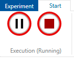{ .img-medium .on-glb width="150" height="150" }

## Interval Purge Loop (IPL)

{ .img-medium .on-glb width="350" height="150" }

If {{ variables.product.name.en }} is leftwith fluid inside for a longer time (up to 72 hours),you can use the Interval Purge Loop (IPL) function to ensure cyclical micro valve flushing. For more information, see [Interval Purge Loop (IPL)](certus_controls.md#interval-purge-loop-ipl).

At a set time interval, IPL dispenses a defined priming and purging volume into the waste tray. fluid can thus be prevented from setting or caulking inside fluid hose or micro valve.

!!! note
    The purging/priming time is taken into account at a set time interval. Therefore, the time interval for the next purging should not be less than 30 s.

!!! warning "Risk of fluid spillage"

    { .img-icon width="80" height="80"}

    Fluid may spill into the waste tray when the Interval Purge Loop function is used. This may cause malfunctions (if fluid spills into the housing) and have health consequences.
    
    ► Manually remove fluid before it spills out.
    
    ► Use a waste tray with discharge function.

!!! caution "Risk of crushing due to axial movement"
    
    { .img-icon width="80" height="80"}
    
    If *Move Dispensing Head down* is checked, the dispensing head moves down. There is a risk of crushing during axial movement.
    
    ► Hands should be kept away during axial movement.
    
    ► Place a check at *Keep Dispensing Head down*.

!!! note "Avoid idle dispensing"

    { .img-icon width="80" height="80"}
    
    Dispensing without fluid could reduce the life of the micro valve.
    
    ► Always dispense with fluid.
    
    ► Make sure that there is enough fluid in the container.
    
    ► Before proceeding with dispensing, check that the micro valve is supplied with fluid.

*Procedure*:

* In *Protocol Editor*, click the *IPL* symbol.
    
    ✔ The *Interval Purge Loop* flyout is opened from the right side.

* Under *Definition*, select the channel to be used with the IPL function.

    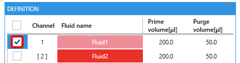{ .img-medium .on-glb width="350" height="150" }

* Adjust the volumes for the priming and purging functions. The default value = 200 µl / 50 µl is recommended.

    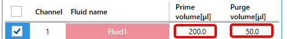{ .img-medium .on-glb width="550" height="350" }

    !!! note

        The value entered in the box can be copied to all channels by subsequently clicking the relevant symbol.

        { .img-icon width="350" height="250"}

* Define the number of cycles for the purging/priming function. (The default value is 1.)

    { .img-medium .on-glb width="550" height="350" }

* Define the behavior of the dispensing head.

    If *Move Dispensing Head down* is checked, the dispensing head moves down to the waste tray for each purging/priming. If *Keep Dispensing Head down* is also checked, the dispensing head moves down only at the start of IPL, where it remains until IPL is complete.

    It is recommended checking both options.

    { .img-medium .on-glb width="550" height="350" }

* Define the time interval for purging/priming.

    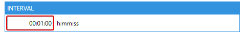{ .img-medium .on-glb width="550" height="350" }

    !!! note
        To save on fluid, you should select the possibly longest time interval. 
        Time can be set in the ```hh:mm:ss``` format or directly in seconds.

* Define the duration of the Interval Purge Loop.

    { .img-medium .on-glb width="550" height="350" }

    !!! note
        Time can be set in the ```hh:mm:ss``` format or directly in seconds.

* Enable compressed air.

    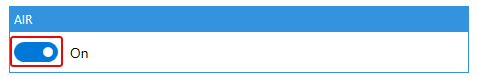{ .img-medium .on-glb width="550" height="350" }

    !!! note
        By clicking the two symbols below, parameters set in IPL can be saved as a *.ipurge file or opened.

        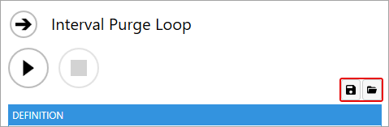{ .img-icon width="350" height="250"}

* Clicking the start symbol launches IPL.

    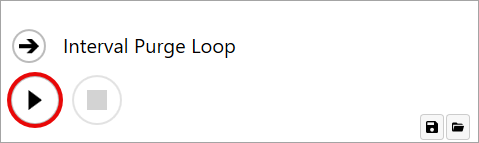{ .img-medium .on-glb width="350" height="250" }

    !!! note "Problems during execution"
        
        If a problem is detected during IPL execution, IPL has to be immediately interrupted to prevent damage and other dangers.
        
        ► Clicking the pause symbol pauses the IPL function (continuation is possible)
        
        ► Clicking the stop symbol stops the IPL function (no continuation is possible)
        
        { .img-medium width="150" height="150" }