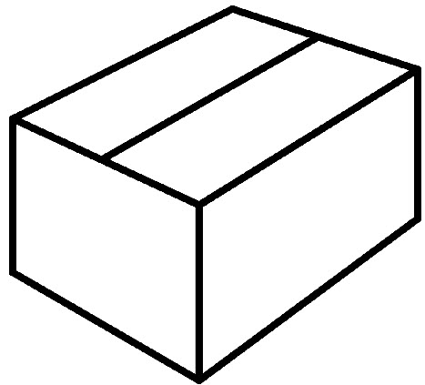
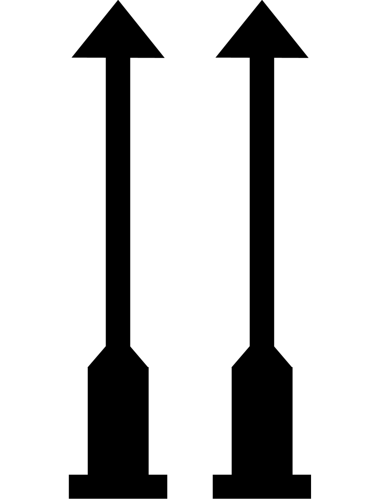

# Transportation and Storage

During installation and subsequent use, shipments should be handled by the end user’s personnel responsible for operation or maintenance. The following instructions should then be absolutely observed.

## Transportation – Safety Instructions

!!! note "NOTE"
    Components should be transported in original packaging.

### Risk of crushing

!!! warning "Risk of injury due to falling or tipping items"
	{ .img-icon width=80 height=100}   

    ► Heavy items may only be lifted by two persons
    
    ► Transportation using rolling tables only	

### Damage due to inadequate transportation

!!! note
    If transported incorrectly, individual items can fall or tip over. This can cause substantial damage.

## Transportation – Inspection

Upon receipt, shipments should be inspected for completeness and any damage incurred in transit.

!!! note
    Any defects or visible transportation damage should be immediately reported to us.

## Packaging

|                                                                  |                                                                 |
| ---------------------------------------------------------------- | --------------------------------------------------------------- |
| {width=200 height=100} | **Length**: 660 mm  **Width**: 550 mm  **Height**: 320 mm  **Weight**: approx. 20-22 kg |
"Packaging"

The packaging should protect individual components against damage until they are installed and should be removed only just before their installation.

!!! note "NOTE"
    All the packaging should be kept for return or storage.

### Special labelling of the packaging

| {width=100 height=80} | {width=100 height=80} | {width=100 height=80} |
| :------------------------------------------------------------------: | :----------------------------------------------------------: | :-----------------------------------------------------------: |
|                             This Way Up                              |                           Fragile                            |                           Keep dry                            |
"Special labelling of the Packaging"

### Disposal of packaging materials

Packaging materials are valuable raw materials, which, in many cases, can be reused, or meaningfully treated and recycled. Improper disposal can cause environmental risks.

!!! note "Environmental risk due to improper disposal"

    { .img-icon width=80 height=80}

    ► Packaging materials should be disposed in an environmentally friendly manner.
    
    ► Follow local disposal regulations. If necessary, have disposal arranged by a specialized collector.	

## Storage

!!! note
    Components that are not going to be immediately installed should be stored in their original packaging in accordance with the storage regulations.

The packaging should be stored under the following conditions:

* Do not store outdoors.
* Keep dry and dust-free.
* Do not expose to any aggressive media.
* Protect against sunlight exposure.
* Avoid mechanical shocks.
* Storage temperature: 13 to 30°C.
* Relative air humidity: max. 70%.

!!! note
    When stored for more than three months, regularly check the general distance between all items and the packaging.

For more information, see [Storing the Unit](decommissioning_disposal.md#storing-the-unit "Decommissioning and Disposal").
