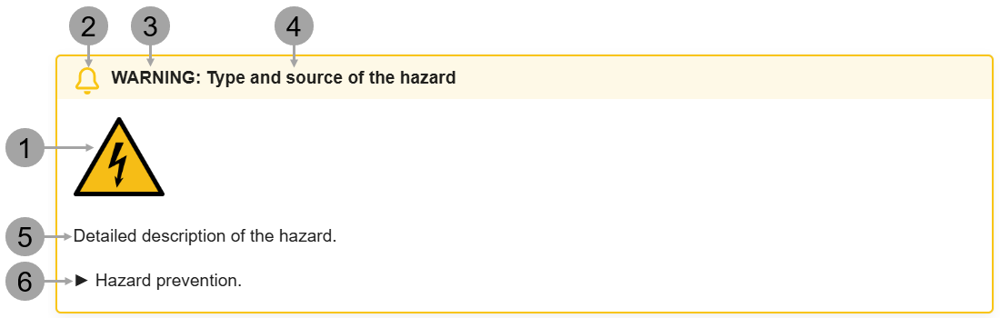

# About this Documentation

This section provides general information on the use of this user manual. 

It also contains important information on the documentation itself, such as the presentation of information, the safety standards and directives applied, and the copyright.

!!! draft

    ## Additional Documents needed

    In addition, the following documents are needed to ensure the safe use of the unit:

    * Micro valve datasheet, document identification: *CERTUSAN002SMLD300GCDEVxxx.pdf*

    * {{ variables.product.name.en }} product catalog: *{{ variables.product.name.en }} ProductCatalog EN Vxxx.pdf*

## General

### Language version

The original user manual of the unit is written in German. All other language versions are translations of the original user manual! 

In case of doubt, the information contained in the original user manual should be prevailing.

### Electronic documentation

The original user manual is available in printout form and electronically in PDF format.

## Copyright

All rights reserved. This user manual must not be reproduced or converted, either entirely or in part, into electronic or machine-readable form without written approval from FritzGyger AG.

## Responsibility for the documentation

|                   |                                         |
| :---------------- | --------------------------------------- |
| Fritz Gyger AG    | Tel: +41 (0)33 336 22 77                |
| Bodmerstrasse 12  | [info@fgyger.ch](mailto:info@fgyger.ch) |
| 3645 Gwatt (Thun) | [www.fgyger.ch](https://www.fgyger.ch)  |
| Switzerland       |                                         |

## Maintenance and storage of documentation

To make sure that the user manual is at any time complete and up to date, please do not remove any of its documents. Any new additional documents should be immediately filed. Keep the user manual in an easily accessible place near the unit.

### Maintenance

The operational availability and value retention of the unit largely depend on diligent and competentmaintenance.

In addition to its maintenance and care,the unit has to be properly operated if operating personnel and other persons are to remain safe.

### Quality

We strive to ensure the highest quality and safety of our products. To this end, we request your support:

* Please report to us any residual hazards related to our product which are not described in this documentation.
* Please bring to our attention any error/inaccuracy that you may stumble upon in this documentation.

## Presentation of Information

The safety instructions, symbols, definitions, and abbreviations used throughout this user manual are explained below.

### Safety Instructions

Through safety instructions,this user manual informs about the type of and effects of failure to take measures to avoid hazards.

{ .img-larger }

|     |                           |                                                                                          |
| :-- | ------------------------- | ---------------------------------------------------------------------------------------- |
| 1   | Warning symbol            | Contains a symbol indicating the type of hazard                                          |
| 2   | Warning icon              | The icon respective to the type of the note, like warning, caution, hazard, danger, etc. |
| 3   | Signal word field         | Draws attention to a hazard                                                              |
| 4   | Type and source of hazard | Specifies the type and source of a hazard                                                |
| 5   | Hazard description        | Detailed description of a hazard                                                         |
| 6   | Hazard prevention         | Measures to prevent a hazard                                                             |

## Document Layout

The following conventions are used throughout the text:

* References to other sections or external documents are highlighted in blue and are often started with the word “See”.
* The dot is used as decimal separator.

## Signal Words

The signal word is part of the safety instructions, and denotes the intensity of a hazard.

!!! danger "Hazard"
    Denotes an immediate hazard. If you do not manage to avoid it, you can die or sustain the most severe of irreversible injury.

!!! warning "Warning"   
    Denotes a possibly dangerous situation. If you do not manage to avoid it, you can die or sustain the most severe of irreversible injury.

!!! caution "Caution"
    Denotes a possibly dangerous situation. If you do not manage to avoid it, you can sustain a lilght or minor injury.

!!! note "Note"
    Denotes a situation that can result in damage, production loss, or an environmental hazard.

!!! important "Important"
    Indicates a situation requiring attention to ensure proper operation and maintenance of the unit.

!!! tip "Tip"
    Indicates a useful hint to make the work easier or more efficient.

!!! draft

    ## Standards and Directives applied
    The unit is the state of the art, and has been made and tested in accordance with the following directives and standards:

    ### 2014/35/EU 
    (formerly 2006/95/EC, valid until April 19, 2016)

    **Low Voltage Directive**

    Directive of the European Parliament and of the Council of February 
    26, 2014 on the harmonization of the laws of the Member States relating to the making available on the market of electrical equipment designed for use within certain voltage limits (recast).

    ### 2014/30/EU 
    (formerly 2004/108/EC, valid until April 19, 2016)

    EMC Directive of the European Parliament and of the Council of February 26, 2014 on the harmonization of the laws of the Member States relating to electromagnetic compatibility (recast).

    ### 2006/42/EC
    (Machinery Directive)

    Directive of the European Parliament and of the Council of 17 May 2006 on machinery, and amending Directive 95/16/EC (recast).

## Text Conventions
The following text conventions are used throughout the texts.

### Paths in software

Paths are shown in software as “>”: 

Example: Certus Control > Library > Valve.

### Real actions

If you are requested to take a real action, it is explicitly stated in the text. Listed actions are preceded by a triangle symbol.

## Presentation example

► Right-click Layer and click the *Disable Layer* command.

### English terms

English terms used throughout the **{{ variables.product.software.name.en }}** software use another font:

Example for Flush: `Flush` (Courier New, 12.0 points)