# Assembly and Operation

!!! draft  

    ## Directions of Movement

    |                                                                                                             |                                                                                                       |
    | ----------------------------------------------------------------------------------------------------------- | ----------------------------------------------------------------------------------------------------- |
    | 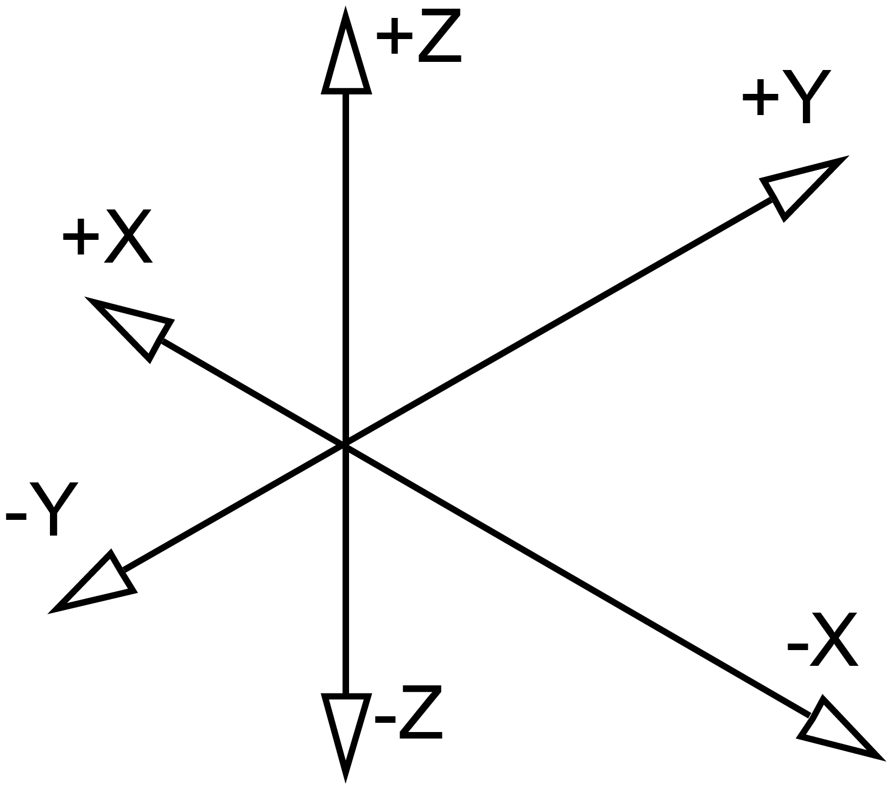{ .img-large .on-glb width="340", height="340" } | 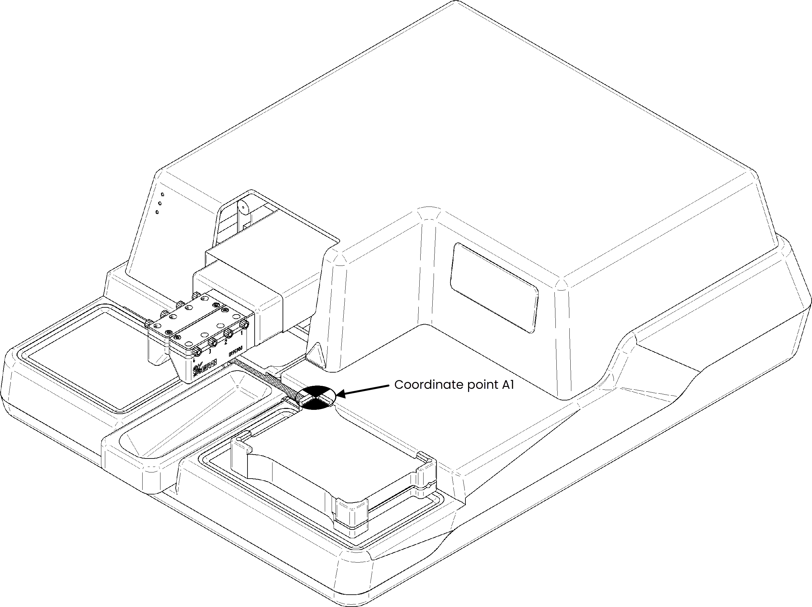{ .img-large .on-glb width="400", height="250"} |
    "Axial movements"

    ## {{ variables.product.name.en }} – Assembly

    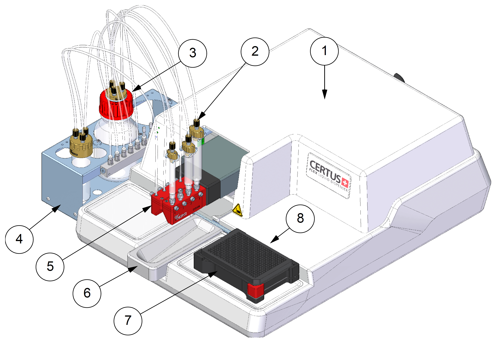{ .img-medium .on-glb width="500", height="350" } 

    |   #   | Component   |   #   | Component       |   #   | Component         |
    | :---: | ----------- | :---: | --------------- | :---: | ----------------- |
    | **1** | Base unit   | **4** | Bottle holder   | **7** | Well plate holder |
    | **2** | Syringe kit | **5** | Dispensing head | **8** | Well plate        |
    | **3** | Bottle kit  | **6** | Waste tray      |       |                   |

    ## {{ variables.product.name.en }} – Operating Principle

    {{ variables.product.name.en }} enables to dispense up to eight various fluids with a volume ranging from 50 nl to several milliliters into all manner of well plates.

    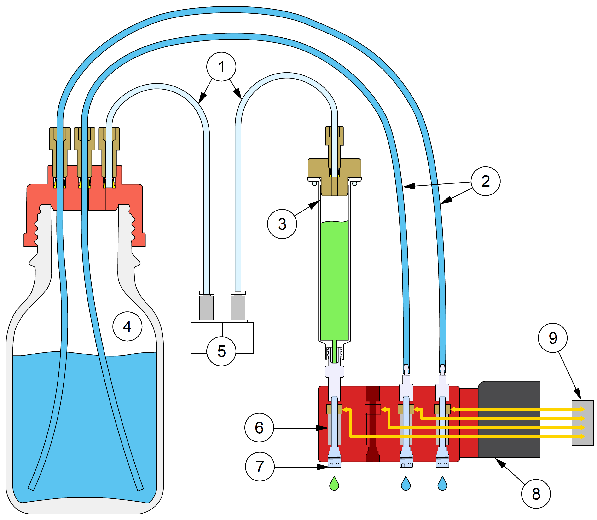{ .img-medium .on-glb width="500", height="350" } 

    |   #   | Component   |   #   | Component    |   #   | Component       |
    | :---: | ----------- | :---: | ------------ | :---: | --------------- |
    | **1** | Air tube    | **4** | Bottle kit   | **7** | Micro valve     |
    | **2** | Fluid tube  | **5** | Air manifold | **8** | Dispensing head |
    | **3** | Syringe kit | **6** | Coil         | **9** | Control system  |

    Mounted on the base unit, the air manifold **(5)** distributes air pressure via air tubes **(1)** between the relevant fluid containers **(3 and 4)**. The micro valves **(7)** are opened by an electrical signal sent by the control system **(9)** to the coil **(6)**. At the same time, the electrical signal determines the micro valve opening times.

    ## Base Unit

    The base unit consists of XYZ axes, control electronics, a compressed air control system, and connectivity possibilities for a dispensing head, a waste tray, and a well plate holder.

    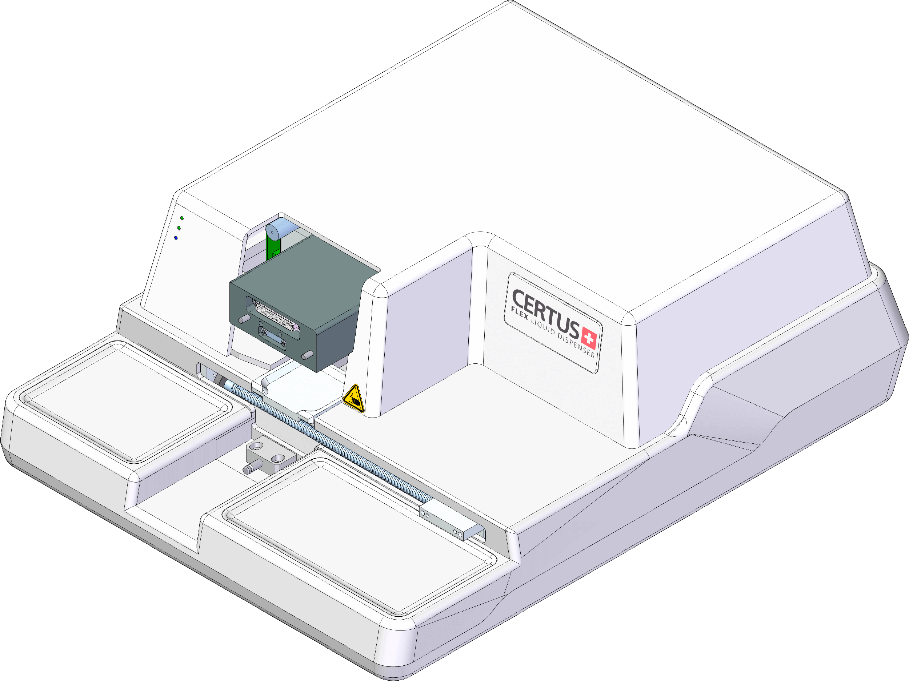{ .img-medium .on-glb width="350", height="150" }

    ### Rating Plate and Interfaces

    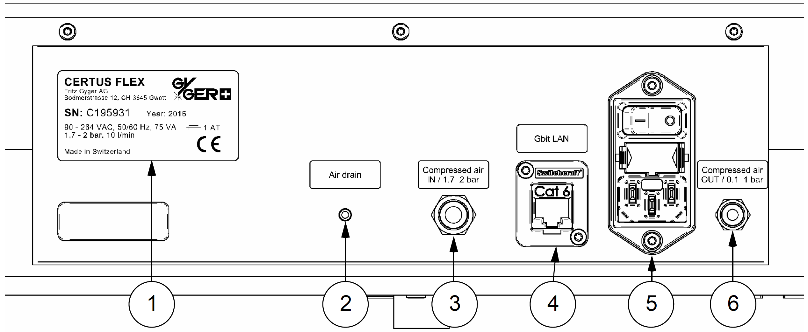{ .img-medium .on-glb width="750", height="550" }

    |   #   | Component                      |   #   | Component                                     |
    | :---: | ------------------------------ | :---: | --------------------------------------------- |
    | **1** | Rating plate                   | **4** | Ethernet 1 Gbit/s, RJ45                       |
    | **2** | Compressed air discharge       | **5** | Main switch, fuse compartment, connector plug |
    | **3** | Compressed air supply (Ø 6 mm) | **6** | Compressed air supply for fluid containers    |

    ### Status Indicator

    The status indicator at {{ variables.product.name.en }} front provides information on the current situation regarding pressure, dispensing availability, and operating status. It is indicated by three LEDs on the housing (to the left of the Y axis).

    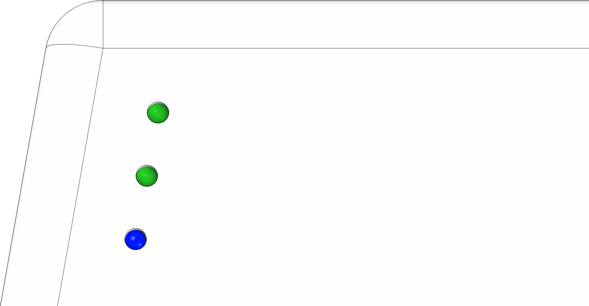{ .img-medium .on-glb width="350", height="150" }

    |                                                           Status Icon                                                           | LED 1 (top) - POWER                                     |
    | :-----------------------------------------------------------------------------------------------------------------------------: | ------------------------------------------------------- |
    | 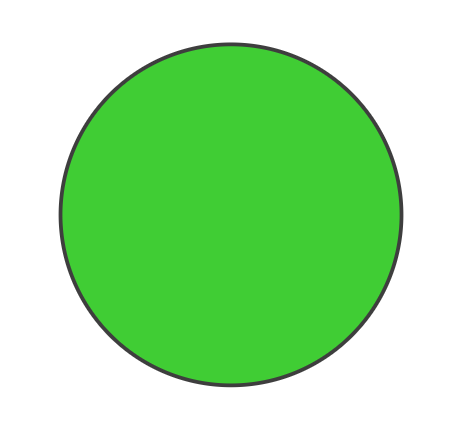{ .img-icon width="50", height="50"} | **LED 1 (top) – POWER**: _power on_ – {{ variables.product.name.en }} is on |

    |                                                                   Status Icon                                                                    | LED 2 (center) - STATUS                                                            |
    | :----------------------------------------------------------------------------------------------------------------------------------------------: | ---------------------------------------------------------------------------------- |
    | { .img-icon width="50", height="50"} | **LED 2 (center) – STATUS**: _ready_ – {{ variables.product.name.en }} is ready       |
    |   { .img-icon width="50", height="50"}   | **LED 2 (center) – STATUS**: _busy_ / _init_ / _standby_ / _run_ (flashing) – Busy |
    |  { .img-icon width="50", height="50"}   | **LED 2 (center) – STATUS**: _error_ (flashing) – Error message                    |

    |                                                            Status Icon                                                            | LED 3 (bottom) - PRESSURE                                                                 |
    | :-------------------------------------------------------------------------------------------------------------------------------: | ----------------------------------------------------------------------------------------- |
    | { .img-icon width="50", height="50"} | **LED 3 (bottom) – PRESSURE**: _ready_ – Pressure is built up or stable                   |
    |  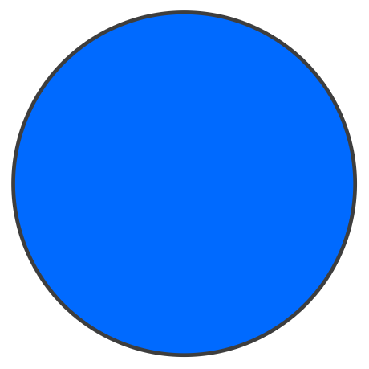{ .img-icon width="50", height="50"}   | **LED 3 (bottom) – PRESSURE**: _init_ (flashing) – Pressure is being built up or unstable |

    ## Bottle and Syringe Kit

    Bottle and syringe kits serve as containers for the fluid to be dispensed, which is transported by the pressure built up in the micro valve. The dispensing accuracy is affected by the micro valve opening time and the container pressure. Therefore, the container pressure is what decides about the accuracy of the dispensing result. Caps ensure the required sealing and proper dispensing.

    ### Bottle Kit – Assembly

    Bottle kits are used to distribute larger volumes across a number of channels. The fluid is then transported to the connected channel via the fluid tube. Caps are available in various versions, and can be used for up to eight channels. {{ variables.product.name.en }} supports the following bottle sizes: 50 ml, 250 ml, and 500 ml.

    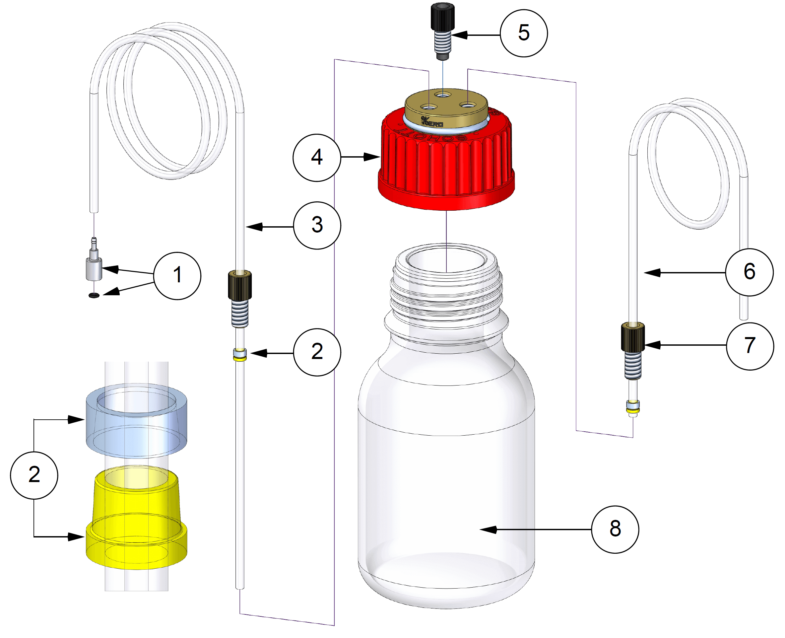{ .img-medium .on-glb width="400", height="250" }

    |   #   | Component                 |   #   | Component                      |
    | :---: | ------------------------- | :---: | ------------------------------ |
    | **1** | Inlet adapter with O-ring | **5** | Blind screw                    |
    | **2** | Clamping sleeve           | **6** | Compressed air tube L = 400 mm |
    | **3** | Fluid tube L = 700 mm     | **7** | Pressure screw                 |
    | **4** | Bottle cap                | **8** | Lab bottle                     |

    ### Bottle Kit – Operational Chart

    The operating principle of the bottle kit is outlined below.

    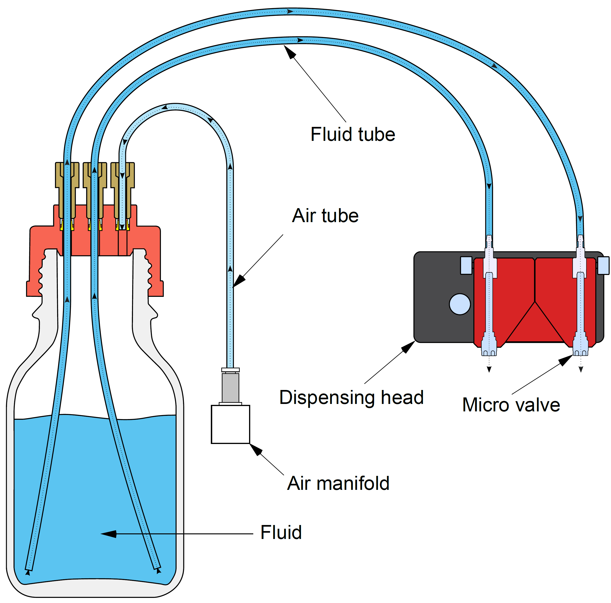{ .img-medium .on-glb width="400", height="250" }

    ### Bottle Kit – Bottle Caps

    Bottle caps are offered for the following fluid outlets.

    !!! note
        All bottle caps can also be operated with an outlet. Unused outlets should be closed with dummy plugs.

    #### For threaded lab bottles

    |                   |                                |                                |                               |
    | :---------------: | ------------------------------ | ------------------------------ | ----------------------------- |
    | **GL45 (250 ml)** | 1 x air inlet   2 x outlets | 1 x air inlet   4 x outlets | 1 x air inlet  8 x outlets |
    | **GL32 (250 ml)** | 1 x air inlet  2 x outlets  | -                              | -                             |

    #### For cone bottles

    |              |                                |                                |                               |
    | :----------: | ------------------------------ | ------------------------------ | ----------------------------- |
    | **(500 ml)** | 1 x air inlet   2 x outlets | 1 x air inlet   4 x outlets | 1 x air inlet  8 x outlets |
    | **(50 ml)**  | 1 x air inlet  2 x outlets  | -                              | -                             |

    !!! note
        Other sizes of lab bottles (GL45) are not offered, but they can be used provided that a pressure resistance of at least 1 bar is ensured.

    ### Syringe Kit – Assembly

    Syringe kits are used to dispense smaller volumes using a single channel. Compared with the bottle kit, the syringe kit does not require any holder or fluid tube as the syringe is installed directly over the micro valve at the dispensing head. However, it can only be used for a single channel.

    Syringes are available in the following sizes: 3 ml, 5 ml,10 ml, and 60 ml.

    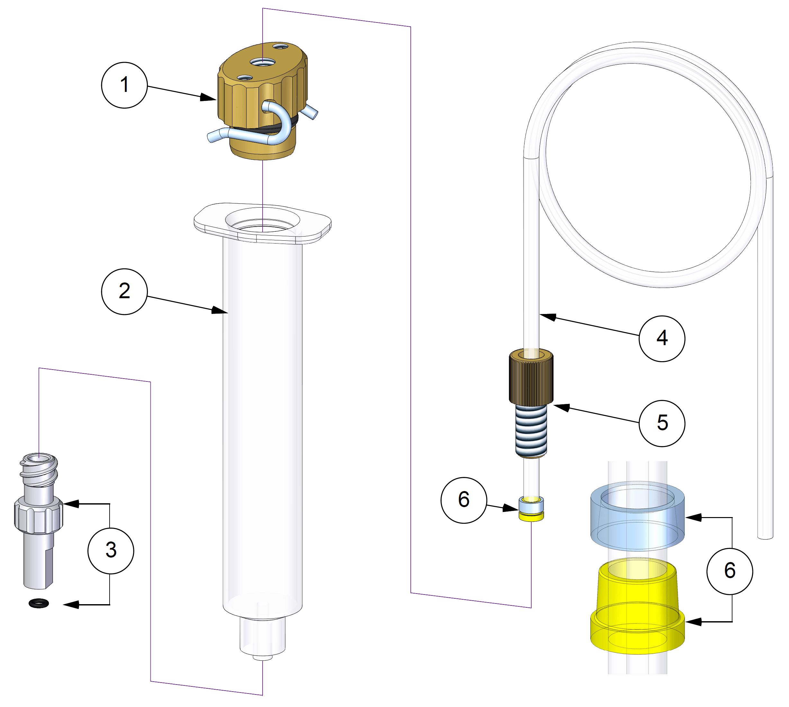{ .img-medium .on-glb width="400", height="250" }

    |   #   | Component                 |   #   | Component                   |
    | :---: | ------------------------- | :---: | --------------------------- |
    | **1** | Adapter head              | **4** | Air tube Ø 3.17; L = 400 mm |
    | **2** | Disposable syringe        | **5** | Pressure screw              |
    | **3** | Inlet adapter with O-ring | **6** | Clamping sleeve             |

    !!! note
        Depending on the dispensing head and the syringe size used, several syringes can be used at the same time.

    ### Syringe Kit – Operational Chart

    The operating principle of the syringe kit is outlined below.

    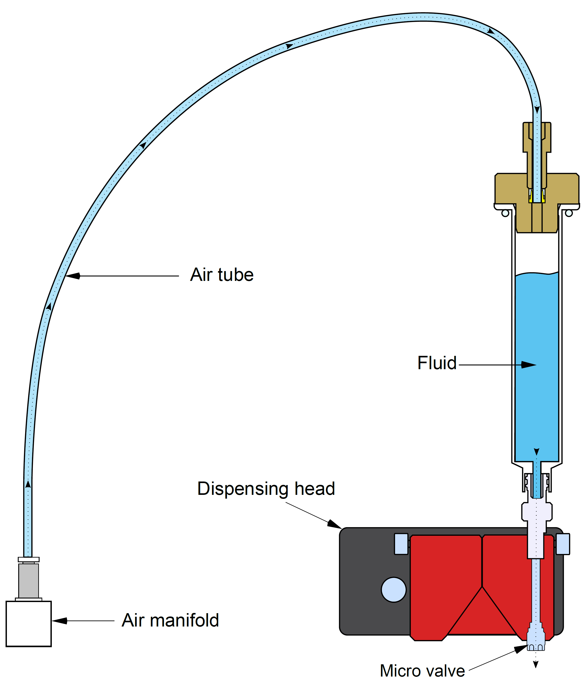{ .img-medium .on-glb width="400", height="250" }

    ## Bottle Holder

    Bottle holders are used to keep fluid containers (with or without cone) in place in a stable and well-arranged manner.

    In addition, the bottle holder is provided with a compressed air manifold, which can be connected to the compressed air outlet (OUT) at the base unit.

    The compressed air manifold makes it possible to provide up to 8 bottle/syringe kits with compressed air.

    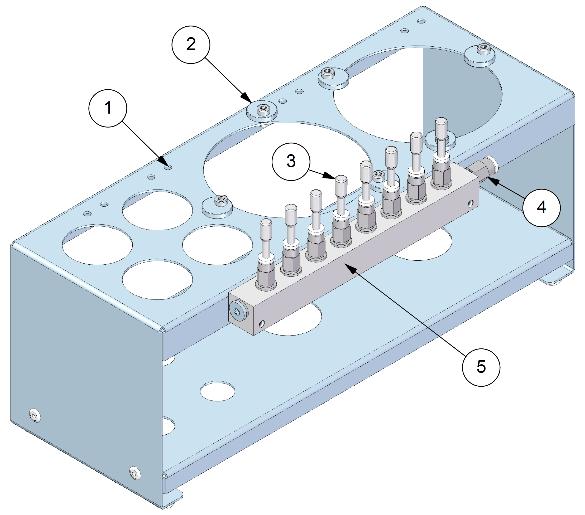{ .img-small .on-glb width="400", height="250" }

    |   #   | Component      |   #   | Component                                        |
    | :---: | -------------- | :---: | ------------------------------------------------ |
    | **1** | Plug hole      | **4** | Air connector  (joining point with base unit) |
    | **2** | Eccentric disk | **5** | Pressure screw                                   |
    | **3** | Plug           |       |                                                  |

    !!! note
        * Plug holes can be used to store plugs removed from the compressed air manifold.
        * Adjustable eccentric disks allow adjustment of differing outer dimensions of containers.

    ## Dispensing Head

    Micro valves and inlet adapters are installed at the dispensing head to ensure the supply of fluid. The inlet adapter can be manually locked using hand screws.

    The micro valves are fastened hand-tight.

    The coil needed to activate the valves is integrated with the dispensing head and connected to the control system via a D-Sub plug.

    The dispensing head can be installed on {{ variables.product.name.en }} using the central screw **(5)**.

    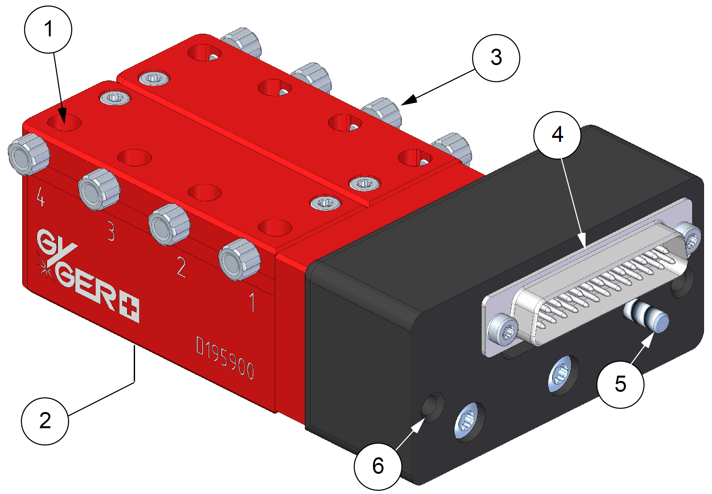{ .img-small .on-glb width="400", height="250" }

    |   #   | Component                 |   #   | Component         |
    | :---: | ------------------------- | :---: | ----------------- |
    | **1** | Inlet adapter hole        | **4** | 25-pin D-Sub plug |
    | **2** | Threaded micro valve hole | **5** | Fastening screw   |
    | **3** | Hand screw                | **6** | Pin guide hole    |

    ### Dispensing head – 22°

    For the dispensing of sensitive substances, such as cells, a dispensing head with a 22-degree tilt has been developed.

    In tilted dispensing, the jet falls onto the well wall.

    This reduces the energy of the jet, mini-mizing foam and bubble formation.

    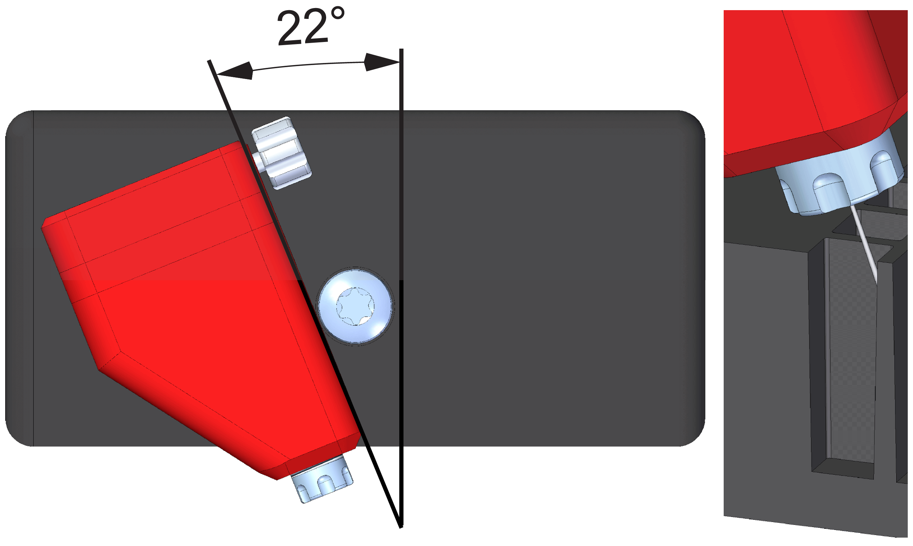{ .img-small .on-glb width="400", height="250" }

    ### Magnetic stirrer dispensing head

    The CERTUS Magnetic Stirrer System optimizes the dispensing of cells, beads and other dissolved particles. With it’s simple to operate, speed control and reusable high quality borosilicate glass or disposable (PP) syringes, thorough mixing while dispensing all kind of solutions is now possible.

    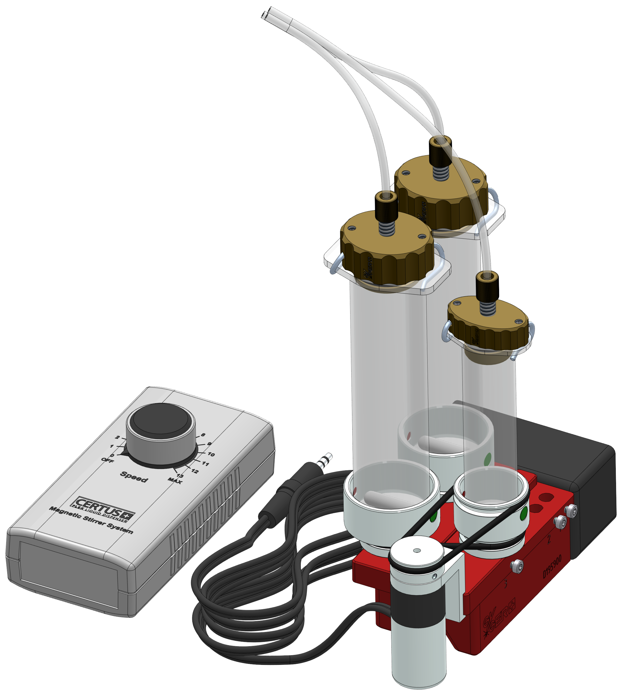{ .img-medium .on-glb width="400", height="250" }

## SMLD 300GC micro valve

The micro valve helps dispense under pressure an accurate volume of fluid. The micro valve is opened by an electromagnetic signal and remains in the powered-off state. Due to its hard sealing design and the use of chemically resistant materials, the micro valve can be used for various fluids.

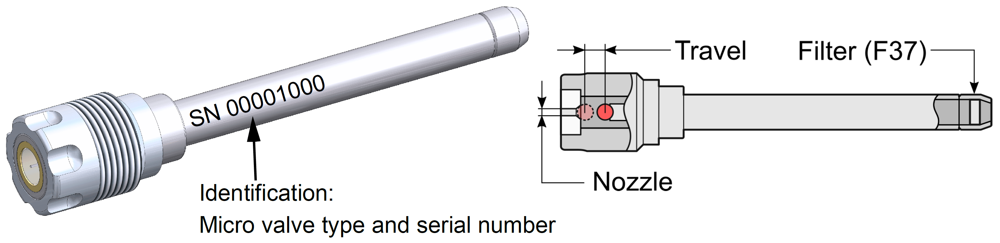{ .img-large .on-glb width="700", height="550" }

### Overview – Dispensing Range

!!! note
    The optimum dispensing range of the micro valve is distributed across the green area. In case of questions or if you need more information on the dispensing capabilities and applicability of a micro valve, please contact your distributor.

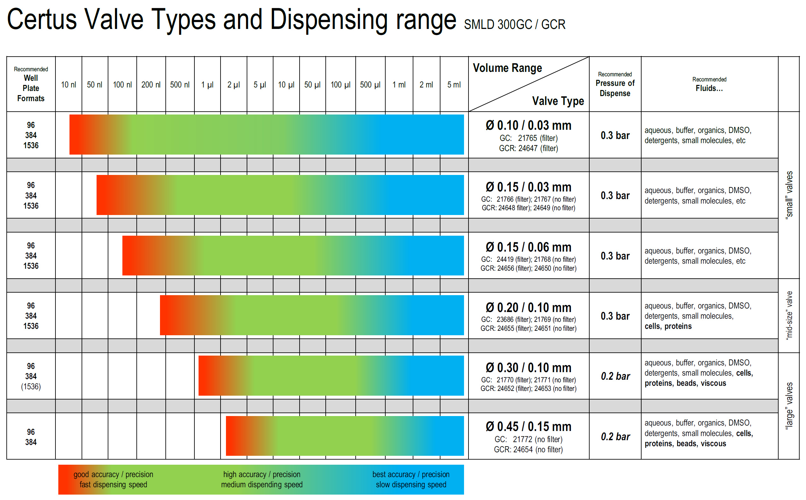{ .img-large .on-glb width="800", height="750" }

!!! draft

    ## Waste Tray

    The waste tray with its volume of approx. 60 ml catches the fluid during the rinsing and cleaning of the micro valves. 

    The fluid can then be discharged via a tube into a separate container (tube ID = 9 mm).

    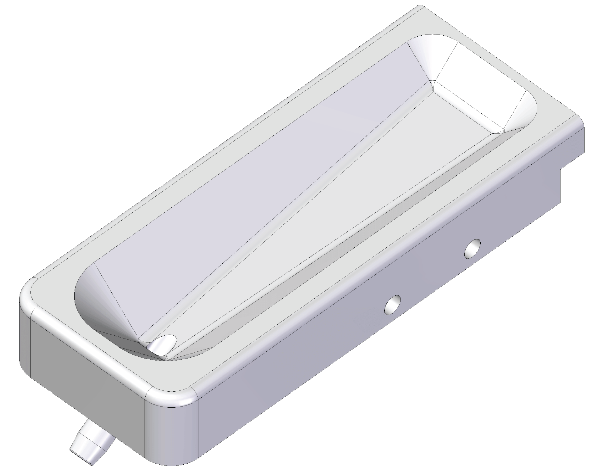{ .img-small width="300", height="150" }

    ## Well Plate Holder

    The well plate holder is attached to the X axis carriage and is intended to hold various well plates in Standard SBS compliant format.

    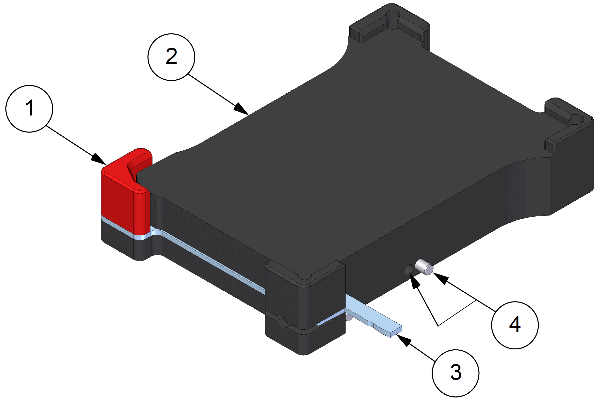{ .img-small .on-glb width="300", height="150" }
    
    |   #   | Component               |   #   | Component                   |
    | :---: | ----------------------- | :---: | --------------------------- |
    | **1** | Stop                    | **3** | Clamp (opens at zero point) |
    | **2** | Teflon coated baseplate | **4** | Pin and screw hole          |