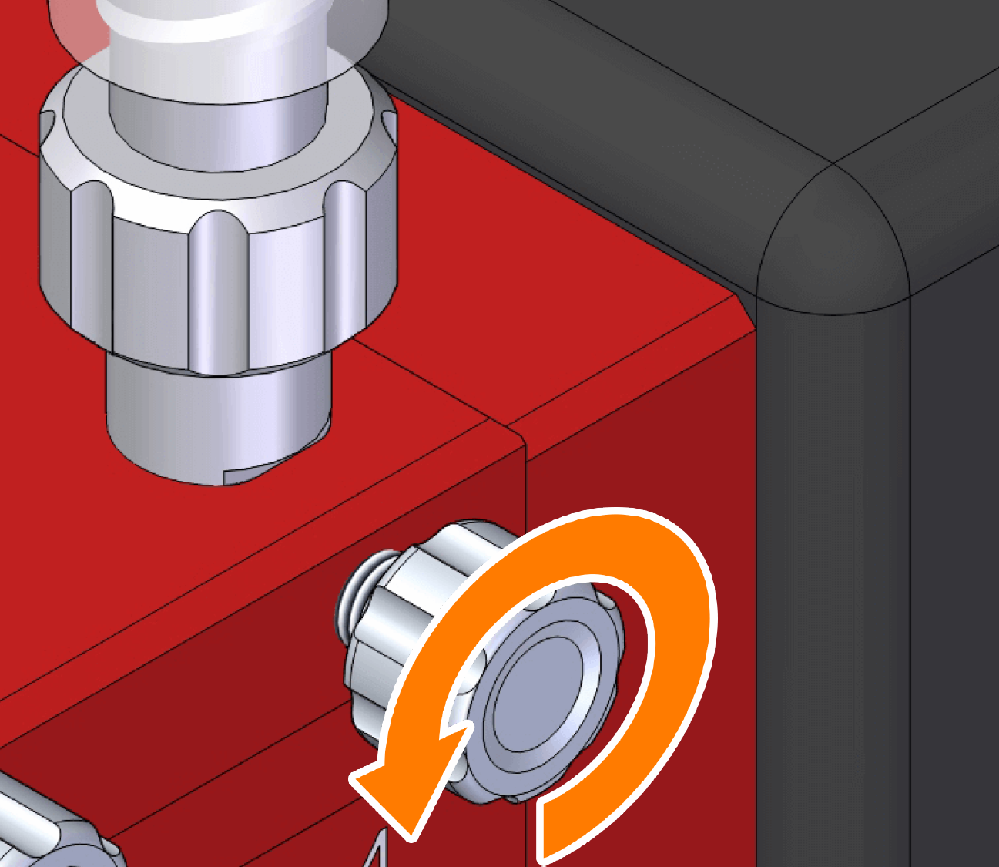
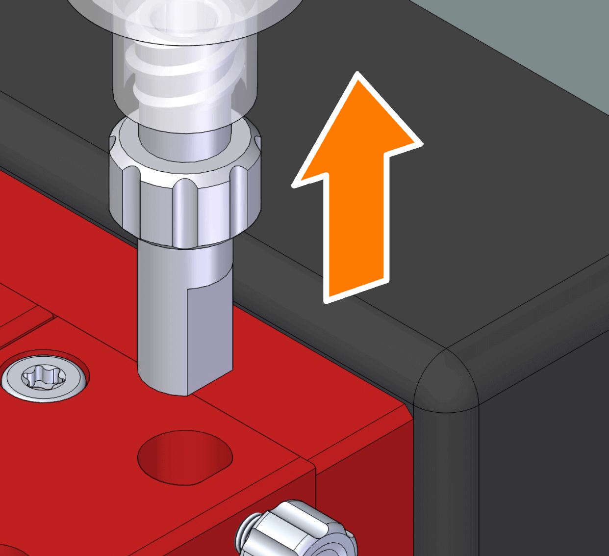
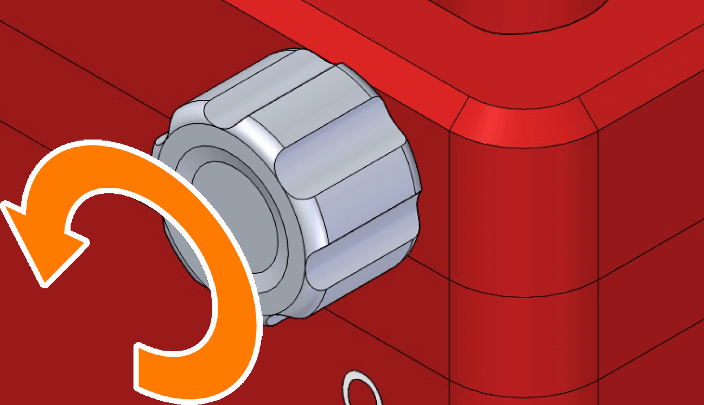
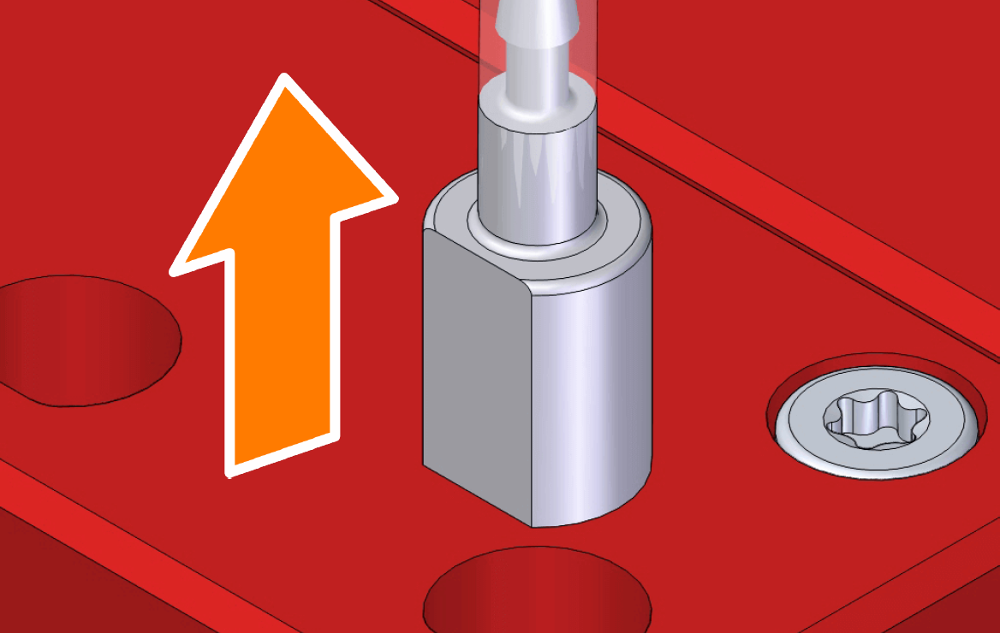
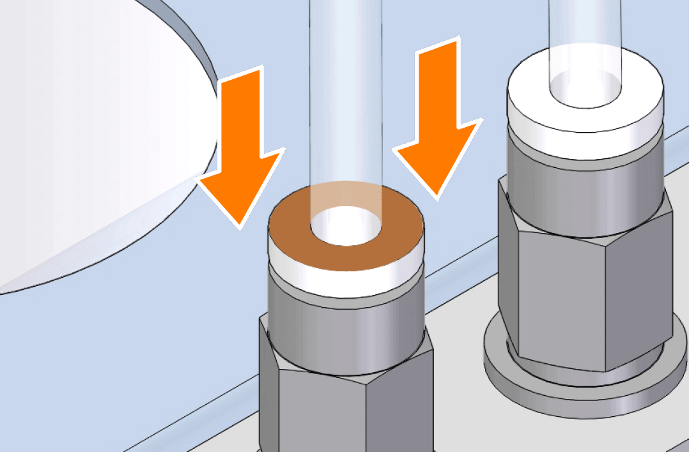
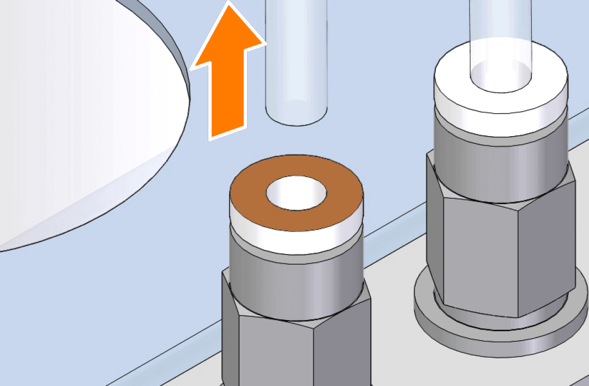
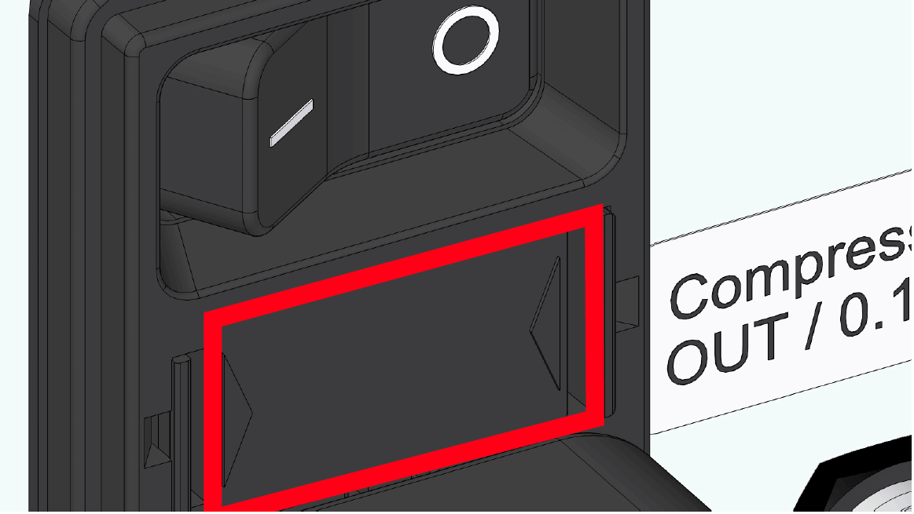
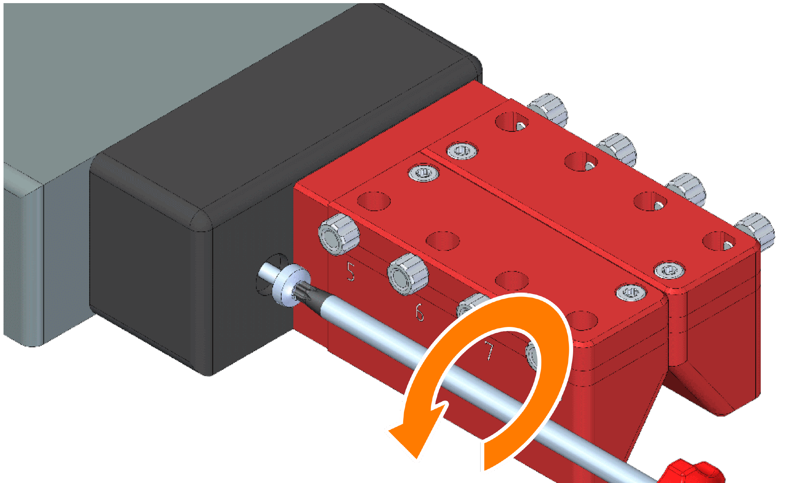
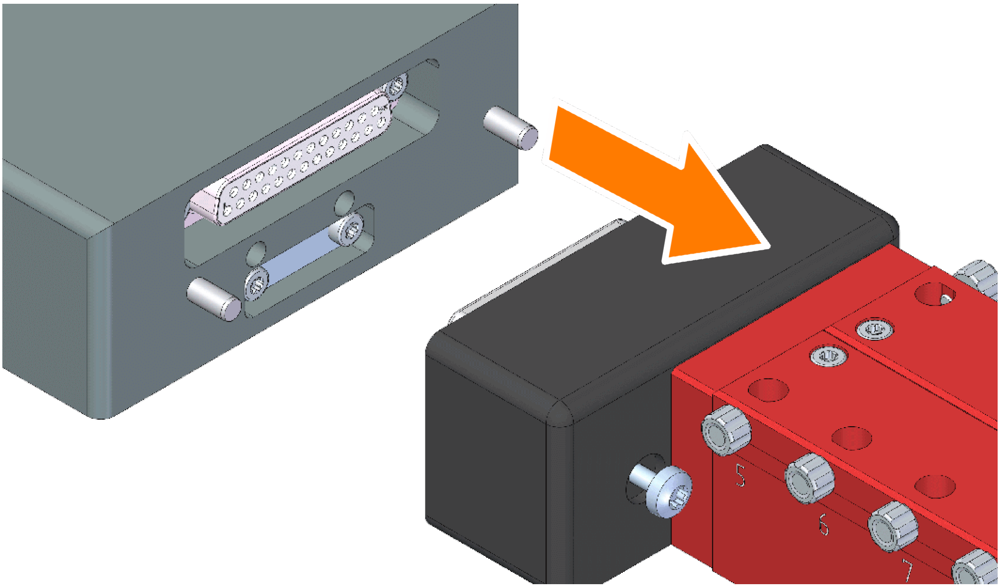

# Maintenance

Regular maintenance of {{ variables.product.name.en }} is necessary to keep its individual components operational and to prolong its lifespan. Regularly conducting maintenance works is in the best interests of the user and ensures safety for their personnel.

## General Safety Instructions

!!! note
    In addition, follow the instructions of the safety section. See [Safety Instructions](safety.md#safety-instructions).

!!! note "Note: Environmental risk due to improper disposal"
    
    ► Packaging materials and substance residues should be disposed in an environmentally friendly manner.
    
    ► Follow local disposal regulations. If necessary, have disposal arranged by a specialized collector.

!!! warning "Caution: Danger from skin irritation and intoxication due to contact with substances harmful to human health (e.g., cleaning agents)"

    { .img-icon width="80px" height="80px"}
    
    ► The end user has to provide the workstation with,for example, additional ventilation, gloves, goggles, protective clothing, protective headgear, etc. To be able to handle substances harmful to human health.
    
    ► Observe warnings of the respective safety datasheets.
    
    ► Wear protective equipment suitable for substances used.
    
    ► The selected cleaning agent should be as non-toxic and non-reactive as possible.

!!! warning "Caution: Risk of crushing due to axial movement"

    { .img-icon width="80px" height="80px"}
    
    ► Maintenance and repair worksmay onlybe performed by qualified maintenance and service personnel.
    
    ► Hands should be kept away during axial movement.

!!! warning "Warning: Risk of electrical injury"
    
    { .img-icon width="80px" height="80px"}

    ► Maintenance and repair worksmay onlybe performed by qualified maintenance and service personnel.

!!! warning "Warning: Risk of fluid spillage"
    
    { .img-icon width="80px" height="80px"}

    Fluid may spill into the waste tray during the execution of maintenance functions (Flush, Prime,andPurge).This may cause malfunctions (if fluid spills into the housing) and have health consequences (depending on the fluid used).
    
    ► Manually remove fluid before it spills out.

    ► Use a waste tray with discharge function.

## Cleaning, Disinfection, and Sterilization

The type, frequency, and procedure of cleaning, disinfecting, and sterilizing the unit, its components and worksurface, as well as cleaning and disinfection agents to be used have to be defined by the end user while taking into account applicable laws, materials used, ambient conditions, and the intended use.

For this purpose, observe the following information:

► Hazard assessment of materials used.

► Safety datasheets of materials used.

► Labelling of materials used.

► End user’s regulations.

► Good Laboratory Practice (GLP) regulations.

► Substance databases.

► Information from the manufacturers of fluids, materials, objects, equipment, tools, etc.

► Local and national legislation.

!!! note 
    The accurate and actual definition and organization of cleaning, disinfection, and sterilization processes are the end user’s or their assignee’s responsibility.

### Manufacturer’s Cleaning Recommendations

If the regulations and information contained in section [Cleaning, Disinfection, and Sterilization](#cleaning-disinfection-and-sterilization) do not stipulate otherwise, the following of the manufacturer’s recommendations should be applied.

#### Preparatory Work

Before starting with cleaning, you should complete the following steps:

► Completely remove residues of the experiment medium from containers and objects.

► Properly dispose the resultant waste.

!!! note "Note: Environmental risk due to improper disposal"

    { .img-icon width="80px" height="80px"}

    ► Packaging materials and substance residues should be disposed in an environmentally friendly manner.

    ► Follow local disposal regulations. If necessary, have disposal arranged by a specialized collector.

#### Necessary maintenance works and cycles

!!! note "Note: Maintenance cycles depending on fluid and purpose"
    
    The maintenance cycles suggested below should be regarded as a recommendation and can significantly vary depending on the type of use, dispensed media, and the frequency of using the unit.

OP = operators; TS = technical staff; SP = support personnel; (D = day/s; Y = year)

| Maintenance Task                                                | 1 D | 7 D | 30 D | ½ Y | 1 Y |
| --------------------------------------------------------------- | :-: | :-: | :--: | :-: | :-: |
| Check general performance                                       | OP  |     |      |     |     |
| Check the clamping function of the well plate holder            | OP  |     |      |     |     |
| Clean the waste tray                                            | OP  |     |      |     |     |
| Clean micro valves                                              | OP  |     |      |     |     |
| Check the tightness of the containers, tubes, and filters       | OP  |     |      |     |     |
| Check the tightness of the air supply                           | OP  |     |      | SP  |     |
| Clean the dispensing head                                       |     |     |  TS  |     |     |
| Clean the inlet adapter                                         |     |     |  TS  |     |     |
| Clean the well plate holder (including the clamp)               |     |     |  TS  | SP  |     |
| Check the zero points (X, Y, and Z axis)                        |     |     |  TS  | SP  |     |
| Remove the adapter holder from the dispensing head and clean it |     |     |  TS  | SP  |     |
| Check compressed air (inlet)                                    |     |     |      | SP  |     |
| Check compressed air (outlet)                                   |     |     |      | SP  |     |
| Clean the X axis spindle and guide                              |     |     |      | SP  |     |
| Check belt tension                                              |     |     |      | SP  |     |
| Update the firmware and software                                |     |     |      | SP  |     |
| Check the Z axis brake (holding force)                          |     |     |      |     | SP  |

#### General cleaning recommendations

► Clean after each experiment.

► After each unintended contamination.

► Whenever you are not sure whether or not the affected components are clean.

► In case of visible dirt.

#### Type of the cleaning agent

!!! warning "Caution: Danger from skin irritation and intoxication due to contact with substances harmful to human health (e.g., cleaning agents)"
    { .img-icon width="80px" height="80px"}
    
    ► The end user has to provide the workstation with, for example, additional ventilation, gloves, goggles, protective clothing, protective headgear, etc. To be able to handle substances harmful to human health.
    
    ► Observe warnings of the respective safety datasheets.
    
    ► Wear protective equipment suitable for substances used.
    
    ► The selected cleaning agent should be as non-toxic and non-reactive as possible.
    
    ► In case of dry dirt (e.g.,dust),use a soft lint-free cellulose cloth.
    
    ► In case of liquid contamination of wipeable surfaces, use a soft lint-free cellulose cloth soaked in ethanol or Isopropanol.
    
    ► In case of liquid contamination of containers, tubes, and the microvalve, flush them with ethanol or Isopropanol. Substance residues or flushing liquids should be disposed of in an environmentally friendly manner.

!!! note "Note"
    For more information on the allowable cleaning method, see [Cleaning Table](#cleaning-table).

!!! note "Note: Environmental risk due to improper disposal"
    { .img-icon width="80px" height="80px"}
    
    ► Packaging materials and substance residues should be disposed in an environmentally friendly manner.
    
    ► Follow local disposal regulations. If necessary, have disposal arranged by a specialized collector.

    ► The micro valve and the inlet adapter should be autoclaved for sterilization purposes.
    
    ► Complete cleaning with a commercial cleaning agent.

#### Drying after cleaning

Once cleaning is complete, make sure that the cleaned components are dry to be used for another experiment. You have the following options to do this:

► Air drying for inaccessible surfaces (for tubes, at least 24hours).

► Drying with a soft lint-free cloth for well accessible surfaces.

► Heating components in a drying oven.

!!! note
    Heating in a drying over is not permitted for objects treated with solvents.

## Cleaning Table

{{ variables.product.name.en }}‘s individual components with appropriate cleaning methods are listed here.

!!! note
    Clean all anodized components with household and special cleaners only.

| Component           | Household Cleaner | Special Cleaner (Isopropanol) | Special Cleaner (Ethanol) | Ultrasound | Autoclave (max temperature) | Dry Chamber (max temperature) |
| ------------------- | :---------------: | :---------------------------: | :-----------------------: | :--------: | :-------------------------: | :---------------------------: |
| Micro valve         |        ✓         |              ✓               |            ✓             |     ✓     |            140°C            |             100°C             |
| Glass container     |        ✓         |              ✓               |            ✓             |     ✓     |            140°C            |             100°C             |
| Fluid tube          |        ✓         |              ✓               |            ✓             |     ✓     |            140°C            |             100°C             |
| Inlet adapter       |        ✓         |              ✓               |            ✓             |     ✓     |            140°C            |             100°C             |
| Adapter head        |        ✓         |              ✓               |            ✓             |     ✓     |            140°C            |             100°C             |
| Bottle cap          |        ✓         |              ✓               |            ✓             |     ✓     |            140°C            |             100°C             |
| Calibration jar     |        ✓         |              ✓               |            ✓             |     ✓     |            140°C            |             100°C             |
| Well plate holder   |        ✓         |              ✓               |            ✓             |     X      |            140°C            |             100°C             |
| Bottle holder       |        ✓         |              ✓               |            ✓             |     X      |            140°C            |             100°C             |
| Air tube            |        ✓         |              ✓               |            ✓             |     X      |              x              |             50°C              |
| Plastic container   |        ✓         |              ✓               |            ✓             |     ✓     |              X              |                               |
| Housing (base unit) |        ✓         |              ✓               |            ✓             |     X      |              X              |                               |
| Dispensing head     |        ✓         |              ✓               |            ✓             |     X      |              X              |                               |
| Air manifold        |        ✓         |              ✓               |            ✓             |     X      |              X              |                               |
| Waste tray          |        ✓         |              ✓               |            ✓             |     X      |              X              |                               |
| Adapter plate       |        ✓         |              ✓               |            ✓             |     X      |              X              |                               |
| Calibration cap     |        ✓         |              ✓               |            ✓             |     X      |              X              |                               |

## Maintenance Works

### Replacing Spare Parts

Only genuine spare parts can ensure excellent functioning. All  {{ variables.product.name.en }} spare parts and accessories can be found in the {{ variables.product.name.en }} product catalog. If you have any questions or need more information, please contact your distributor.

### General Cleaning
All parts that come into contact with fluid should be cleaned with an appropriate cleaning agent. The {{ variables.product.name.en }} base unit can be cleaned with a customary cleaning agent suitable for the material in question.

### Cleaning the Micro Valve

If a problem occurs during dispensing or the micro valve was not used for a longer period of time, it is recommended to clean the micro valve. You can clean micro valves using the Purge and Clean Cycle functions. See [Cleaning](operations.md#cleaning).

The following prerequisites have to be met before taking the steps described below:

✓ {{ variables.product.software.name.en}} is open and connected to the base unit.

✓ The Maintenance window is open. See [Maintenance](maintenance.md#maintenance).

✓ The fluid container is connected to the micro valve on the dispensing head.

✓ Compressed air is on and the fluid container is under pressure.

1. Execute Purge in the same way. See [Purge](operations.md#purge).

2. Execute Clean Cycle in the same way. See [Clean Cycle](operations.md#clean-cycle).
   
!!! note
    
    ► If the micro valve encounters a problem during the execution of Clean Cycle, it is recommended cleaning it with a cleaning kit. (See [Cleaning the micro valve](#cleaning-the-micro-valve)). 
    
    ► If the problem persists despite using the cleaning kit, the micro valve should be replaced. (See [Removing/Replacing the micro valve](#removing-replacing-the-micro-valve))

!!! note "Note: Do not remove the micro valve"
    
    { .img-icon width="80px" height="80px"}

    ► The micro valve must not be removed if the inlet adapter remains connected to the dispensing head.
    
    ► Take the steps described under [Removing the micro valve](#removing-replacing-the-micro-valve).

### Removing/Replacing the micro valve

Prior to the following maintenance works, the micro valve has to be removed:

► Sterilization/cleaning

► Replacement (upon expiration of its life or in case of dispensing problems)

!!! note "Note: Inlet adapter without micro valve"
    
    { .img-icon width="80px" height="80px"}

    ► A micro valve installed on the dispensing head prevents fluid from flowing out. Once the dispensing head is supplied with fluid, a micro valve has mandatorily to be installed in the relevant channel.
    
    ► Before removing the micro valve, make sure that the inlet adapter is detached from the dispensing head.

The following prerequisites have to be met before taking the steps described below:

► CERTUS CONTROL is open and connected to the base unit.

► The Maintenance window is open. See [Maintenance](certus_controls.md#maintenance).

► The fluid container is connected to the micro valve on the dispensing head.

► Compressed air is off and the fluid container is not under pressure.

► If the micro valve is connected to a syringe kit, empty first the syringe. For this purpose, see [Fluid Change – Syringe Kit](#fluid-change-syringe-kit).

#### Removing the micro valve

!!! draft
    
    1. Loosen the hand screw at the dispensing head and remove the inlet adapter. Note: Some residual fluid may spill from the syringe or tube.

1. Unscrew the micro valve from the dispensing head. (If you cannot loosen it manually, use the valve key)

2. (Option) Clean the micro valve with the cleaning kit.

3. Store the micro valve in its container.
    
    ► Micro valve was successfully removed.

#### Installing a new micro valve

!!! draft
    1. Loosen the hand screw at the dispensing head and remove the inlet adapter.

1. Fasten and tighten the micro valve to the dispensing head hand-tight.

!!! draft

    1. Insert the inlet adapter and tighten the screw hand-tight. It is well inserted once it snaps into the O-ring.

1. Mount the fluid tube or syringe onto the inlet adapter.

2. Execute the Flush function before using the micro valve. For this purpose, see [Flush](operations.md#flush).
    
    ► The micro valve was successfully installed.

!!! note
    
    Once Flush is complete, make sure that no air bubbles are formed in the connection. 
    
    **TIP**: During Flush, tap the fluid tube with your fingers to push any present air bubbles forward.

### Fluid Change – Syringe Kit

The following steps should only be taken when using a syringe kit. Asfluidstandsdirectlyoverthemicrovalveinthesyringekit,afterchangingfluidyoushould proceed otherwise than with bottle kits.

!!! warning "Warning: Spillage when removing the syringe kit"

    { .img-icon width="80px" height="80px"}

    If you remove the syringe kit without first detaching it from the dispensing head, the fluid remaining in the syringe can be discharged through the dispensing head in an uncontrollable way.
    
    ► Remove only empty syringes from the dispensing head.
    
    ► Do not remove the micro valve unless the syringe is empty.

The following prerequisites have to be met before taking the steps described below:

► {{ variables.product.software.name.en }} is open and connected to the base unit.

► The Maintenance window is open. See [Maintenance](#maintenance).

► The syringe kit is connected to the micro valve on the dispensing head.

► Compressed air is on and the syringe kit is under pressure.

1. Execute *Flush* with the syringe kit channel. See [Flush](operations.md#flush).
2. Execute *Flush* until there is no more fluid in the syringe.
3. Switch off compressed air.

!!! draft
    
    1. Loosen the hand screw of the dispensing head.
    
    { .img-medium width="200px" height="200px"}

1. Remove the syringe with the installed dispensing head.

    { .img-medium width="200px" height="200px"}

2. Install a new or cleaned syringe kit with inlet adapter onto the dispensing head. For more purpose, see [Installing the Bottle/Syringe Kit on the Dispensing Head](start-up.md#installing-the-bottle-syringe-kit-on-the-dispensing-head).
3. Refill the syringe with fluid.
4. Execute the *Flush* with the relevant channel. See [Flush](operations.md#flush).
5.  Execute the *Flush* until all fluid in the micro valve is dispensed.
    
    ► Fluid was successfully changed.

### Fluid Change -Bottle Kit

If fluid should be refilled or exchanged in the container, you should proceed as follows. 

The following prerequisites have to be met before taking the steps described below:

► CERTUS CONTROL is open and connected to the base unit.

► The Maintenance window is open. See [Maintenance](#maintenance).

► The fluid tube is connected to the micro valve on the dispensing head.

► Compressed air is off and the bottle kit is not under pressure air.

#### Refilling fluid

1. Loosen the bottle cap.

2. Carefully refill the container with fluid.

3. Attach the bottle cap to the bottle and tighten it until it reaches the stop.
    
    ► Refilling was successfully completed.

#### Replacing fluid

!!! warning "Warning: **Never remove the inlet adapter if under pressure**"
    
    { .img-icon width="80px" height="80px"}
    
    If the inlet adapter is removed under pressure, fluid pours from it.

    ► Remove the inlet adapter only if compressed air is off and the container is not under pressure.

1. Loosen the bottle cap.

!!! draft
    
    1. Loosen the hand screw of the dispensing head.

        { .img-medium width="200px" height="200px"}

1. Remove the tube with the installed inlet adapter from the dispensing head.
 
    { .img-medium width="200px" height="200px"}

2. Remove the compressed air tube from the compressed air manifold.

!!! tip "Tip"
    The loosening ring on the plug-in connector has to be pressed when removing the compressed air tube or plugging the compressed air manifold.
    
    { .img-icon width="200px" height="200px"} { .img-icon width="200px" height="200px"}

5. Remove the bottle cap.

6. Thoroughly flush or replace with new materials all parts that may come into contact with fluid (glass bottle, bottle cap, tubes, filters, etc.).

7. Refill the glass bottle with fluid.

8. Attach the bottle cap with installed tubes to the glass bottle and tighten it until it reaches the stop.

9.  Install all fluid tubes with inlet adapter to the dispensing head. For this purpose, see [Installing the Bottle/Syringe Kit on the Dispensing Head](#installing-the-bottle-syringe-kit-on-the-dispensing-head).

10. Connect the compressed air tube to the compressed air manifold.
    
    ► Fluid was successfully changed.

### Replacing the Fuse on the Base Unit

The power input is protected in the housing by means of a fuse (1 AT / 240 V).
{ .img-medium width="250px" height="150px"}

!!! note "Note: **For trained personnel only**"
    { .img-icon width="80px" height="80px"}

    The fuse may only be installed by a trained person.

!!! draft

    ### Removing the Dispensing Head

    The dispensing head can be removed from the base unit for maintenance purposes or to replace it with another dispensing head.

    !!! note "Note: **Electronic components**"

        { .img-icon width="80px" height="80px"}
        
        The dispensing head contains electronic components, so it must not be bathed for cleaning (e.g., in an ultrasound bath).
        
        ► Clean the dispensing head with a wet cloth and avoid touching the D/Sub plug contact.
        
        ► Clean the dispensing head after it is installed on the base unit.

    !!! note "Note: **Malfunction due to a damaged part**"

        { .img-icon width="80px" height="80px"}
        
        Due to excessive force, pins of the D-SUB plug could become deformed and thus affect contact with the control unit.
        
        ► Carefully and unforcefully remove the dispensing head from the Y axis.
        
        ► Avoid contact with the pins.

    1. Remove all fluid tubes with inlet adapter from the dispensing head.
    2. Loosen the lateral screw of the dispensing head. The screw does not have to be completely removed (it is undetachable).

        {.img-medium width="250px" height="150px"}

    3. Carefully remove the dispensing head.

        { .img-medium width="250px" height="150px"}

    !!! note
        As soon as the dispensing head is removed, it is indicated accordingly by the software if open.