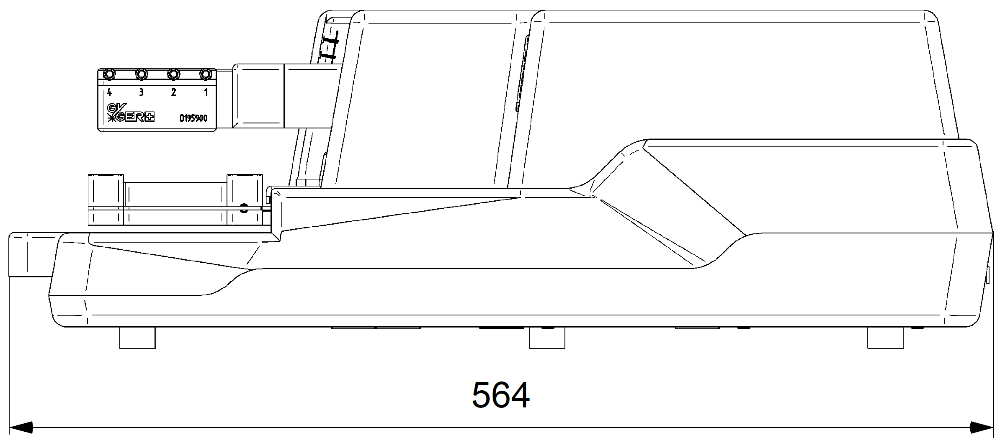
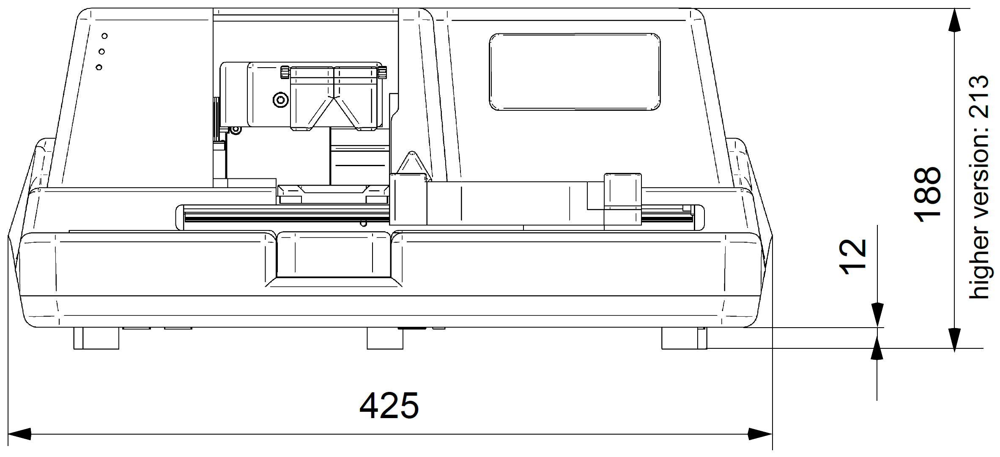
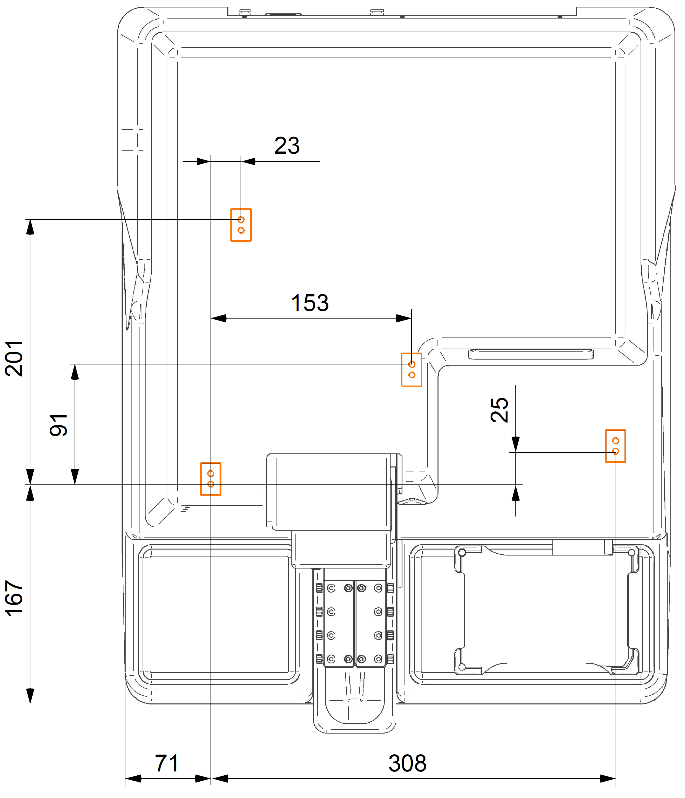
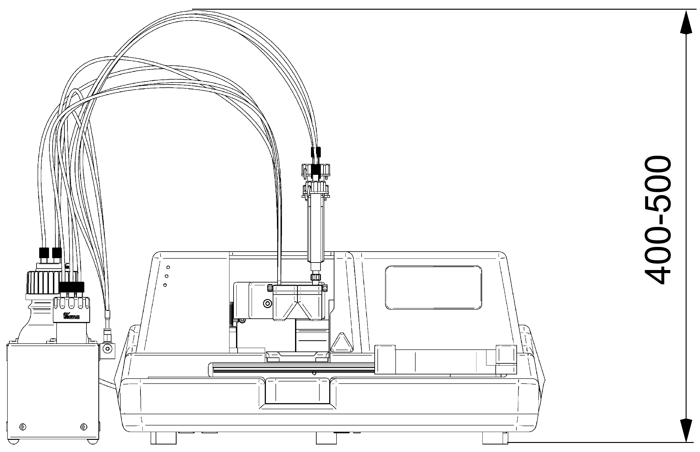
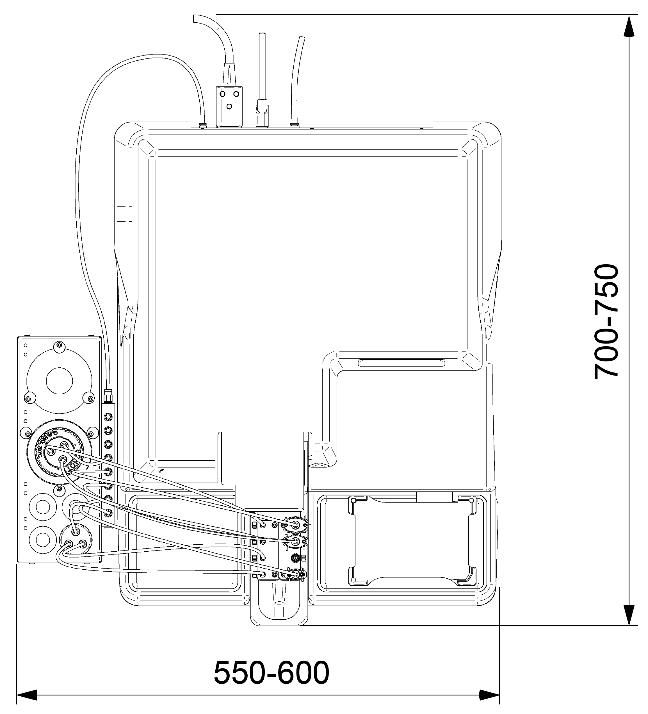

# Technical Specifications - Dimensions

!!! draft

    The specifications provide major dimensions (in **mm**). 

    !!! note
        The specified dimensions relate to the latest version of the product. The dimensions of older versions may show minor deviations.

!!! draft

    ## Base Unit

    { .on-glb width="550px" height="150px" }

    { .on-glb width="550px" height="150px" }

    !!! note 
        The five feet of the **{{ variables.product.name.en }}** unit are not provided for height adjustment, and their removal requires qualified service and maintenance personnel.

!!! draft

    ## System Integration

    On the underside of the unit, there are four mounting points (M5 × depth 8) to attach **{{ variables.product.name.en }}** to the apparatus. For mechanical stability, the four points are connected to three axes.

    ### Mounting Point Specifications

    { .img-medium .on-glb width="550px" height="auto" }

    !!! note
        The mounting calculation should take into account the height of the unit feet (12 mm).

!!! draft

    ## Operating Range

    Minimum dimensions for the operating range of the **{{ variables.product.name.en }}** starter kit (base unit with bottle holder and bottle/syringe kit) are defined. 

    !!! note 
            
        ► The PC to run **{{ variables.product.software.name.en }}** software is not included.
            
        ► The specified dimensions may vary depending on the location and use of additional accessories.

    ### Operating Range Dimensions

    { .img-medium .on-glb width="550px" height="auto" }

    { .img-medium .on-glb width="550px" height="auto" }