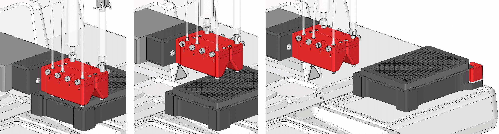

# Troubleshooting

## General Safety Instructions

!!! note

    In addition, please follow the instructions of the safety section. See [Safety Instructions](#safety-instructions).

!!! warning "Warning: Risk of Electrical Injury"

    ► Maintenance and repair worksmay onlybe performed by qualified maintenance and service personnel.

!!! caution "Caution: Risk of crushing due to axial movement"

    ► Maintenance and repair worksmay onlybe performed by qualified maintenance and service personnel.
    
    ► Hands should be kept away during axial movement.

!!! danger "Hizard: Danger to life from handling toxic or highly reactive substances (storage, use, mixing, and disposal)"

    ► Workstations should be properly equipped with additional ventilation, gloves, goggles, protective clothing, and protective headgear.
    
    ► Personal protective equipment specified in the manufacturer's safety data sheet should be worn.
    
    ► Storage containers, ambient conditions (temperatures, air humidity), and premises specified in the manufacturer's safety data sheet and other regulations should be observed.
    
    ► Contact with other substances (can be lethal) should be avoided. Follow and implement the manufacturer's instructions.
    
    ► Inhalation of vapors of toxic or highly reactive substances (can be lethal) should be avoided.
    
    ► Every direct skin contact with a toxic or highly reactive medium (can be lethal) should be avoided.
    
    ► Oral intake of any toxic medium (can be lethal) should be avoided.
    
    ► Inappropriate protective equipment that can lead to skin contact or ingestion of a toxic medium (can be lethal) should be avoided.
    
    ► In case of skin contact or ingestion of any toxic substance despite safety precautions taken, a doctor's consultation should be immediately sought.
    
    ► All requirements and regulations regarding the disposal of a medium, as well as objects and fluids that have come into contact with it (improper disposal can be lethal), should be observed.

## What to do in case of a Malfunction

If any malfunction or disruption occurs on or near the unit, immediately switch it off and take the following steps:

* Switch off and disconnect the unit from the mains. Close pneumatic cut-off valves and reduce pressure.
  
* Find and remedy the cause of the malfunction. Only then restart the unit.

!!! draft

    ## {{ variables.product.name.en }} - Hardware

    Problems that may occur during the operation are listed here.

    !!! note
    
        * **Problem description**: It is described in a red bar. 
        
        * **Possible causes**: It is provided with a number. 
        
        * **Remedy**: It is marked with a black triangle.
        
    ??? failure "Collision of the dispensing head with the well plate upon completion of an experiment."

        After collision, the axes have to be brought back to their starting position.

        1. Click Protocol `Editor` > `Maintenance` > `Axis` > `Park`.

            ✓ All the axes return to their starting position.

            { .img-medium .on-glb width="650" height="450" }

        2. A wrong well plate height was entered in the library.

            ► Measure the well plate height again and correct the library entry.

        3. A wrong well plate was put on the well plate holder.

            ► Check that the installed well plate is compatible with the well plate used for the experiment.

    ??? failure "Irregular dispensing."

        1. Dirt in the micro valve.

            ► Clean the affected channel of the micro valve nozzle.

        2. Fluid pollution.

            ► Clean the micro valve and fluid container and replace fluid.

            ► Use a suction filter.

        3. Varying compressed air.

            ► Make sure that compressed air supply works properly.

        4. Air pockets in the fluid tube.

            ► Thoroughly flush the micro valve with the Flush or Primefunction. Tap on the tube during flushing or priming. Air pockets can thus be removed.

    ??? failure "Drop formation on the micro valve."

        1. Due to impurities, the micro valve is leaky.
        
            ► Clean the micro valve with the Flush, Prime, or Purgefunction. If the problem persists, the micro valve has additionally to be cleaned with a micro valve cleaning kit.

    ??? failure "The dispensing jet is skewed."

        1. Dirt in the micro valve.
        
            ► Clean the micro valve nozzle. Flush the micro valve with the Flush, Prime, or Purge function.

### {{ variables.product.software.name.en }} - Protocol Validator

The most likely error messages of {{ variables.product.software.name.en }}‘s Protocol Validator are listed here. More support is available from service personnel or your distributor.

!!! note
    
    The bold values are possible examples from an experiment and can varydepending on their designation or entered quantity.

#### Error Messages

??? failure "Different air pressure used. Not all channels with fluid fluid1 using same pressure."

    Not all channel swith the same fluid use the same pressure. As a solution, there are three options to choose from:

    ► Use identical pressure for all channels.

    ► Use the same micro valve type for all channels.

    ► Disable the relevant channel (disable).

??? failure "Different airpressureused. Withthesetting region1,theaffectedfluidsuppliesmustuse same air pressure!"

    For Mixed Fluid, all channels have to be used with the same pressure.
    
    ► Adjust the configuration so that all channels use the same pressure.
    
??? failure "Evaporation drop volume out of range 10 nl to 10 ml, currently 0.005 μl."

    Each volume within an evaporation curtain has to be 10 nl to 10 ml.
    
    ► Adjust the dispensing volume within the evaporation curtain accordingly.

??? failure "Evaporation command unexpected data / channel state."

    ► Correct the definition of the evaporation curtain.

??? failure "Fluid not available. fluid1 is not supplied by any channel."

    ► The relevant fluid has to be assigned to a channel.

??? failure "Maximum well volume of A1.1 has been exceeded. Possible 200 μl, currently 220 μl."

    ► Reduce the volume set for the relevant well.
    
    ► Or use another well plate with a higher well volume.

??? failure "No valid well plate assigned!"
    
    ► A well plate has to be added to the experiment.

??? failure "Your Well Plate Z-Offset (thickness) is too high to fit with current valve head!"
    
    ► You have to select a well plate with a lower height.

??? failure "Volume too low. 0.008 μl of fluid1 in B12.1; layer1 is below system limits."

    ► The dispensing volume in the specified well is too low for the micro valve type used.

    ► Increase the volume or change the type of micro valve.

#### Warnings

??? warning "Set air pressure not recommended. Channel 3 uses a ø 0.45 mm valve with an uncalibrated air pressure of 0.3 bar. Recommended is 0.2 bar."
    
    ► The selected pressure does not match the micro valve type. 
    
    ► The pressure was not used for the calibration of the channel. 
    
    ► Higher volume deviations are to be expected.

??? warning "No volumes found to dispense."

    No volume is defined in the whole protocol.

??? warning "Not recommended well plate used. Valve type of channel 3 does not fit to used well plate Standard 96 Well Plate. Recommended well plates have 384 or less wells."

    The micro valve type does not match the well plate. Inaccurate dispensations are to be expected.
    
    ► Use a well plate with 384 or less wells.
    
    ► Select the micro valve type with the following nozzle diameters: 0.10 mm, 0.15 mm, or 0.2mm.

??? warning "Volume below valve specification. 0.05μl of fluid1 in {valve}.{layerandregioninfo} is too low. (ø 0.45 / 0.15 mm)"
    
    The volume is too low for the defined micro valve.
    
    ► Increase the volume or use another micro valve type.

#### Information Notices

??? note "Channel 3 uses a ø 0.45 mm valve with an air pressure of 0.3 bar. Recommended is 0.2 bar."
    
    The selected pressure is incompatible with the valve type. As the channel was so configured, information is only displayed.

??? note "Evaporation volume out of calibration range. 110.0 μl with channel 3 is not within range. (Min: 0.031807 μl, Max: 78.849848 μl)"

    No action is necessary. {{ variables.product.software.name.en }} informs about a dispensed volume in the evaporation curtain which does not fit into the calibrated area. Some deviations may occur.

??? note "Volume out of calibration range. 110.0 μl of fluid2 in A1.1; (region ’Region2’, layer ’Layer1’) is not within range. (Min: 0.031807 μl, Max: 78.849848 μl)"
    
    No action is necessary. {{ variables.product.software.name.en }} informs about a dispensed volume in the evaporation curtain which does not fit into the calibrated area. Some deviations may occur.

### {{ variables.product.software.name.en }} - Maintenance

The most likely error messages of {{ variables.product.name.en }}‘s Maintenance are listed here. More support is available from service personnel or your distributor.

!!! note 
    
    The bold values are possible examples from an experiment and can varydepending on their designation or entered quantity.

#### Error Messages

??? failure "Channel setup cannot be null."
    
    Avalid configuration is needed.
    
    ► Load a configuration

??? failure "Channel: `3` is disabled."
    
    ► Enable the relevant channel (enable)

??? failure "No calibration assigned. Channel `3` has no calibration assigned."
    
    ► Assign a calibration to the channel.

??? failure "No supply/valve/calibration assigned. Channel `#3` is not ready to be used."
    
    The channel was not completely configured.
    ► Configure the relevant channel.

??? failure "Purge volume too large.  Purge volume with channel `3` must be less than defined limit of 200.0 μl."

    Too high purging volume.
    
    ► Reduce the purging volume to not more than the entered value.

??? failure "Purge volume too small.  Purge volume with channel `3` must be greater than one drop of 0.5 μl."
    
    Too low purging volume.
    
    ► Increase the purging volume to at least the entered value.

??? failure "Volume too low. `0.05 μl` with channel 3 is below system limits."
    
    The dispensing volume of the specified well is too low for the micro valve type used.
    
    ► Increase the volume or select another micro valve type.

#### Warnings

??? warning "Channel `3` uses a `ø 0.45 mm` valve with an uncalibrated air pressure of `0.3 bar`. Recommended is `0.2 bar`."

    ► The selected pressure is incompatible with the valve type. 
    
    ► The channel was not configured with the pressure applied, either. 
        
    ► Major volume deviations are to be expected.

??? warning "Volume below valve specification. `0.05 μl` with channel `3` is too low. (`ø 0.45`/`0.15 mm`)"
    
    The volume is too low for the selected micro valve.
    
    ► Increase the Volume or use another micro valve type.

#### Information Notices

??? note "Channel `3` uses a `ø 0.45 mm` valve with an air pressure of `0.3 bar`. Recommended is `0.2 bar`."

    ► The selected pressure is incompatible with the valve type. 
    
    ► As the channel was so configured, information is only displayed.